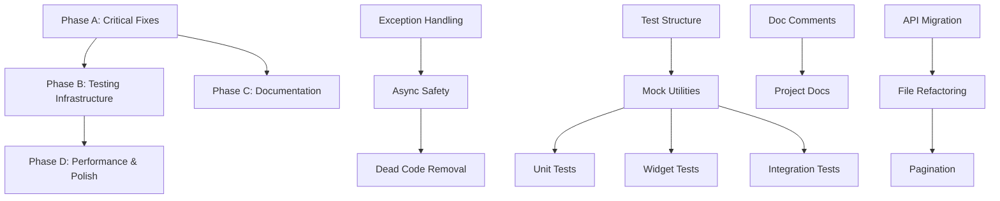

# Design Document

## Overview

This design document outlines the technical approach for improving the AndroCare360 application's code quality, test coverage, and documentation standards. The implementation follows a phased approach prioritizing critical fixes (exception handling, async safety) before building comprehensive testing infrastructure and documentation.

### Design Goals

1. **Zero Critical Lint Warnings**: Eliminate all 121 generic catch clauses, 25 discarded futures, and 14 unreachable code warnings
2. **70%+ Test Coverage**: Establish comprehensive test suite covering unit, widget, and integration tests
3. **Production-Grade Documentation**: Add doc comments to all public APIs and create project documentation artifacts
4. **Maintainable Architecture**: Ensure consistent DI patterns and eliminate static singletons
5. **Performance Optimization**: Fix slow async IO and implement pagination for large datasets

### Success Metrics

- Flutter analyze warnings: 193 → ≤ 50
- Test coverage: < 10% → 70%+
- Doc comment coverage: ~20% → 90%+
- Health score: 72/100 → 90+/100

## Architecture

### Phase-Based Implementation Strategy

The implementation follows a four-phase approach to minimize risk and ensure incremental progress:

```
Phase A: Critical Fixes (Week 1-2)
├── Exception Handling Refactoring
├── Async Operation Safety
└── Dead Code Removal

Phase B: Testing Infrastructure (Week 3-4)
├── Test Directory Structure
├── Mock Utilities & Fixtures
├── Unit Tests (21 services)
├── Widget Tests (critical screens)
└── Integration Tests (3 flows)

Phase C: Documentation (Week 5)
├── Doc Comments (services, models, repositories)
└── Project Documentation (CHANGELOG, CONTRIBUTING, API_DOCS)

Phase D: Performance & Polish (Week 6)
├── Deprecated API Migration
├── Large File Refactoring
└── Pagination Implementation
```


### Dependency Graph



## Components and Interfaces

### 1. Exception Handling Framework

#### Custom Exception Types

Create a hierarchy of domain-specific exceptions to replace generic catch clauses:

```dart
// lib/core/errors/exceptions.dart

/// Base exception for all application errors
abstract class AppException implements Exception {
  final String message;
  final String? code;
  final dynamic originalError;
  
  const AppException(this.message, {this.code, this.originalError});
}

/// Thrown when Firestore operations fail
class FirestoreException extends AppException {
  const FirestoreException(
    String message, {
    String? code,
    dynamic originalError,
  }) : super(message, code: code, originalError: originalError);
}

/// Thrown when network connectivity issues occur
class NetworkException extends AppException {
  const NetworkException(
    String message, {
    dynamic originalError,
  }) : super(message, originalError: originalError);
}

/// Thrown when Agora video call operations fail
class AgoraException extends AppException {
  const AgoraException(
    String message, {
    String? code,
    dynamic originalError,
  }) : super(message, code: code, originalError: originalError);
}

/// Thrown when VoIP call operations fail
class VoIPException extends AppException {
  const VoIPException(
    String message, {
    dynamic originalError,
  }) : super(message, originalError: originalError);
}
```


#### Exception Handling Pattern

Standard pattern for all service methods:

```dart
/// Standard exception handling pattern for repository methods
Future<Either<Failure, T>> executeWithErrorHandling<T>({
  required Future<T> Function() operation,
  required String operationName,
}) async {
  try {
    final result = await operation();
    return Right(result);
  } on firebase_core.FirebaseException catch (e) {
    debugPrint('$operationName - Firebase error: ${e.code} - ${e.message}');
    return Left(FirestoreFailure(e.message ?? 'Firestore operation failed'));
  } on SocketException catch (e) {
    debugPrint('$operationName - Network error: ${e.message}');
    return Left(NetworkFailure('No internet connection'));
  } on AppException catch (e) {
    debugPrint('$operationName - App error: ${e.message}');
    return Left(AppFailure(e.message));
  } catch (e, stackTrace) {
    debugPrint('$operationName - Unexpected error: $e');
    debugPrint('Stack trace: $stackTrace');
    return Left(UnexpectedFailure('An unexpected error occurred'));
  }
}
```

#### Refactoring Strategy for 121 Generic Catches

Priority order for refactoring:
1. **Critical Services** (Days 1-2): agora_service.dart, voip_call_service.dart, call_monitoring_service.dart
2. **EMR Repositories** (Days 3-4): All 15 EMR repository implementations
3. **Other Services** (Days 5-6): Remaining services and utilities

### 2. Async Operation Safety Framework

#### Unawaited Wrapper Pattern

```dart
import 'dart:async' show unawaited;

// BAD - Current pattern
void initializeService() {
  someAsyncOperation(); // ❌ Discarded future
}

// GOOD - Explicit unawaited with comment
void initializeService() {
  // Intentionally not awaited - initialization continues in background
  unawaited(someAsyncOperation());
}

// BETTER - Await when possible
Future<void> initializeService() async {
  await someAsyncOperation(); // ✅ Properly awaited
}
```

#### Main.dart Initialization Pattern

```dart
Future<void> main() async {
  WidgetsFlutterBinding.ensureInitialized();
  
  // All async operations properly awaited
  await Firebase.initializeApp(
    options: DefaultFirebaseOptions.currentPlatform,
  );
  
  await configureDependencies();
  
  // Background services explicitly marked as unawaited
  unawaited(_initializeBackgroundServices());
  
  runApp(const ProviderScope(child: MyApp()));
}

Future<void> _initializeBackgroundServices() async {
  // Background initialization that doesn't block app startup
  await getIt<FCMService>().initialize();
  await getIt<BackgroundService>().initialize();
}
```


### 3. Test Infrastructure Architecture

#### Directory Structure

```
test/
├── fixtures/                    # Test data fixtures
│   ├── user_fixtures.dart
│   ├── appointment_fixtures.dart
│   └── emr_fixtures.dart
├── helpers/                     # Test utilities
│   ├── test_helpers.dart
│   ├── mock_firebase.dart
│   └── provider_container_helper.dart
├── mocks/                       # Generated mocks
│   └── mocks.dart              # @GenerateMocks annotations
├── unit/                        # Unit tests
│   ├── services/
│   │   ├── agora_service_test.dart
│   │   ├── voip_call_service_test.dart
│   │   ├── call_monitoring_service_test.dart
│   │   └── ... (21 service tests)
│   ├── repositories/
│   │   ├── auth_repository_test.dart
│   │   ├── appointment_repository_test.dart
│   │   └── ... (repository tests)
│   └── providers/
│       ├── auth_provider_test.dart
│       └── appointments_provider_test.dart
├── widget/                      # Widget tests
│   ├── screens/
│   │   ├── booking_screen_test.dart
│   │   ├── agora_video_call_screen_test.dart
│   │   └── ... (critical screen tests)
│   └── widgets/
│       └── ... (reusable widget tests)
└── integration/                 # Integration tests
    ├── video_call_flow_test.dart
    ├── appointment_booking_test.dart
    └── emr_workflow_test.dart
```

#### Mock Generation Strategy

Using mockito for mock generation:

```dart
// test/mocks/mocks.dart
import 'package:mockito/annotations.dart';
import 'package:cloud_firestore/cloud_firestore.dart';
import 'package:firebase_auth/firebase_auth.dart';
import 'package:agora_rtc_engine/agora_rtc_engine.dart';

@GenerateMocks([
  FirebaseFirestore,
  FirebaseAuth,
  User,
  DocumentReference,
  CollectionReference,
  QuerySnapshot,
  DocumentSnapshot,
  RtcEngine,
])
void main() {}
```

#### Test Fixtures Design

```dart
// test/fixtures/user_fixtures.dart

/// Provides test fixtures for User model
class UserFixtures {
  /// Creates a doctor user for testing
  static UserModel createDoctor({
    String? id,
    String? fullName,
    List<String>? specializations,
  }) {
    return UserModel(
      id: id ?? 'doctor_test_001',
      fullName: fullName ?? 'Dr. Test Doctor',
      email: 'doctor@test.com',
      phoneNumber: '+966500000001',
      role: UserRole.doctor,
      specializations: specializations ?? ['Nutrition'],
      isActive: true,
      createdAt: DateTime(2024, 1, 1),
    );
  }
  
  /// Creates a patient user for testing
  static UserModel createPatient({
    String? id,
    String? fullName,
  }) {
    return UserModel(
      id: id ?? 'patient_test_001',
      fullName: fullName ?? 'Test Patient',
      email: 'patient@test.com',
      phoneNumber: '+966500000002',
      role: UserRole.patient,
      isActive: true,
      createdAt: DateTime(2024, 1, 1),
    );
  }
}
```


#### Unit Test Template

Standard template for service unit tests:

```dart
// test/unit/services/agora_service_test.dart
import 'package:flutter_test/flutter_test.dart';
import 'package:mockito/mockito.dart';
import '../../mocks/mocks.dart';
import '../../fixtures/user_fixtures.dart';

void main() {
  late AgoraService agoraService;
  late MockRtcEngine mockRtcEngine;
  
  setUp(() {
    mockRtcEngine = MockRtcEngine();
    agoraService = AgoraService(rtcEngine: mockRtcEngine);
  });
  
  tearDown(() {
    agoraService.dispose();
  });
  
  group('AgoraService - Initialization', () {
    test('should initialize RTC engine with correct app ID', () async {
      // Arrange
      when(mockRtcEngine.initialize(any))
          .thenAnswer((_) async => 0);
      
      // Act
      await agoraService.initialize();
      
      // Assert
      verify(mockRtcEngine.initialize(any)).called(1);
    });
    
    test('should throw AgoraException when initialization fails', () async {
      // Arrange
      when(mockRtcEngine.initialize(any))
          .thenThrow(Exception('Init failed'));
      
      // Act & Assert
      expect(
        () => agoraService.initialize(),
        throwsA(isA<AgoraException>()),
      );
    });
  });
  
  group('AgoraService - Join Channel', () {
    test('should join channel with valid token and channel name', () async {
      // Test implementation
    });
    
    test('should handle join channel failure gracefully', () async {
      // Test implementation
    });
  });
}
```

#### Integration Test Template

```dart
// test/integration/video_call_flow_test.dart
import 'package:flutter_test/flutter_test.dart';
import 'package:integration_test/integration_test.dart';
import '../helpers/test_helpers.dart';

void main() {
  IntegrationTestWidgetsFlutterBinding.ensureInitialized();
  
  group('Video Call Flow Integration Test', () {
    testWidgets('complete video call flow from initiation to termination',
        (WidgetTester tester) async {
      // Setup
      await TestHelpers.setupFirebaseEmulator();
      await TestHelpers.seedTestData();
      
      // Launch app
      await tester.pumpWidget(const MyApp());
      await tester.pumpAndSettle();
      
      // Login as doctor
      await TestHelpers.loginAsDoctor(tester);
      
      // Navigate to appointments
      await tester.tap(find.text('Appointments'));
      await tester.pumpAndSettle();
      
      // Start video call
      await tester.tap(find.byKey(const Key('start_call_button')));
      await tester.pumpAndSettle();
      
      // Verify call screen appears
      expect(find.byType(AgoraVideoCallScreen), findsOneWidget);
      
      // Verify call logged to Firestore
      final callLogs = await TestHelpers.getCallLogs();
      expect(callLogs.length, 1);
      expect(callLogs.first.status, 'initiated');
      
      // End call
      await tester.tap(find.byKey(const Key('end_call_button')));
      await tester.pumpAndSettle();
      
      // Verify call ended and logged
      final updatedLogs = await TestHelpers.getCallLogs();
      expect(updatedLogs.first.status, 'completed');
    });
  });
}
```


### 4. Dependency Injection Refactoring

#### Converting Static Singletons to DI

**Before (Static Singleton):**
```dart
// lib/core/services/encryption_service.dart
class EncryptionService {
  static final EncryptionService _instance = EncryptionService._internal();
  static EncryptionService get instance => _instance;
  
  EncryptionService._internal();
  
  String encrypt(String data) {
    // Implementation
  }
}

// Usage
final encrypted = EncryptionService.instance.encrypt(data);
```

**After (Dependency Injection):**
```dart
// lib/core/services/encryption_service.dart
import 'package:injectable/injectable.dart';

/// Service for encrypting and decrypting sensitive data.
///
/// This service is registered as a lazy singleton via dependency injection.
/// Access it through GetIt:
/// ```dart
/// final encryptionService = getIt<EncryptionService>();
/// ```
@lazySingleton
class EncryptionService {
  String encrypt(String data) {
    // Implementation
  }
  
  String decrypt(String encryptedData) {
    // Implementation
  }
}

// Usage
final encryptionService = getIt<EncryptionService>();
final encrypted = encryptionService.encrypt(data);
```

#### Injectable Configuration Update

```dart
// lib/core/di/injection.dart
import 'package:get_it/get_it.dart';
import 'package:injectable/injectable.dart';
import 'injection.config.dart';

final getIt = GetIt.instance;

@InjectableInit(
  initializerName: 'init',
  preferRelativeImports: true,
  asExtension: true,
)
Future<void> configureDependencies() async {
  await getIt.init();
}
```

After modifying services with @injectable annotations, run:
```bash
flutter pub run build_runner build --delete-conflicting-outputs
```

### 5. Documentation Framework

#### Doc Comment Template for Services

```dart
/// Manages Agora RTC video call functionality for the application.
///
/// This service handles video call initialization, channel joining/leaving,
/// local/remote video rendering, and call state management. It integrates
/// with Agora RTC Engine SDK and requires valid tokens generated by
/// Cloud Functions.
///
/// **Dependency Injection:**
/// This service is registered as a lazy singleton. Access via:
/// ```dart
/// final agoraService = getIt<AgoraService>();
/// ```
///
/// **Usage Example:**
/// ```dart
/// // Initialize service
/// await agoraService.initialize();
///
/// // Join a video call
/// await agoraService.joinChannel(
///   channelName: 'appointment_123',
///   token: 'generated_token',
///   uid: 12345,
/// );
///
/// // Leave call
/// await agoraService.leaveChannel();
/// ```
///
/// **Error Handling:**
/// All methods throw [AgoraException] on failure. Wrap calls in try-catch:
/// ```dart
/// try {
///   await agoraService.joinChannel(...);
/// } on AgoraException catch (e) {
///   debugPrint('Call failed: ${e.message}');
/// }
/// ```
@lazySingleton
class AgoraService {
  /// Initializes the Agora RTC engine with app credentials.
  ///
  /// Must be called before any other operations. Configures video encoding,
  /// channel profile, and event handlers.
  ///
  /// Throws [AgoraException] if initialization fails.
  Future<void> initialize() async {
    // Implementation
  }
  
  /// Joins a video call channel with the specified parameters.
  ///
  /// Parameters:
  /// - [channelName]: Unique identifier for the call channel
  /// - [token]: Authentication token generated by Cloud Functions
  /// - [uid]: User ID for this participant (0 for auto-assignment)
  ///
  /// Returns the assigned user ID.
  ///
  /// Throws [AgoraException] if join fails or token is invalid.
  Future<int> joinChannel({
    required String channelName,
    required String token,
    int uid = 0,
  }) async {
    // Implementation
  }
}
```


#### Doc Comment Template for Models

```dart
/// Represents a medical appointment between a doctor and patient.
///
/// This model stores all appointment details including scheduling information,
/// participant IDs, status, and optional video call metadata. It uses Freezed
/// for immutability and JSON serialization.
///
/// **Firestore Collection:** `appointments`
///
/// **Status Values:**
/// - `pending`: Appointment requested, awaiting doctor confirmation
/// - `confirmed`: Doctor confirmed, appointment scheduled
/// - `completed`: Appointment finished successfully
/// - `cancelled`: Appointment cancelled by doctor or patient
///
/// **Example:**
/// ```dart
/// final appointment = AppointmentModel(
///   id: 'apt_123',
///   doctorId: 'doc_456',
///   patientId: 'pat_789',
///   scheduledAt: DateTime(2024, 3, 15, 10, 0),
///   status: 'confirmed',
///   specialization: 'Nutrition',
/// );
/// ```
@freezed
class AppointmentModel with _$AppointmentModel {
  const factory AppointmentModel({
    /// Unique identifier for the appointment
    required String id,
    
    /// ID of the doctor assigned to this appointment
    required String doctorId,
    
    /// ID of the patient for this appointment
    required String patientId,
    
    /// Scheduled date and time for the appointment
    required DateTime scheduledAt,
    
    /// Current status: pending, confirmed, completed, or cancelled
    required String status,
    
    /// Medical specialization for this appointment
    required String specialization,
    
    /// Optional Agora channel name if video call is scheduled
    String? channelName,
    
    /// Optional video call token generated by Cloud Functions
    String? callToken,
  }) = _AppointmentModel;
  
  /// Creates an AppointmentModel from Firestore document data
  factory AppointmentModel.fromFirestore(DocumentSnapshot doc) {
    // Implementation
  }
  
  /// Converts this model to a Map for Firestore storage
  Map<String, dynamic> toFirestore() {
    // Implementation
  }
}
```

### 6. Performance Optimization Design

#### Pagination Implementation

```dart
/// Repository method with pagination support
class AppointmentRepositoryImpl implements AppointmentRepository {
  static const int _pageSize = 20;
  DocumentSnapshot? _lastDocument;
  
  /// Fetches appointments with pagination.
  ///
  /// Parameters:
  /// - [userId]: User ID to filter appointments
  /// - [loadMore]: If true, loads next page; if false, resets to first page
  ///
  /// Returns a list of appointments (max 20 per page).
  @override
  Future<Either<Failure, List<AppointmentModel>>> getAppointments({
    required String userId,
    bool loadMore = false,
  }) async {
    try {
      if (!loadMore) {
        _lastDocument = null; // Reset pagination
      }
      
      Query query = _firestore
          .collection('appointments')
          .where('patientId', isEqualTo: userId)
          .orderBy('scheduledAt', descending: true)
          .limit(_pageSize);
      
      if (_lastDocument != null && loadMore) {
        query = query.startAfterDocument(_lastDocument!);
      }
      
      final snapshot = await query.get();
      
      if (snapshot.docs.isNotEmpty) {
        _lastDocument = snapshot.docs.last;
      }
      
      final appointments = snapshot.docs
          .map((doc) => AppointmentModel.fromFirestore(doc))
          .toList();
      
      return Right(appointments);
    } on firebase_core.FirebaseException catch (e) {
      return Left(FirestoreFailure(e.message ?? 'Failed to fetch appointments'));
    } on SocketException catch (e) {
      return Left(NetworkFailure('No internet connection'));
    } catch (e) {
      return Left(UnexpectedFailure('An unexpected error occurred'));
    }
  }
  
  /// Checks if more appointments are available for pagination
  bool get hasMoreData => _lastDocument != null;
}
```


#### Large File Refactoring Strategy

For files exceeding 500 lines (e.g., patient_profile_screen.dart at 650+ lines):

**Before:**
```dart
// patient_profile_screen.dart (650 lines)
class PatientProfileScreen extends ConsumerWidget {
  @override
  Widget build(BuildContext context, WidgetRef ref) {
    return Scaffold(
      body: Column(
        children: [
          // 100+ lines of header UI
          // 200+ lines of appointment list
          // 150+ lines of medical records
          // 200+ lines of action buttons
        ],
      ),
    );
  }
}
```

**After (Refactored):**
```dart
// patient_profile_screen.dart (150 lines)
class PatientProfileScreen extends ConsumerWidget {
  @override
  Widget build(BuildContext context, WidgetRef ref) {
    return Scaffold(
      body: Column(
        children: [
          const PatientProfileHeader(),
          const PatientAppointmentsList(),
          const PatientMedicalRecordsSummary(),
          const PatientActionButtons(),
        ],
      ),
    );
  }
}

// widgets/patient_profile_header.dart (80 lines)
class PatientProfileHeader extends StatelessWidget {
  // Header implementation
}

// widgets/patient_appointments_list.dart (120 lines)
class PatientAppointmentsList extends ConsumerWidget {
  // Appointments list with pagination
}

// widgets/patient_medical_records_summary.dart (100 lines)
class PatientMedicalRecordsSummary extends ConsumerWidget {
  // Medical records summary
}

// widgets/patient_action_buttons.dart (60 lines)
class PatientActionButtons extends StatelessWidget {
  // Action buttons
}
```

#### Deprecated API Migration

```dart
// Before (Deprecated)
final color = Colors.blue.withOpacity(0.7); // ❌ Deprecated

// After (Current API)
final color = Colors.blue.withValues(alpha: 0.7); // ✅ Current

// Migration locations:
// - lib/features/video_call/presentation/screens/agora_video_call_screen.dart (4 instances)
```

## Data Models

### Test Fixture Models

```dart
// test/fixtures/appointment_fixtures.dart
class AppointmentFixtures {
  static AppointmentModel createPendingAppointment() {
    return AppointmentModel(
      id: 'apt_pending_001',
      doctorId: 'doctor_test_001',
      patientId: 'patient_test_001',
      scheduledAt: DateTime.now().add(const Duration(days: 1)),
      status: 'pending',
      specialization: 'Nutrition',
    );
  }
  
  static AppointmentModel createConfirmedAppointment({
    String? channelName,
    String? callToken,
  }) {
    return AppointmentModel(
      id: 'apt_confirmed_001',
      doctorId: 'doctor_test_001',
      patientId: 'patient_test_001',
      scheduledAt: DateTime.now().add(const Duration(hours: 2)),
      status: 'confirmed',
      specialization: 'Nutrition',
      channelName: channelName ?? 'test_channel_001',
      callToken: callToken ?? 'test_token_123',
    );
  }
}
```

### Failure Models

```dart
// lib/core/errors/failures.dart
import 'package:freezed_annotation/freezed_annotation.dart';

part 'failures.freezed.dart';

/// Base class for all failure types in the application
@freezed
class Failure with _$Failure {
  /// Firestore operation failure
  const factory Failure.firestore(String message) = FirestoreFailure;
  
  /// Network connectivity failure
  const factory Failure.network(String message) = NetworkFailure;
  
  /// Agora video call failure
  const factory Failure.agora(String message) = AgoraFailure;
  
  /// VoIP call failure
  const factory Failure.voip(String message) = VoIPFailure;
  
  /// Application-level failure
  const factory Failure.app(String message) = AppFailure;
  
  /// Unexpected failure
  const factory Failure.unexpected(String message) = UnexpectedFailure;
}
```


## Error Handling

### Comprehensive Error Handling Strategy

#### Service-Level Error Handling

All services follow this pattern:

```dart
class AgoraService {
  Future<void> joinChannel({
    required String channelName,
    required String token,
    int uid = 0,
  }) async {
    try {
      if (kDebugMode) {
        debugPrint('AgoraService: Joining channel $channelName with uid $uid');
      }
      
      final result = await _rtcEngine.joinChannel(
        token: token,
        channelId: channelName,
        uid: uid,
        options: const ChannelMediaOptions(),
      );
      
      if (result < 0) {
        throw AgoraException(
          'Failed to join channel',
          code: result.toString(),
        );
      }
      
      if (kDebugMode) {
        debugPrint('AgoraService: Successfully joined channel $channelName');
      }
    } on AgoraException {
      rethrow; // Re-throw custom exceptions
    } catch (e, stackTrace) {
      if (kDebugMode) {
        debugPrint('AgoraService: Unexpected error joining channel: $e');
        debugPrint('Stack trace: $stackTrace');
      }
      throw AgoraException(
        'Unexpected error joining channel',
        originalError: e,
      );
    }
  }
}
```

#### Repository-Level Error Handling

All repositories use Either<Failure, T> pattern:

```dart
class AppointmentRepositoryImpl implements AppointmentRepository {
  @override
  Future<Either<Failure, AppointmentModel>> createAppointment(
    AppointmentModel appointment,
  ) async {
    return executeWithErrorHandling(
      operation: () async {
        if (kDebugMode) {
          debugPrint('Creating appointment: ${appointment.id}');
          debugPrint('Doctor: ${appointment.doctorId}');
          debugPrint('Patient: ${appointment.patientId}');
        }
        
        await _firestore
            .collection('appointments')
            .doc(appointment.id)
            .set(appointment.toFirestore());
        
        if (kDebugMode) {
          debugPrint('Appointment created successfully: ${appointment.id}');
        }
        
        return appointment;
      },
      operationName: 'createAppointment',
    );
  }
}
```

#### UI-Level Error Handling

```dart
class BookingScreen extends ConsumerWidget {
  Future<void> _bookAppointment(WidgetRef ref) async {
    final result = await ref.read(appointmentRepositoryProvider)
        .createAppointment(appointment);
    
    result.fold(
      (failure) {
        // Handle failure
        ScaffoldMessenger.of(context).showSnackBar(
          SnackBar(
            content: Text(_getErrorMessage(failure)),
            backgroundColor: Colors.red,
          ),
        );
      },
      (appointment) {
        // Handle success
        ScaffoldMessenger.of(context).showSnackBar(
          const SnackBar(
            content: Text('Appointment booked successfully'),
            backgroundColor: Colors.green,
          ),
        );
        Navigator.pop(context);
      },
    );
  }
  
  String _getErrorMessage(Failure failure) {
    return failure.when(
      firestore: (msg) => 'Database error: $msg',
      network: (msg) => 'Network error: $msg',
      agora: (msg) => 'Video call error: $msg',
      voip: (msg) => 'Call error: $msg',
      app: (msg) => msg,
      unexpected: (msg) => 'An unexpected error occurred',
    );
  }
}
```

### Error Logging Strategy

All errors are logged with context:

```dart
void logError({
  required String operation,
  required dynamic error,
  StackTrace? stackTrace,
  Map<String, dynamic>? context,
}) {
  if (kDebugMode) {
    debugPrint('=== ERROR ===');
    debugPrint('Operation: $operation');
    debugPrint('Error: $error');
    if (context != null) {
      debugPrint('Context: $context');
    }
    if (stackTrace != null) {
      debugPrint('Stack trace: $stackTrace');
    }
    debugPrint('=============');
  }
  
  // TODO: Send to Firebase Crashlytics in production
  // FirebaseCrashlytics.instance.recordError(error, stackTrace);
}
```


## Testing Strategy

### Test Coverage Goals

| Component Type | Target Coverage | Priority |
|---------------|----------------|----------|
| Core Services | 80%+ | Critical |
| Repositories | 80%+ | Critical |
| Providers | 70%+ | High |
| Models | 60%+ | Medium |
| UI Widgets | 50%+ | Medium |
| Overall | 70%+ | Critical |

### Unit Testing Strategy

#### Service Testing Approach

Each service test file covers:
1. **Initialization**: Verify service initializes correctly
2. **Happy Path**: Test successful operations
3. **Error Scenarios**: Test all exception types
4. **Edge Cases**: Test boundary conditions
5. **State Management**: Verify state changes correctly

Example test structure:
```dart
void main() {
  group('AgoraService', () {
    group('Initialization', () {
      test('should initialize successfully with valid config', () {});
      test('should throw AgoraException on init failure', () {});
    });
    
    group('Join Channel', () {
      test('should join channel with valid parameters', () {});
      test('should throw AgoraException with invalid token', () {});
      test('should handle network errors gracefully', () {});
    });
    
    group('Leave Channel', () {
      test('should leave channel successfully', () {});
      test('should handle leave errors gracefully', () {});
    });
    
    group('Dispose', () {
      test('should clean up resources on dispose', () {});
    });
  });
}
```

#### Repository Testing Approach

Each repository test covers:
1. **CRUD Operations**: Create, Read, Update, Delete
2. **Query Operations**: Filtering, sorting, pagination
3. **Error Handling**: Firebase exceptions, network errors
4. **Data Validation**: Input validation, constraint checks

### Widget Testing Strategy

#### Critical Screens to Test

1. **Booking Screen**
   - Form validation
   - Date/time picker interaction
   - Submit button state
   - Error message display

2. **Video Call Screen**
   - Video rendering
   - Control buttons (mute, camera, end call)
   - Network status indicators
   - Call timer display

3. **EMR Forms**
   - Form field validation
   - Checkbox/radio interactions
   - Save/cancel functionality
   - Data persistence

Example widget test:
```dart
void main() {
  testWidgets('BookingScreen displays form and handles submission',
      (WidgetTester tester) async {
    // Arrange
    final mockRepository = MockAppointmentRepository();
    when(mockRepository.createAppointment(any))
        .thenAnswer((_) async => Right(appointmentFixture));
    
    // Act
    await tester.pumpWidget(
      ProviderScope(
        overrides: [
          appointmentRepositoryProvider.overrideWithValue(mockRepository),
        ],
        child: const MaterialApp(home: BookingScreen()),
      ),
    );
    
    // Assert - Form fields present
    expect(find.byType(TextField), findsNWidgets(2));
    expect(find.byType(ElevatedButton), findsOneWidget);
    
    // Act - Fill form
    await tester.enterText(find.byKey(const Key('date_field')), '2024-03-15');
    await tester.enterText(find.byKey(const Key('time_field')), '10:00');
    await tester.tap(find.byType(ElevatedButton));
    await tester.pumpAndSettle();
    
    // Assert - Success message
    expect(find.text('Appointment booked successfully'), findsOneWidget);
    verify(mockRepository.createAppointment(any)).called(1);
  });
}
```

### Integration Testing Strategy

#### Test Scenarios

1. **Video Call Flow**
   - Doctor initiates call
   - Patient receives notification
   - Patient accepts call
   - Video/audio connection established
   - Call logged to Firestore
   - Call ended successfully

2. **Appointment Booking Flow**
   - Patient selects doctor
   - Patient chooses date/time
   - Appointment created
   - Doctor receives notification
   - Doctor confirms appointment
   - Calendar updated

3. **EMR Workflow**
   - Doctor opens patient EMR
   - Doctor fills form fields
   - Data validated
   - EMR saved to Firestore
   - EMR retrieved successfully
   - All data persisted correctly

#### Firebase Emulator Setup

```dart
// test/helpers/firebase_emulator_helper.dart
class FirebaseEmulatorHelper {
  static Future<void> setupEmulator() async {
    await Firebase.initializeApp();
    
    // Connect to Firestore emulator
    FirebaseFirestore.instance.useFirestoreEmulator('localhost', 8080);
    
    // Connect to Auth emulator
    await FirebaseAuth.instance.useAuthEmulator('localhost', 9099);
    
    // Connect to Functions emulator
    FirebaseFunctions.instance.useFunctionsEmulator('localhost', 5001);
  }
  
  static Future<void> clearFirestore() async {
    final collections = ['users', 'appointments', 'call_logs', 'emr_records'];
    for (final collection in collections) {
      final snapshot = await FirebaseFirestore.instance
          .collection(collection)
          .get();
      for (final doc in snapshot.docs) {
        await doc.reference.delete();
      }
    }
  }
  
  static Future<void> seedTestData() async {
    // Seed test users
    await FirebaseFirestore.instance
        .collection('users')
        .doc('doctor_test_001')
        .set(UserFixtures.createDoctor().toFirestore());
    
    await FirebaseFirestore.instance
        .collection('users')
        .doc('patient_test_001')
        .set(UserFixtures.createPatient().toFirestore());
  }
}
```

### Test Execution Strategy

#### Local Development
```bash
# Run all tests with coverage
flutter test --coverage

# Run specific test file
flutter test test/unit/services/agora_service_test.dart

# Run tests with verbose output
flutter test --verbose

# Generate coverage report
genhtml coverage/lcov.info -o coverage/html
```

#### CI/CD Pipeline
```yaml
# .github/workflows/flutter-ci.yml
name: Flutter CI

on:
  push:
    branches: [ main, develop ]
  pull_request:
    branches: [ main, develop ]

jobs:
  test:
    runs-on: ubuntu-latest
    
    steps:
    - uses: actions/checkout@v3
    
    - uses: subosito/flutter-action@v2
      with:
        flutter-version: '3.19.0'
        channel: 'stable'
    
    - name: Install dependencies
      run: flutter pub get
    
    - name: Run analyzer
      run: flutter analyze --fatal-infos
    
    - name: Run tests with coverage
      run: flutter test --coverage
    
    - name: Check coverage threshold
      run: |
        COVERAGE=$(lcov --summary coverage/lcov.info | grep lines | awk '{print $2}' | sed 's/%//')
        if (( $(echo "$COVERAGE < 70" | bc -l) )); then
          echo "Coverage $COVERAGE% is below 70% threshold"
          exit 1
        fi
    
    - name: Upload coverage to Codecov
      uses: codecov/codecov-action@v3
      with:
        files: coverage/lcov.info
```


## Implementation Phases

### Phase A: Critical Fixes (Week 1-2)

**Objective**: Eliminate critical lint warnings and establish error handling foundation

#### Day 1-2: Exception Handling Framework
- Create custom exception types (lib/core/errors/exceptions.dart)
- Create failure types with Freezed (lib/core/errors/failures.dart)
- Create executeWithErrorHandling utility
- Run build_runner for Freezed generation

#### Day 3-4: Refactor Critical Services
Priority order:
1. agora_service.dart (6 generic catches)
2. voip_call_service.dart (8 generic catches)
3. call_monitoring_service.dart (9 generic catches)
4. video_consultation_service.dart

#### Day 5-6: Refactor EMR Repositories
- nutrition_emr_repository_impl.dart (9 generic catches)
- physiotherapy_emr_repository_impl.dart
- All other EMR repository implementations

#### Day 7-8: Async Safety & Dead Code
- Fix all 25 discarded_futures warnings
- Add unawaited() wrappers with comments
- Remove or integrate 14 unreachable_from_main items
- Update main.dart initialization

**Verification**: Run `flutter analyze` - expect ≤ 100 warnings

### Phase B: Testing Infrastructure (Week 3-4)

**Objective**: Achieve 70%+ test coverage with comprehensive test suite

#### Day 1: Test Infrastructure Setup
- Create test directory structure
- Create mocks.dart with @GenerateMocks
- Create test fixtures (user, appointment, EMR)
- Create test helpers (Firebase emulator, provider container)
- Run build_runner for mock generation

#### Day 2-3: Core Service Unit Tests
Priority services:
1. agora_service_test.dart
2. voip_call_service_test.dart
3. call_monitoring_service_test.dart
4. auth_service_test.dart
5. appointment_service_test.dart

Target: 80%+ coverage per service

#### Day 4-5: Repository Unit Tests
Priority repositories:
1. auth_repository_test.dart
2. appointment_repository_test.dart
3. nutrition_emr_repository_test.dart
4. physiotherapy_emr_repository_test.dart

Target: 80%+ coverage per repository

#### Day 6-7: Widget Tests
Priority screens:
1. booking_screen_test.dart
2. agora_video_call_screen_test.dart
3. nutrition_emr_form_test.dart

Target: 50%+ coverage for critical screens

#### Day 8-10: Integration Tests
1. video_call_flow_test.dart
2. appointment_booking_test.dart
3. emr_workflow_test.dart

Setup Firebase emulator for integration tests

**Verification**: Run `flutter test --coverage` - expect ≥ 70% coverage

### Phase C: Documentation (Week 5)

**Objective**: Comprehensive documentation for all public APIs

#### Day 1-2: Service Documentation
- Add doc comments to all 21 core services
- Include class descriptions, usage examples, DI patterns
- Document all public methods with parameters and exceptions

#### Day 3: Model & Repository Documentation
- Add doc comments to all data models
- Document Firestore collections and field purposes
- Add doc comments to all repositories

#### Day 4: Project Documentation
- Create CHANGELOG.md (version history)
- Create CONTRIBUTING.md (development guidelines)
- Create API_DOCUMENTATION.md (Cloud Functions reference)
- Update README.md with testing instructions

#### Day 5: Documentation Review
- Verify all doc comments render correctly
- Check code examples are syntactically correct
- Ensure consistency across documentation

**Verification**: Check doc comment coverage - expect ≥ 90%

### Phase D: Performance & Polish (Week 6)

**Objective**: Optimize performance and eliminate remaining warnings

#### Day 1: Deprecated API Migration
- Replace withOpacity() with withValues() (4 instances)
- Update Radio widget usage
- Verify no deprecated_member_use warnings

#### Day 2-3: Large File Refactoring
Files to refactor:
1. patient_profile_screen.dart (650 lines → 150 lines)
2. main.dart (678 lines → 300 lines)
3. doctor_appointments_screen.dart

Extract widgets into separate files (max 300 lines per file)

#### Day 4: Pagination Implementation
- Add pagination to appointment lists
- Add pagination to medical records screens
- Implement infinite scroll with loading indicators

#### Day 5: DI Consistency
- Convert EncryptionService to DI
- Convert ConnectionService to DI
- Run build_runner
- Update all usage sites

#### Day 6: Final Verification
- Run flutter analyze (expect ≤ 50 warnings)
- Run flutter test --coverage (expect ≥ 70%)
- Manual testing of critical flows
- Performance profiling

**Verification**: 
- Flutter analyze: ≤ 50 warnings
- Test coverage: ≥ 70%
- Health score: 90+/100

## Risk Mitigation

### Breaking Changes

**Risk**: Exception handling refactoring may change error behavior

**Mitigation**:
- Implement changes incrementally (one service at a time)
- Write tests before refactoring to verify behavior
- Test error scenarios explicitly
- Document all behavior changes

### Test Flakiness

**Risk**: Integration tests may be flaky due to timing issues

**Mitigation**:
- Use pumpAndSettle() to wait for animations
- Add explicit waits for async operations
- Use Firebase emulator for consistent test data
- Implement retry logic for network-dependent tests

### Coverage Gaps

**Risk**: May not achieve 70% coverage target

**Mitigation**:
- Focus on critical paths first (services, repositories)
- Use coverage reports to identify gaps
- Prioritize business logic over UI code
- Accept lower coverage for generated code

### Performance Regression

**Risk**: Refactoring may introduce performance issues

**Mitigation**:
- Profile before and after refactoring
- Use Flutter DevTools for performance monitoring
- Test on real devices (not just emulators)
- Implement pagination early to prevent data loading issues

## Success Criteria

### Quantitative Metrics

- ✅ Flutter analyze warnings: 193 → ≤ 50
- ✅ Test coverage: < 10% → ≥ 70%
- ✅ Doc comment coverage: ~20% → ≥ 90%
- ✅ Generic catch clauses: 121 → 0
- ✅ Discarded futures: 25 → 0
- ✅ Unreachable code: 14 → 0
- ✅ Files > 500 lines: 3 → 0
- ✅ Health score: 72/100 → 90+/100

### Qualitative Metrics

- ✅ All services use typed exception handling
- ✅ All async operations explicitly handled
- ✅ All services use dependency injection
- ✅ All public APIs documented
- ✅ CI/CD pipeline operational
- ✅ Integration tests pass consistently
- ✅ No deprecated API usage

## Maintenance Plan

### Ongoing Quality Assurance

1. **Pre-commit Hooks**
   - Run flutter analyze
   - Run flutter format
   - Check for TODO comments

2. **Pull Request Requirements**
   - All tests pass
   - Coverage doesn't decrease
   - No new lint warnings
   - Doc comments for new public APIs

3. **Monthly Reviews**
   - Review test coverage reports
   - Update documentation
   - Refactor large files
   - Update dependencies

4. **Quarterly Audits**
   - Full code quality audit
   - Performance profiling
   - Security review
   - Dependency updates
