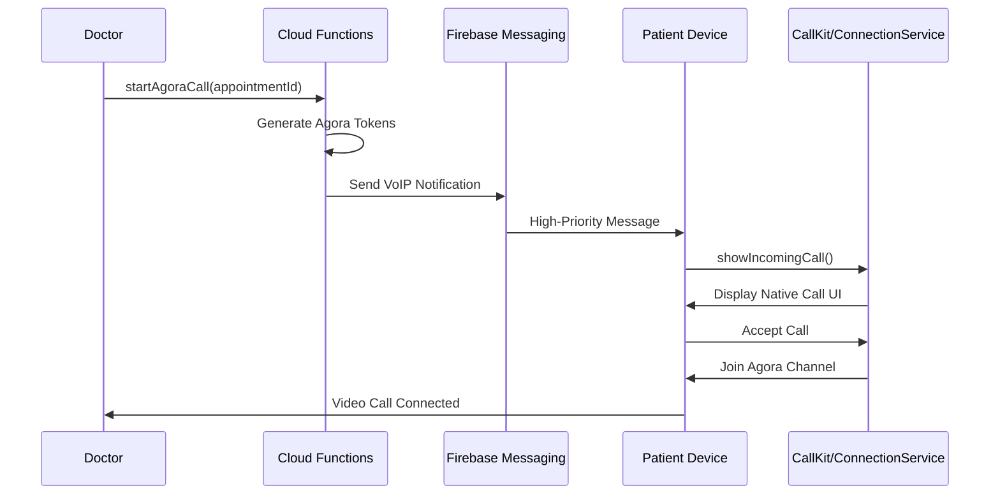
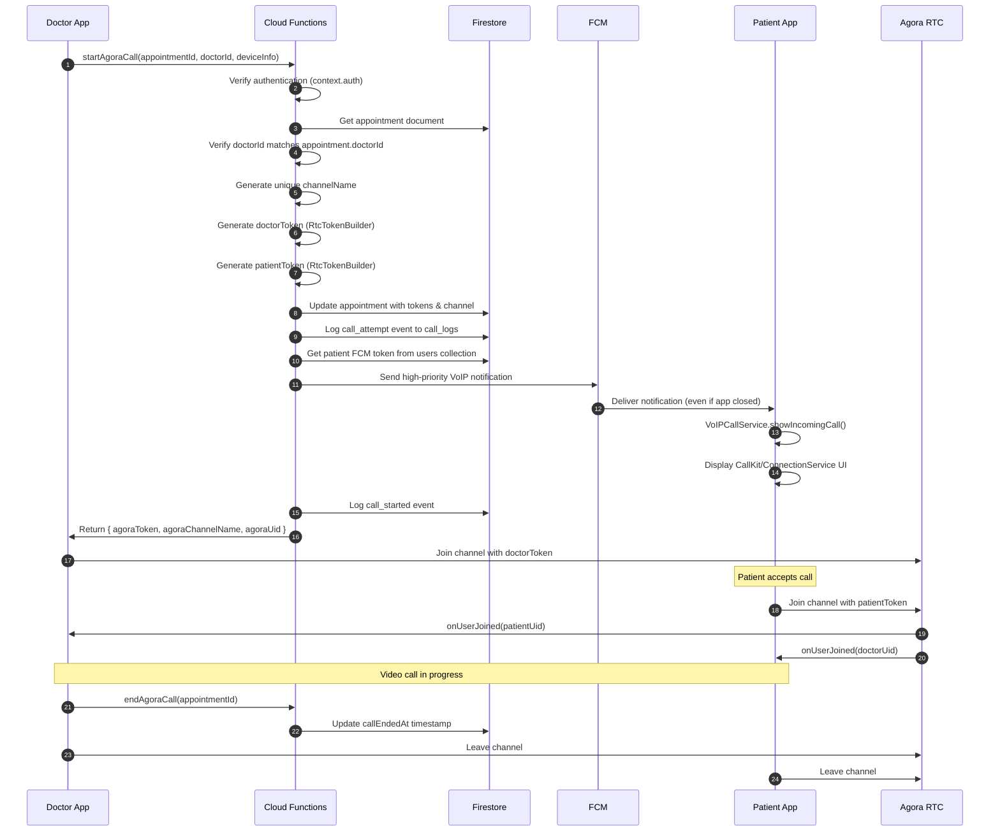

# 🏥 AndroCare360 - Project Overview

## 📋 Table of Contents
- [Introduction](#-introduction)
- [System Architecture](#-system-architecture)
- [Core Modules](#-core-modules)
- [Security Protocols](#-security-protocols)
- [Technical Features](#-technical-features)
- [Data Flow](#-data-flow)
- [Testing & QA Plan](#-testing--qa-plan)

---

## 🎯 Introduction

**AndroCare360** is a comprehensive medical consultation platform built with Flutter and Firebase, designed to connect patients with healthcare professionals through secure video consultations. The platform provides a complete telemedicine solution with real-time video calls, appointment management, electronic medical records (EMR), and integrated monitoring systems.

### Key Highlights
- **Real-time Video Consultations** using Agora.io RTC Engine
- **VoIP Call System** with iOS CallKit and Android ConnectionService
- **Comprehensive EMR** for multiple specialties (Nutrition, Physiotherapy, General Medicine)
- **Secure Authentication** with Firebase Auth
- **Cloud-Based Architecture** leveraging Firebase ecosystem
- **Multi-Platform Support** (Android & iOS)

---

## 🏗️ System Architecture

### High-Level Architecture

The system follows a **Clean Architecture** pattern with clear separation of concerns:

```
lib/
├── core/                    # Shared infrastructure
│   ├── services/           # Platform services (21 services)
│   ├── models/             # Data models
│   ├── constants/          # App-wide constants
│   └── di/                 # Dependency injection
├── features/               # Feature modules (16 features)
│   ├── auth/              # Authentication
│   ├── appointments/      # Appointment management
│   ├── doctor/            # Doctor-specific features
│   ├── patient/           # Patient-specific features
│   ├── emr/               # Electronic Medical Records
│   └── ...
└── shared/                # Shared UI components
```

### Technology Stack

| Layer | Technology | Purpose |
|-------|-----------|---------|
| **Frontend** | Flutter 3.x (Dart 3.10.4) | Cross-platform mobile app |
| **State Management** | Riverpod 2.5.1 | Reactive state management |
| **Backend** | Firebase (Cloud Firestore, Functions v2) | Serverless backend |
| **Database** | Cloud Firestore (`elajtech` database) | NoSQL document database |
| **Authentication** | Firebase Auth | User authentication |
| **Storage** | Firebase Storage | File storage (images, PDFs) |
| **Messaging** | Firebase Cloud Messaging (FCM) | Push notifications |
| **Video Engine** | Agora RTC Engine 6.3.2 | Real-time video/audio |
| **VoIP** | flutter_callkit_incoming 2.0.4 | Native call UI |
| **DI Container** | get_it + injectable | Dependency injection |

### Firebase Configuration

```yaml
Project ID: elajtech
Region: europe-west1
Database: elajtech (custom Firestore database)
Functions Runtime: Node.js (Cloud Functions v2)
```

### Key Firebase Services

1. **Cloud Firestore Collections**:
   - `users` - User profiles (doctors & patients)
   - `appointments` - Appointment records
   - `call_logs` - Video call monitoring logs
   - `emr_records` - Electronic medical records
   - `prescriptions`, `lab_requests`, `radiology_requests` - Medical documents

2. **Cloud Functions** (3 main functions):
   - `startAgoraCall` - Initiates video call with token generation
   - `endAgoraCall` - Ends video call session
   - `completeAppointment` - Marks appointment as completed

3. **Firebase Storage Structure**:
   - `/prescriptions/{userId}/{fileId}`
   - `/lab_results/{userId}/{fileId}`
   - `/radiology_images/{userId}/{fileId}`
   - `/profile_pictures/{userId}/{fileId}`

---

## 🔧 Core Modules

### 1. Video Engine (Agora Integration)

**File**: [`lib/core/services/agora_service.dart`](file:///c:/Users/moham/Desktop/androcare/elajtech/elajtech/lib/core/services/agora_service.dart)

#### Responsibilities
- Initialize Agora RTC Engine with App ID
- Join/leave video channels with secure tokens
- Control audio/video (mute, unmute, switch camera)
- Handle remote user events (join, leave)
- Monitor connection state and errors
- Integrate with Call Monitoring Service

#### Key Features
- **Singleton Pattern** for global access
- **Event Stream** for UI updates
- **Automatic Permission Handling** (camera, microphone)
- **Connection Failure Detection** with automatic logging
- **Media Device Error Tracking** (camera/microphone failures)

#### Token Security
```dart
// Tokens are generated server-side via Cloud Functions
// Client receives:
// - agoraToken: JWT token with 1-hour expiration
// - agoraChannelName: Unique channel identifier
// - agoraUid: User ID within the channel
```

#### Configuration
```dart
VideoEncoderConfiguration(
  dimensions: VideoDimensions(width: 640, height: 480),
  frameRate: 15,
  bitrate: 0, // Auto-adjust
  orientationMode: OrientationMode.orientationModeAdaptive,
)
```

---

### 2. VoIP Call System

**File**: [`lib/core/services/voip_call_service.dart`](file:///c:/Users/moham/Desktop/androcare/elajtech/elajtech/lib/core/services/voip_call_service.dart)

#### Platform Integration

| Platform | Technology | Features |
|----------|-----------|----------|
| **iOS** | CallKit | Native incoming call UI, lock screen display, system integration |
| **Android** | ConnectionService | Full-screen incoming call, notification channel, system ringtone |

#### Call Flow



#### VoIP Notification Payload

```javascript
// FCM Message Structure
{
  token: patientFcmToken,
  notification: {
    title: `مكالمة واردة من ${doctorName}`,
    body: 'اضغط للرد على الاستشارة'
  },
  data: {
    type: 'incoming_call',
    appointmentId: '...',
    doctorName: '...',
    agoraChannelName: '...',
    agoraToken: '...',
    agoraUid: '...'
  },
  android: {
    priority: 'high',
    notification: {
      channelId: 'incoming_calls',
      priority: 'max',
      sound: 'default'
    }
  },
  apns: {
    headers: { 'apns-priority': '10' },
    payload: {
      aps: {
        'content-available': 1,
        sound: 'default'
      }
    }
  }
}
```

#### Cold Start Handling
The system handles app launch from terminated state:
```dart
// Check for pending calls on app startup
await _checkActiveCallsOnStartup();

// Restore call data from CallKit/ConnectionService
final activeCalls = await FlutterCallkitIncoming.activeCalls();
if (activeCalls.isNotEmpty) {
  final callData = activeCalls.last['extra'];
  // Restore agoraToken, channelName, appointmentId
}
```

---

### 3. Call Monitoring Service

**File**: [`lib/core/services/call_monitoring_service.dart`](file:///c:/Users/moham/Desktop/androcare/elajtech/elajtech/lib/core/services/call_monitoring_service.dart)

#### Purpose
Comprehensive logging system for debugging and analytics.

#### Logged Events

| Event Type | Trigger | Data Collected |
|-----------|---------|----------------|
| `call_attempt` | Doctor initiates call | User ID, appointment ID, device info |
| `call_started` | Successfully joined channel | Channel name, Agora UID |
| `call_error` | Any failure during call | Error type, message, stack trace, device info |
| `connection_failure` | Network disconnection | Connection state, reason, metadata |
| `media_device_error` | Camera/mic failure | Device type, error message |
| `call_ended` | Call terminated | Duration, end reason |

#### Firestore Schema (`call_logs` collection)

```typescript
interface CallLog {
  id: string;                    // UUID
  appointmentId: string;
  userId: string;                // Doctor or patient ID
  eventType: CallLogEventType;
  timestamp: Timestamp;
  errorCode?: string;
  errorMessage?: string;
  stackTrace?: string;
  deviceInfo?: DeviceInfoModel;
  metadata?: Record<string, any>;
}
```

#### Integration with Agora Service
```dart
// Automatic logging on connection state changes
onConnectionStateChanged: (connection, state, reason) async {
  if (state == ConnectionStateType.connectionStateFailed) {
    await _callMonitoringService.logConnectionFailure(
      appointmentId: _currentAppointmentId!,
      userId: _currentUserId!,
      reason: 'Connection state: $state, Reason: $reason',
      metadata: {
        'connectionState': state.toString(),
        'connectionReason': reason.toString(),
      },
    );
  }
}
```

---

### 4. Device Info Service

**File**: [`lib/core/services/device_info_service.dart`](file:///c:/Users/moham/Desktop/androcare/elajtech/elajtech/lib/core/services/device_info_service.dart)

#### Collected Information

```dart
class DeviceInfoModel {
  final String platform;           // 'android' or 'ios'
  final String deviceModel;        // e.g., 'Samsung Galaxy S21'
  final String manufacturer;       // e.g., 'Samsung', 'Apple'
  final String osVersion;          // e.g., 'Android 13', 'iOS 16.5'
  final String appVersion;         // e.g., '1.0.0'
  final String appBuildNumber;     // e.g., '1'
  final String connectionType;     // 'wifi', 'mobile', 'none'
  final int? availableMemoryMB;    // Optional
  final String screenResolution;   // e.g., '1080x2400'
}
```

#### Caching Strategy
- Device info is cached on first retrieval
- Only `connectionType` is refreshed on subsequent calls
- Cache can be manually cleared if needed

#### Usage in Call Monitoring
```dart
// Automatically collected when logging errors
await _callMonitoringService.logCallError(
  appointmentId: appointmentId,
  userId: userId,
  errorType: 'join_channel_failed',
  errorMessage: e.toString(),
  // deviceInfo is auto-collected if not provided
);
```

---

### 5. FCM Service

**File**: [`lib/core/services/fcm_service.dart`](file:///c:/Users/moham/Desktop/androcare/elajtech/elajtech/lib/core/services/fcm_service.dart)

#### Message Handlers

1. **Background Handler** (`@pragma('vm:entry-point')`)
   - Runs when app is in background or terminated
   - Displays incoming call UI via VoIPCallService
   - Must be top-level function

2. **Foreground Handler** (`FirebaseMessaging.onMessage`)
   - Runs when app is active
   - Shows local notification for regular messages
   - Triggers incoming call UI for VoIP calls

3. **Notification Tap Handler** (`FirebaseMessaging.onMessageOpenedApp`)
   - Runs when user taps notification
   - Routes to appropriate screen based on message type

#### Permission Request
```dart
final settings = await _messaging.requestPermission(
  criticalAlert: true,  // Essential for VoIP calls
);
```

---

## 🔐 Security Protocols

### 1. Agora Token Security

#### Server-Side Token Generation
**File**: [`functions/index.js`](file:///c:/Users/moham/Desktop/androcare/elajtech/elajtech/functions/index.js) (Lines 23-51)

```javascript
function generateAgoraToken(channelName, uid, role = 'publisher', expirationTime = 3600) {
  // Secrets stored in Firebase Functions config
  const appId = functions.config().agora.app_id;
  const appCertificate = functions.config().agora.app_certificate;
  
  // Generate token with 1-hour expiration
  const token = RtcTokenBuilder.buildTokenWithUid(
    appId,
    appCertificate,
    channelName,
    uid,
    RtcRole.PUBLISHER,
    currentTimestamp + expirationTime
  );
  
  return token;
}
```

#### Environment Secrets Management

```bash
# Set secrets via Firebase CLI
firebase functions:config:set agora.app_id="YOUR_APP_ID"
firebase functions:config:set agora.app_certificate="YOUR_CERTIFICATE"

# Access in code
process.env.AGORA_APP_ID  # Alternative method
```

> **⚠️ CRITICAL**: Never expose `AGORA_APP_CERTIFICATE` in client code. Always generate tokens server-side.

---

### 2. Firebase Auth Integration

#### Doctor Authorization Check
```javascript
// In startAgoraCall Cloud Function
if (appointment.doctorId !== doctorId) {
  throw new functions.https.HttpsError(
    'permission-denied',
    'غير مصرح لك ببدء هذه المكالمة'
  );
}
```

#### User ID Binding
- Each Agora channel is tied to a specific `appointmentId`
- Only the assigned doctor can generate tokens for that appointment
- Patient receives token via secure FCM data payload

---

### 3. Firestore Security Rules

**File**: [`firestore.rules`](file:///c:/Users/moham/Desktop/androcare/elajtech/elajtech/firestore.rules)

Key rules:
- Users can only read/write their own profile
- Appointments are accessible only to involved doctor and patient
- Call logs are write-only (prevent tampering)
- EMR records require role-based access

---

### 4. Data Encryption

**Service**: [`lib/core/services/encryption_service.dart`](file:///c:/Users/moham/Desktop/androcare/elajtech/elajtech/lib/core/services/encryption_service.dart)

- Sensitive data encrypted before storage
- Uses `encrypt` package with AES encryption
- Keys stored in `flutter_secure_storage`

---

### 5. Firebase App Check (Temporarily Disabled)

**Status**: Commented out in [`main.dart`](file:///c:/Users/moham/Desktop/androcare/elajtech/elajtech/lib/main.dart) (Lines 159-232)

**Planned Implementation**:
- **Debug Mode**: Debug provider for testing
- **Release Mode**: Play Integrity API for Android
- **Purpose**: Prevent unauthorized API access

---

## 🚀 Technical Features

### 1. Dynamic Connectivity Handling

**Challenge**: `connectivity_plus` API changed from returning single value to list.

**Solution** ([`device_info_service.dart`](file:///c:/Users/moham/Desktop/androcare/elajtech/elajtech/lib/core/services/device_info_service.dart#L140-L171)):
```dart
Future<String> _getConnectionType() async {
  final dynamic result = await _connectivity.checkConnectivity();
  
  // Handle both single value and list return types
  List<ConnectivityResult> results;
  if (result is List<ConnectivityResult>) {
    results = result;
  } else if (result is ConnectivityResult) {
    results = [result];
  } else {
    return 'unknown';
  }
  
  // Check for connection types
  if (results.contains(ConnectivityResult.wifi)) return 'wifi';
  if (results.contains(ConnectivityResult.mobile)) return 'mobile';
  // ...
}
```

---

### 2. Atomic Timestamp Updates

**Usage**: `FieldValue.serverTimestamp()` for accurate audit logs.

```javascript
// In Cloud Functions
await appointmentRef.update({
  callStartedAt: admin.firestore.FieldValue.serverTimestamp(),
  status: 'scheduled',
});
```

**Benefits**:
- Eliminates client-server time drift
- Ensures consistent timestamps across all clients
- Critical for call duration calculations

---

### 3. Lifecycle-Aware Call Cleanup

**File**: [`main.dart`](file:///c:/Users/moham/Desktop/androcare/elajtech/elajtech/lib/main.dart) (Lines 485-519)

```dart
@override
void didChangeAppLifecycleState(AppLifecycleState state) {
  if (state == AppLifecycleState.resumed) {
    unawaited(_checkAndCleanupCalls());
  }
}

Future<void> _checkAndCleanupCalls() async {
  // Clean up CallKit/ConnectionService notifications
  final appointmentId = await VoIPCallService().cleanupAfterCall();
  
  if (appointmentId != null && user.userType == UserType.doctor) {
    // Show confirmation dialog for doctor
    await _showDoctorSessionEndDialog(appointmentId);
  } else {
    // Auto-complete for patient
    await completeAppointment(appointmentId);
  }
}
```

---

### 4. Screen Resolution Detection

**Android**:
```dart
final view = ui.PlatformDispatcher.instance.views.first;
final physicalSize = view.physicalSize;
screenResolution = '${physicalSize.width.toInt()}x${physicalSize.height.toInt()}';
```

**iOS**: Uses device model name (can be enhanced with specific resolution mapping).

---

### 5. Missed Call & Decline Handling

**VoIP Service** ([`voip_call_service.dart`](file:///c:/Users/moham/Desktop/androcare/elajtech/elajtech/lib/core/services/voip_call_service.dart#L342-L391)):

```dart
void _onCallTimeout(CallEvent event) {
  // Notify server of missed call
  _notifyServerMissedCall(appointmentId);
}

void _onCallDeclined(CallEvent event) {
  // Notify server of declined call
  _notifyServerCallDeclined(appointmentId);
}
```

**Cloud Functions** (to be implemented):
- `handleMissedCall` - Updates appointment status, sends notification to doctor
- `handleCallDeclined` - Logs decline reason, notifies doctor

---

## 📊 Data Flow

### Complete Call Initiation Flow



### Appointment Booking to Call Flow

1. **Booking Phase**:
   - Patient selects doctor and time slot
   - `AppointmentRepository` creates Firestore document
   - Status: `pending` → `confirmed` (after doctor approval)

2. **Pre-Call Phase**:
   - Doctor opens appointment screen
   - Sees "Start Video Call" button
   - Clicks button → triggers `startAgoraCall` Cloud Function

3. **Call Initiation**:
   - Cloud Function generates Agora tokens
   - Updates Firestore with `agoraChannelName`, `agoraToken`, `doctorAgoraToken`
   - Sends FCM notification to patient

4. **Patient Notification**:
   - FCM delivers high-priority message
   - `FCMService` background handler receives message
   - `VoIPCallService.showIncomingCall()` displays native UI

5. **Call Connection**:
   - Patient accepts → joins Agora channel
   - Doctor already in channel
   - Agora triggers `onUserJoined` events
   - Video streams established

6. **Call End**:
   - Either party leaves channel
   - `endAgoraCall` updates `callEndedAt`
   - Doctor manually marks appointment as `completed`

---

## ✅ Testing & QA Plan

### 1. Video Call Testing

#### Unit Tests
- [ ] Agora token generation (server-side)
- [ ] Channel name uniqueness
- [ ] Token expiration validation
- [ ] Permission handling

#### Integration Tests
- [ ] End-to-end call flow (doctor → patient)
- [ ] Call acceptance from terminated app state
- [ ] Call decline handling
- [ ] Missed call timeout (60 seconds)
- [ ] Network disconnection recovery

#### Device Tests

| Scenario | Android | iOS |
|----------|---------|-----|
| App in foreground | ✅ | ✅ |
| App in background | ✅ | ✅ |
| App terminated (cold start) | ⚠️ Test | ⚠️ Test |
| Lock screen display | ✅ | ✅ |
| Multiple incoming calls | ⚠️ Test | ⚠️ Test |

---

### 2. Security Testing

#### Checklist
- [ ] Verify Agora tokens expire after 1 hour
- [ ] Attempt unauthorized call start (wrong doctorId)
- [ ] Test Firestore security rules
- [ ] Validate FCM token refresh mechanism
- [ ] Test encryption service for sensitive data

---

### 3. Performance Testing

#### Metrics to Monitor
- **Call Setup Time**: < 3 seconds from button press to ringing
- **Video Quality**: Maintain 640x480 @ 15fps on 3G connection
- **Memory Usage**: < 200MB during active call
- **Battery Drain**: < 10% per 30-minute call

#### Tools
- Flutter DevTools (Memory, Performance tabs)
- Agora Analytics Dashboard
- Firebase Performance Monitoring

---

### 4. Call Monitoring Validation

#### Test Cases
- [ ] Verify `call_attempt` logged on button press
- [ ] Verify `call_started` logged after successful join
- [ ] Trigger connection failure → check `connection_failure` log
- [ ] Disable camera → check `media_device_error` log
- [ ] Verify device info collected correctly

#### Firestore Query Test
```dart
// Retrieve all error logs for debugging
final errorLogs = await CallMonitoringService().getErrorLogs(limit: 100);
for (final log in errorLogs) {
  print('Error: ${log.errorCode} - ${log.errorMessage}');
  print('Device: ${log.deviceInfo?.deviceModel}');
}
```

---

### 5. UI/UX Testing

#### Patient Experience
- [ ] Incoming call displays doctor name correctly
- [ ] Call UI shows video feed within 2 seconds
- [ ] Mute/unmute buttons work correctly
- [ ] Switch camera button works
- [ ] End call button terminates session

#### Doctor Experience
- [ ] "Start Call" button enabled only for confirmed appointments
- [ ] Loading indicator during token generation
- [ ] Error message if patient doesn't answer (timeout)
- [ ] Confirmation dialog after call ends
- [ ] Appointment status updates to "completed"

---

### 6. Edge Cases

| Scenario | Expected Behavior |
|----------|-------------------|
| Patient has no FCM token | Log error, show "Patient unreachable" message |
| Agora App ID missing | Cloud Function throws `failed-precondition` error |
| Network switches mid-call (WiFi → Mobile) | Agora auto-reconnects, log `connection_failure` |
| App crashes during call | On restart, check for active calls and cleanup |
| Doctor cancels before patient answers | Send cancel notification, update appointment status |

---

### 7. Regression Testing

After each deployment:
1. Run full test suite (unit + integration)
2. Perform manual smoke test:
   - Login as doctor
   - Start video call
   - Login as patient (different device)
   - Accept call
   - Verify video/audio
   - End call
   - Verify appointment marked as completed

---

## 📦 Dependencies

### Core Dependencies

```yaml
# Video & VoIP
agora_rtc_engine: ^6.3.2
flutter_callkit_incoming: ^2.0.4+1
permission_handler: ^12.0.1

# Firebase
firebase_core: ^3.8.1
firebase_auth: ^5.3.3
cloud_firestore: ^5.5.2
cloud_functions: ^5.6.2
firebase_messaging: ^15.2.10

# State Management
flutter_riverpod: ^2.5.1

# Dependency Injection
get_it: ^9.2.0
injectable: ^2.7.1+4

# Device Info
device_info_plus: ^12.0.0
package_info_plus: ^8.1.3
connectivity_plus: ^5.0.0

# Utilities
uuid: any
encrypt: ^5.0.0
```

---

## 🔄 Future Enhancements

1. **Firebase App Check**: Re-enable Play Integrity for production
2. **Call Recording**: Implement server-side recording with user consent
3. **Screen Sharing**: Add Agora screen share extension
4. **Group Calls**: Support multi-party consultations
5. **AI Transcription**: Real-time medical transcription
6. **Analytics Dashboard**: Admin panel for call quality metrics

---

## 👥 Team Onboarding

### For New Developers

1. **Setup**:
   ```bash
   flutter pub get
   firebase login
   firebase use elajtech
   ```

2. **Environment Secrets**:
   - Request Agora App ID and Certificate from team lead
   - Set Firebase Functions config:
     ```bash
     firebase functions:config:set agora.app_id="..."
     firebase functions:config:set agora.app_certificate="..."
     ```

3. **Run App**:
   ```bash
   flutter run
   ```

4. **Deploy Functions**:
   ```bash
   cd functions
   npm install
   firebase deploy --only functions
   ```

### Key Files to Review

1. [`functions/index.js`](file:///c:/Users/moham/Desktop/androcare/elajtech/elajtech/functions/index.js) - Cloud Functions
2. [`lib/core/services/agora_service.dart`](file:///c:/Users/moham/Desktop/androcare/elajtech/elajtech/lib/core/services/agora_service.dart) - Video engine
3. [`lib/core/services/voip_call_service.dart`](file:///c:/Users/moham/Desktop/androcare/elajtech/elajtech/lib/core/services/voip_call_service.dart) - VoIP system
4. [`lib/main.dart`](file:///c:/Users/moham/Desktop/androcare/elajtech/elajtech/lib/main.dart) - App initialization

---

## 📞 Support

For technical questions or issues:
- Review existing documentation in `/docs` folder
- Check `call_logs` collection in Firestore for debugging
- Consult Agora documentation: https://docs.agora.io/

---

**Last Updated**: 2026-02-06  
**Version**: 1.0.0  
**Maintained by**: AndroCare360 Development Team
