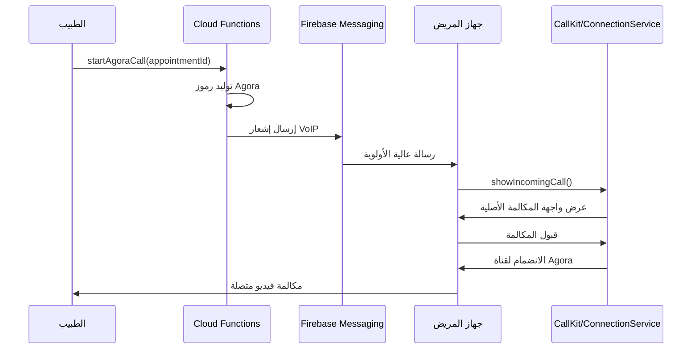
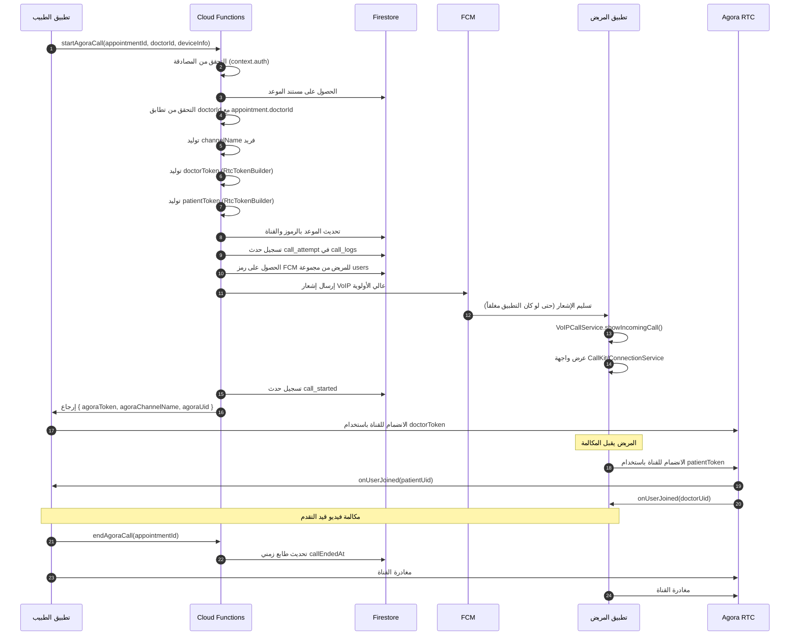

<div dir="rtl" lang="ar">

# 🏥 AndroCare360 - نظرة عامة على المشروع

## 📋 جدول المحتويات
- [المقدمة](#-المقدمة)
- [البنية المعمارية للنظام](#-البنية-المعمارية-للنظام)
- [الوحدات الأساسية](#-الوحدات-الأساسية)
- [بروتوكولات الأمان](#-بروتوكولات-الأمان)
- [الميزات التقنية](#-الميزات-التقنية)
- [تدفق البيانات](#-تدفق-البيانات)
- [خطة الاختبار وضمان الجودة](#-خطة-الاختبار-وضمان-الجودة)

---

## 🎯 المقدمة

**AndroCare360** هي منصة استشارات طبية شاملة مبنية باستخدام Flutter و Firebase، مصممة لربط المرضى بمقدمي الرعاية الصحية من خلال استشارات فيديو آمنة. توفر المنصة حلاً كاملاً للطب عن بُعد مع مكالمات فيديو في الوقت الفعلي، وإدارة المواعيد، والسجلات الطبية الإلكترونية (EMR)، وأنظمة المراقبة المتكاملة.

### النقاط الرئيسية
- **استشارات فيديو في الوقت الفعلي** باستخدام Agora.io RTC Engine
- **نظام مكالمات VoIP** مع iOS CallKit و Android ConnectionService
- **سجلات طبية إلكترونية شاملة** لتخصصات متعددة (التغذية، العلاج الطبيعي، الطب العام)
- **مصادقة آمنة** باستخدام Firebase Auth
- **بنية سحابية** تستفيد من نظام Firebase البيئي
- **دعم متعدد المنصات** (Android و iOS)

---

## 🏗️ البنية المعمارية للنظام

### البنية المعمارية عالية المستوى

يتبع النظام نمط **Clean Architecture** مع فصل واضح للمسؤوليات:

```
lib/
├── core/                    # البنية التحتية المشتركة
│   ├── services/           # خدمات المنصة (21 خدمة)
│   ├── models/             # نماذج البيانات
│   ├── constants/          # الثوابت على مستوى التطبيق
│   └── di/                 # حقن التبعيات
├── features/               # وحدات الميزات (16 ميزة)
│   ├── auth/              # المصادقة
│   ├── appointments/      # إدارة المواعيد
│   ├── doctor/            # ميزات خاصة بالأطباء
│   ├── patient/           # ميزات خاصة بالمرضى
│   ├── emr/               # السجلات الطبية الإلكترونية
│   └── ...
└── shared/                # مكونات واجهة المستخدم المشتركة
```

### المكدس التقني

| الطبقة | التقنية | الغرض |
|-------|---------|-------|
| **الواجهة الأمامية** | Flutter 3.x (Dart 3.10.4) | تطبيق موبايل متعدد المنصات |
| **إدارة الحالة** | Riverpod 2.5.1 | إدارة حالة تفاعلية |
| **الخلفية** | Firebase (Cloud Firestore, Functions v2) | خلفية بدون خادم |
| **قاعدة البيانات** | Cloud Firestore (قاعدة بيانات `elajtech`) | قاعدة بيانات NoSQL |
| **المصادقة** | Firebase Auth | مصادقة المستخدم |
| **التخزين** | Firebase Storage | تخزين الملفات (صور، PDF) |
| **المراسلة** | Firebase Cloud Messaging (FCM) | إشعارات الدفع |
| **محرك الفيديو** | Agora RTC Engine 6.3.2 | فيديو/صوت في الوقت الفعلي |
| **VoIP** | flutter_callkit_incoming 2.0.4 | واجهة مكالمات أصلية |
| **حاوية DI** | get_it + injectable | حقن التبعيات |

### إعدادات Firebase

```yaml
معرف المشروع: elajtech
المنطقة: europe-west1
قاعدة البيانات: elajtech (قاعدة بيانات Firestore مخصصة)
بيئة تشغيل الدوال: Node.js (Cloud Functions v2)
```

### خدمات Firebase الرئيسية

1. **مجموعات Cloud Firestore**:
   - `users` - ملفات تعريف المستخدمين (أطباء ومرضى)
   - `appointments` - سجلات المواعيد
   - `call_logs` - سجلات مراقبة مكالمات الفيديو
   - `emr_records` - السجلات الطبية الإلكترونية
   - `prescriptions`, `lab_requests`, `radiology_requests` - المستندات الطبية

2. **Cloud Functions** (3 دوال رئيسية):
   - `startAgoraCall` - بدء مكالمة فيديو مع توليد الرموز
   - `endAgoraCall` - إنهاء جلسة مكالمة الفيديو
   - `completeAppointment` - تحديد الموعد كمكتمل

3. **هيكل Firebase Storage**:
   - `/prescriptions/{userId}/{fileId}`
   - `/lab_results/{userId}/{fileId}`
   - `/radiology_images/{userId}/{fileId}`
   - `/profile_pictures/{userId}/{fileId}`

---

## 🔧 الوحدات الأساسية

### 1. محرك الفيديو (تكامل Agora)

**الملف**: [`lib/core/services/agora_service.dart`](file:///c:/Users/moham/Desktop/androcare/elajtech/elajtech/lib/core/services/agora_service.dart)

#### المسؤوليات
- تهيئة Agora RTC Engine باستخدام App ID
- الانضمام/المغادرة من قنوات الفيديو باستخدام رموز آمنة
- التحكم في الصوت/الفيديو (كتم، إلغاء الكتم، تبديل الكاميرا)
- معالجة أحداث المستخدمين البعيدين (انضمام، مغادرة)
- مراقبة حالة الاتصال والأخطاء
- التكامل مع خدمة مراقبة المكالمات

#### الميزات الرئيسية
- **نمط Singleton** للوصول العام
- **Event Stream** لتحديثات واجهة المستخدم
- **معالجة تلقائية للأذونات** (الكاميرا، الميكروفون)
- **كشف فشل الاتصال** مع تسجيل تلقائي
- **تتبع أخطاء أجهزة الوسائط** (فشل الكاميرا/الميكروفون)

#### أمان الرموز
```dart
// يتم توليد الرموز من جانب الخادم عبر Cloud Functions
// يستلم العميل:
// - agoraToken: رمز JWT مع انتهاء صلاحية لمدة ساعة واحدة
// - agoraChannelName: معرف قناة فريد
// - agoraUid: معرف المستخدم داخل القناة
```

#### التكوين
```dart
VideoEncoderConfiguration(
  dimensions: VideoDimensions(width: 640, height: 480),
  frameRate: 15,
  bitrate: 0, // ضبط تلقائي
  orientationMode: OrientationMode.orientationModeAdaptive,
)
```

---

### 2. نظام مكالمات VoIP

**الملف**: [`lib/core/services/voip_call_service.dart`](file:///c:/Users/moham/Desktop/androcare/elajtech/elajtech/lib/core/services/voip_call_service.dart)

#### تكامل المنصة

| المنصة | التقنية | الميزات |
|--------|---------|---------|
| **iOS** | CallKit | واجهة مكالمة واردة أصلية، عرض شاشة القفل، تكامل النظام |
| **Android** | ConnectionService | مكالمة واردة بملء الشاشة، قناة إشعارات، نغمة رنين النظام |

#### تدفق المكالمة



#### حمولة إشعار VoIP

```javascript
// هيكل رسالة FCM
{
  token: patientFcmToken,
  notification: {
    title: `مكالمة واردة من ${doctorName}`,
    body: 'اضغط للرد على الاستشارة'
  },
  data: {
    type: 'incoming_call',
    appointmentId: '...',
    doctorName: '...',
    agoraChannelName: '...',
    agoraToken: '...',
    agoraUid: '...'
  },
  android: {
    priority: 'high',
    notification: {
      channelId: 'incoming_calls',
      priority: 'max',
      sound: 'default'
    }
  },
  apns: {
    headers: { 'apns-priority': '10' },
    payload: {
      aps: {
        'content-available': 1,
        sound: 'default'
      }
    }
  }
}
```

#### معالجة البدء البارد (Cold Start)
يتعامل النظام مع إطلاق التطبيق من حالة الإنهاء:
```dart
// فحص المكالمات المعلقة عند بدء التطبيق
await _checkActiveCallsOnStartup();

// استعادة بيانات المكالمة من CallKit/ConnectionService
final activeCalls = await FlutterCallkitIncoming.activeCalls();
if (activeCalls.isNotEmpty) {
  final callData = activeCalls.last['extra'];
  // استعادة agoraToken, channelName, appointmentId
}
```

---

### 3. خدمة مراقبة المكالمات

**الملف**: [`lib/core/services/call_monitoring_service.dart`](file:///c:/Users/moham/Desktop/androcare/elajtech/elajtech/lib/core/services/call_monitoring_service.dart)

#### الغرض
نظام تسجيل شامل لتصحيح الأخطاء والتحليلات.

#### الأحداث المسجلة

| نوع الحدث | المحفز | البيانات المجمعة |
|-----------|--------|------------------|
| `call_attempt` | الطبيب يبدأ المكالمة | معرف المستخدم، معرف الموعد، معلومات الجهاز |
| `call_started` | انضمام ناجح للقناة | اسم القناة، Agora UID |
| `call_error` | أي فشل أثناء المكالمة | نوع الخطأ، الرسالة، stack trace، معلومات الجهاز |
| `connection_failure` | انقطاع الشبكة | حالة الاتصال، السبب، البيانات الوصفية |
| `media_device_error` | فشل الكاميرا/الميكروفون | نوع الجهاز، رسالة الخطأ |
| `call_ended` | إنهاء المكالمة | المدة، سبب الإنهاء |

#### مخطط Firestore (مجموعة `call_logs`)

```typescript
interface CallLog {
  id: string;                    // UUID
  appointmentId: string;
  userId: string;                // معرف الطبيب أو المريض
  eventType: CallLogEventType;
  timestamp: Timestamp;
  errorCode?: string;
  errorMessage?: string;
  stackTrace?: string;
  deviceInfo?: DeviceInfoModel;
  metadata?: Record<string, any>;
}
```

---

### 4. خدمة معلومات الجهاز

**الملف**: [`lib/core/services/device_info_service.dart`](file:///c:/Users/moham/Desktop/androcare/elajtech/elajtech/lib/core/services/device_info_service.dart)

#### المعلومات المجمعة

```dart
class DeviceInfoModel {
  final String platform;           // 'android' أو 'ios'
  final String deviceModel;        // مثل: 'Samsung Galaxy S21'
  final String manufacturer;       // مثل: 'Samsung', 'Apple'
  final String osVersion;          // مثل: 'Android 13', 'iOS 16.5'
  final String appVersion;         // مثل: '1.0.0'
  final String appBuildNumber;     // مثل: '1'
  final String connectionType;     // 'wifi', 'mobile', 'none'
  final int? availableMemoryMB;    // اختياري
  final String screenResolution;   // مثل: '1080x2400'
}
```

#### استراتيجية التخزين المؤقت
- يتم تخزين معلومات الجهاز مؤقتاً عند الاسترجاع الأول
- يتم تحديث `connectionType` فقط في الاستدعاءات اللاحقة
- يمكن مسح ذاكرة التخزين المؤقت يدوياً عند الحاجة

---

### 5. خدمة FCM

**الملف**: [`lib/core/services/fcm_service.dart`](file:///c:/Users/moham/Desktop/androcare/elajtech/elajtech/lib/core/services/fcm_service.dart)

#### معالجات الرسائل

1. **معالج الخلفية** (`@pragma('vm:entry-point')`)
   - يعمل عندما يكون التطبيق في الخلفية أو منتهياً
   - يعرض واجهة المكالمة الواردة عبر VoIPCallService
   - يجب أن يكون دالة على المستوى الأعلى

2. **معالج المقدمة** (`FirebaseMessaging.onMessage`)
   - يعمل عندما يكون التطبيق نشطاً
   - يعرض إشعاراً محلياً للرسائل العادية
   - يطلق واجهة المكالمة الواردة لمكالمات VoIP

3. **معالج النقر على الإشعار** (`FirebaseMessaging.onMessageOpenedApp`)
   - يعمل عندما ينقر المستخدم على الإشعار
   - يوجه إلى الشاشة المناسبة بناءً على نوع الرسالة

#### طلب الإذن
```dart
final settings = await _messaging.requestPermission(
  criticalAlert: true,  // ضروري لمكالمات VoIP
);
```

---

## 🔐 بروتوكولات الأمان

### 1. أمان رموز Agora

#### توليد الرموز من جانب الخادم
**الملف**: [`functions/index.js`](file:///c:/Users/moham/Desktop/androcare/elajtech/elajtech/functions/index.js) (الأسطر 23-51)

```javascript
function generateAgoraToken(channelName, uid, role = 'publisher', expirationTime = 3600) {
  // الأسرار مخزنة في إعدادات Firebase Functions
  const appId = functions.config().agora.app_id;
  const appCertificate = functions.config().agora.app_certificate;
  
  // توليد رمز مع انتهاء صلاحية لمدة ساعة واحدة
  const token = RtcTokenBuilder.buildTokenWithUid(
    appId,
    appCertificate,
    channelName,
    uid,
    RtcRole.PUBLISHER,
    currentTimestamp + expirationTime
  );
  
  return token;
}
```

#### إدارة الأسرار البيئية

```bash
# تعيين الأسرار عبر Firebase CLI
firebase functions:config:set agora.app_id="YOUR_APP_ID"
firebase functions:config:set agora.app_certificate="YOUR_CERTIFICATE"

# الوصول في الكود
process.env.AGORA_APP_ID  # طريقة بديلة
```

> **⚠️ حرج**: لا تكشف أبداً `AGORA_APP_CERTIFICATE` في كود العميل. قم دائماً بتوليد الرموز من جانب الخادم.

---

### 2. تكامل Firebase Auth

#### فحص تفويض الطبيب
```javascript
// في دالة startAgoraCall Cloud Function
if (appointment.doctorId !== doctorId) {
  throw new functions.https.HttpsError(
    'permission-denied',
    'غير مصرح لك ببدء هذه المكالمة'
  );
}
```

#### ربط معرف المستخدم
- كل قناة Agora مرتبطة بـ `appointmentId` محدد
- فقط الطبيب المعين يمكنه توليد رموز لذلك الموعد
- يستلم المريض الرمز عبر حمولة بيانات FCM الآمنة

---

### 3. قواعد أمان Firestore

**الملف**: [`firestore.rules`](file:///c:/Users/moham/Desktop/androcare/elajtech/elajtech/firestore.rules)

القواعد الرئيسية:
- يمكن للمستخدمين قراءة/كتابة ملفهم الشخصي فقط
- المواعيد متاحة فقط للطبيب والمريض المعنيين
- سجلات المكالمات للكتابة فقط (منع التلاعب)
- سجلات EMR تتطلب وصولاً قائماً على الدور

---

### 4. تشفير البيانات

**الخدمة**: [`lib/core/services/encryption_service.dart`](file:///c:/Users/moham/Desktop/androcare/elajtech/elajtech/lib/core/services/encryption_service.dart)

- البيانات الحساسة مشفرة قبل التخزين
- يستخدم حزمة `encrypt` مع تشفير AES
- المفاتيح مخزنة في `flutter_secure_storage`

---

### 5. Firebase App Check (معطل مؤقتاً)

**الحالة**: معلق في [`main.dart`](file:///c:/Users/moham/Desktop/androcare/elajtech/elajtech/lib/main.dart) (الأسطر 159-232)

**التنفيذ المخطط**:
- **وضع التصحيح**: موفر التصحيح للاختبار
- **وضع الإصدار**: Play Integrity API لنظام Android
- **الغرض**: منع الوصول غير المصرح به إلى API

---

## 🚀 الميزات التقنية

### 1. معالجة الاتصال الديناميكي

**التحدي**: تغيرت واجهة برمجة التطبيقات `connectivity_plus` من إرجاع قيمة واحدة إلى قائمة.

**الحل** ([`device_info_service.dart`](file:///c:/Users/moham/Desktop/androcare/elajtech/elajtech/lib/core/services/device_info_service.dart#L140-L171)):
```dart
Future<String> _getConnectionType() async {
  final dynamic result = await _connectivity.checkConnectivity();
  
  // معالجة كل من أنواع الإرجاع القيمة الواحدة والقائمة
  List<ConnectivityResult> results;
  if (result is List<ConnectivityResult>) {
    results = result;
  } else if (result is ConnectivityResult) {
    results = [result];
  } else {
    return 'unknown';
  }
  
  // فحص أنواع الاتصال
  if (results.contains(ConnectivityResult.wifi)) return 'wifi';
  if (results.contains(ConnectivityResult.mobile)) return 'mobile';
  // ...
}
```

---

### 2. تحديثات الطابع الزمني الذرية

**الاستخدام**: `FieldValue.serverTimestamp()` لسجلات تدقيق دقيقة.

```javascript
// في Cloud Functions
await appointmentRef.update({
  callStartedAt: admin.firestore.FieldValue.serverTimestamp(),
  status: 'scheduled',
});
```

**الفوائد**:
- يزيل انحراف الوقت بين العميل والخادم
- يضمن طوابع زمنية متسقة عبر جميع العملاء
- حرج لحسابات مدة المكالمة

---

### 3. تنظيف المكالمات الواعي بدورة الحياة

**الملف**: [`main.dart`](file:///c:/Users/moham/Desktop/androcare/elajtech/elajtech/lib/main.dart) (الأسطر 485-519)

```dart
@override
void didChangeAppLifecycleState(AppLifecycleState state) {
  if (state == AppLifecycleState.resumed) {
    unawaited(_checkAndCleanupCalls());
  }
}

Future<void> _checkAndCleanupCalls() async {
  // تنظيف إشعارات CallKit/ConnectionService
  final appointmentId = await VoIPCallService().cleanupAfterCall();
  
  if (appointmentId != null && user.userType == UserType.doctor) {
    // عرض مربع حوار تأكيد للطبيب
    await _showDoctorSessionEndDialog(appointmentId);
  } else {
    // إكمال تلقائي للمريض
    await completeAppointment(appointmentId);
  }
}
```

---

### 4. كشف دقة الشاشة

**Android**:
```dart
final view = ui.PlatformDispatcher.instance.views.first;
final physicalSize = view.physicalSize;
screenResolution = '${physicalSize.width.toInt()}x${physicalSize.height.toInt()}';
```

**iOS**: يستخدم اسم طراز الجهاز (يمكن تحسينه بتعيين دقة محددة).

---

### 5. معالجة المكالمات الفائتة والمرفوضة

**خدمة VoIP** ([`voip_call_service.dart`](file:///c:/Users/moham/Desktop/androcare/elajtech/elajtech/lib/core/services/voip_call_service.dart#L342-L391)):

```dart
void _onCallTimeout(CallEvent event) {
  // إخطار الخادم بالمكالمة الفائتة
  _notifyServerMissedCall(appointmentId);
}

void _onCallDeclined(CallEvent event) {
  // إخطار الخادم بالمكالمة المرفوضة
  _notifyServerCallDeclined(appointmentId);
}
```

**Cloud Functions** (سيتم تنفيذها):
- `handleMissedCall` - تحديث حالة الموعد، إرسال إشعار للطبيب
- `handleCallDeclined` - تسجيل سبب الرفض، إخطار الطبيب

---

## 📊 تدفق البيانات

### تدفق بدء المكالمة الكامل



### من حجز الموعد إلى تدفق المكالمة

1. **مرحلة الحجز**:
   - المريض يختار الطبيب والوقت
   - `AppointmentRepository` ينشئ مستند Firestore
   - الحالة: `pending` → `confirmed` (بعد موافقة الطبيب)

2. **مرحلة ما قبل المكالمة**:
   - الطبيب يفتح شاشة الموعد
   - يرى زر "بدء مكالمة فيديو"
   - ينقر على الزر → يطلق دالة `startAgoraCall` Cloud Function

3. **بدء المكالمة**:
   - Cloud Function تولد رموز Agora
   - تحديث Firestore بـ `agoraChannelName`, `agoraToken`, `doctorAgoraToken`
   - إرسال إشعار FCM للمريض

4. **إشعار المريض**:
   - FCM يسلم رسالة عالية الأولوية
   - معالج خلفية `FCMService` يستلم الرسالة
   - `VoIPCallService.showIncomingCall()` يعرض واجهة أصلية

5. **اتصال المكالمة**:
   - المريض يقبل → ينضم لقناة Agora
   - الطبيب بالفعل في القناة
   - Agora يطلق أحداث `onUserJoined`
   - تدفقات الفيديو تُنشأ

6. **إنهاء المكالمة**:
   - أي طرف يغادر القناة
   - `endAgoraCall` يحدث `callEndedAt`
   - الطبيب يحدد الموعد يدوياً كـ `completed`

---

## ✅ خطة الاختبار وضمان الجودة

### 1. اختبار مكالمات الفيديو

#### اختبارات الوحدة
- [ ] توليد رموز Agora (من جانب الخادم)
- [ ] تفرد اسم القناة
- [ ] التحقق من انتهاء صلاحية الرمز
- [ ] معالجة الأذونات

#### اختبارات التكامل
- [ ] تدفق المكالمة من البداية للنهاية (طبيب → مريض)
- [ ] قبول المكالمة من حالة التطبيق المنتهية
- [ ] معالجة رفض المكالمة
- [ ] مهلة المكالمة الفائتة (60 ثانية)
- [ ] استرداد انقطاع الشبكة

#### اختبارات الأجهزة

| السيناريو | Android | iOS |
|-----------|---------|-----|
| التطبيق في المقدمة | ✅ | ✅ |
| التطبيق في الخلفية | ✅ | ✅ |
| التطبيق منتهي (بدء بارد) | ⚠️ اختبار | ⚠️ اختبار |
| عرض شاشة القفل | ✅ | ✅ |
| مكالمات واردة متعددة | ⚠️ اختبار | ⚠️ اختبار |

---

### 2. اختبار الأمان

#### قائمة التحقق
- [ ] التحقق من انتهاء صلاحية رموز Agora بعد ساعة واحدة
- [ ] محاولة بدء مكالمة غير مصرح بها (doctorId خاطئ)
- [ ] اختبار قواعد أمان Firestore
- [ ] التحقق من آلية تحديث رمز FCM
- [ ] اختبار خدمة التشفير للبيانات الحساسة

---

### 3. اختبار الأداء

#### المقاييس للمراقبة
- **وقت إعداد المكالمة**: < 3 ثوانٍ من الضغط على الزر إلى الرنين
- **جودة الفيديو**: الحفاظ على 640x480 @ 15fps على اتصال 3G
- **استخدام الذاكرة**: < 200 ميجابايت أثناء المكالمة النشطة
- **استنزاف البطارية**: < 10% لكل 30 دقيقة مكالمة

#### الأدوات
- Flutter DevTools (علامات تبويب الذاكرة والأداء)
- لوحة تحليلات Agora
- مراقبة أداء Firebase

---

### 4. التحقق من مراقبة المكالمات

#### حالات الاختبار
- [ ] التحقق من تسجيل `call_attempt` عند الضغط على الزر
- [ ] التحقق من تسجيل `call_started` بعد الانضمام الناجح
- [ ] تحفيز فشل الاتصال → فحص سجل `connection_failure`
- [ ] تعطيل الكاميرا → فحص سجل `media_device_error`
- [ ] التحقق من جمع معلومات الجهاز بشكل صحيح

#### اختبار استعلام Firestore
```dart
// استرجاع جميع سجلات الأخطاء لتصحيح الأخطاء
final errorLogs = await CallMonitoringService().getErrorLogs(limit: 100);
for (final log in errorLogs) {
  print('خطأ: ${log.errorCode} - ${log.errorMessage}');
  print('الجهاز: ${log.deviceInfo?.deviceModel}');
}
```

---

### 5. اختبار واجهة المستخدم/تجربة المستخدم

#### تجربة المريض
- [ ] المكالمة الواردة تعرض اسم الطبيب بشكل صحيح
- [ ] واجهة المكالمة تعرض تغذية الفيديو خلال ثانيتين
- [ ] أزرار كتم/إلغاء الكتم تعمل بشكل صحيح
- [ ] زر تبديل الكاميرا يعمل
- [ ] زر إنهاء المكالمة ينهي الجلسة

#### تجربة الطبيب
- [ ] زر "بدء المكالمة" مفعل فقط للمواعيد المؤكدة
- [ ] مؤشر التحميل أثناء توليد الرمز
- [ ] رسالة خطأ إذا لم يرد المريض (مهلة)
- [ ] مربع حوار تأكيد بعد انتهاء المكالمة
- [ ] تحديث حالة الموعد إلى "مكتمل"

---

### 6. الحالات الحدية

| السيناريو | السلوك المتوقع |
|-----------|-----------------|
| المريض ليس لديه رمز FCM | تسجيل خطأ، عرض رسالة "المريض غير متاح" |
| Agora App ID مفقود | Cloud Function ترمي خطأ `failed-precondition` |
| تبديل الشبكة أثناء المكالمة (WiFi → Mobile) | Agora يعيد الاتصال تلقائياً، تسجيل `connection_failure` |
| تعطل التطبيق أثناء المكالمة | عند إعادة التشغيل، فحص المكالمات النشطة والتنظيف |
| الطبيب يلغي قبل رد المريض | إرسال إشعار إلغاء، تحديث حالة الموعد |

---

### 7. اختبار الانحدار

بعد كل نشر:
1. تشغيل مجموعة الاختبار الكاملة (وحدة + تكامل)
2. إجراء اختبار دخان يدوي:
   - تسجيل الدخول كطبيب
   - بدء مكالمة فيديو
   - تسجيل الدخول كمريض (جهاز مختلف)
   - قبول المكالمة
   - التحقق من الفيديو/الصوت
   - إنهاء المكالمة
   - التحقق من تحديد الموعد كمكتمل

---

## 📦 التبعيات

### التبعيات الأساسية

```yaml
# الفيديو و VoIP
agora_rtc_engine: ^6.3.2
flutter_callkit_incoming: ^2.0.4+1
permission_handler: ^12.0.1

# Firebase
firebase_core: ^3.8.1
firebase_auth: ^5.3.3
cloud_firestore: ^5.5.2
cloud_functions: ^5.6.2
firebase_messaging: ^15.2.10

# إدارة الحالة
flutter_riverpod: ^2.5.1

# حقن التبعيات
get_it: ^9.2.0
injectable: ^2.7.1+4

# معلومات الجهاز
device_info_plus: ^12.0.0
package_info_plus: ^8.1.3
connectivity_plus: ^5.0.0

# أدوات مساعدة
uuid: any
encrypt: ^5.0.0
```

---

## 🔄 التحسينات المستقبلية

1. **Firebase App Check**: إعادة تفعيل Play Integrity للإنتاج
2. **تسجيل المكالمات**: تنفيذ التسجيل من جانب الخادم بموافقة المستخدم
3. **مشاركة الشاشة**: إضافة امتداد مشاركة شاشة Agora
4. **المكالمات الجماعية**: دعم الاستشارات متعددة الأطراف
5. **النسخ بالذكاء الاصطناعي**: النسخ الطبي في الوقت الفعلي
6. **لوحة التحليلات**: لوحة إدارة لمقاييس جودة المكالمات

---

## 👥 تأهيل الفريق

### للمطورين الجدد

1. **الإعداد**:
   ```bash
   flutter pub get
   firebase login
   firebase use elajtech
   ```

2. **الأسرار البيئية**:
   - طلب Agora App ID و Certificate من قائد الفريق
   - تعيين إعدادات Firebase Functions:
     ```bash
     firebase functions:config:set agora.app_id="..."
     firebase functions:config:set agora.app_certificate="..."
     ```

3. **تشغيل التطبيق**:
   ```bash
   flutter run
   ```

4. **نشر الدوال**:
   ```bash
   cd functions
   npm install
   firebase deploy --only functions
   ```

### الملفات الرئيسية للمراجعة

1. [`functions/index.js`](file:///c:/Users/moham/Desktop/androcare/elajtech/elajtech/functions/index.js) - Cloud Functions
2. [`lib/core/services/agora_service.dart`](file:///c:/Users/moham/Desktop/androcare/elajtech/elajtech/lib/core/services/agora_service.dart) - محرك الفيديو
3. [`lib/core/services/voip_call_service.dart`](file:///c:/Users/moham/Desktop/androcare/elajtech/elajtech/lib/core/services/voip_call_service.dart) - نظام VoIP
4. [`lib/main.dart`](file:///c:/Users/moham/Desktop/androcare/elajtech/elajtech/lib/main.dart) - تهيئة التطبيق

---

## 📞 الدعم

للأسئلة التقنية أو المشاكل:
- مراجعة الوثائق الموجودة في مجلد `/docs`
- فحص مجموعة `call_logs` في Firestore لتصحيح الأخطاء
- استشارة وثائق Agora: https://docs.agora.io/

---

**آخر تحديث**: 2026-02-06  
**الإصدار**: 1.0.0  
**يحتفظ به**: فريق تطوير AndroCare360

</div>
