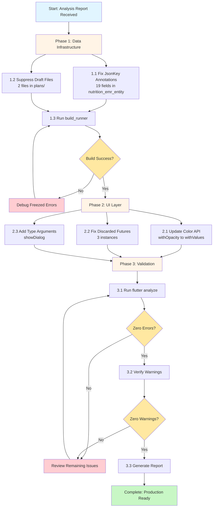
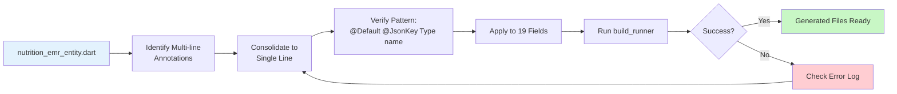
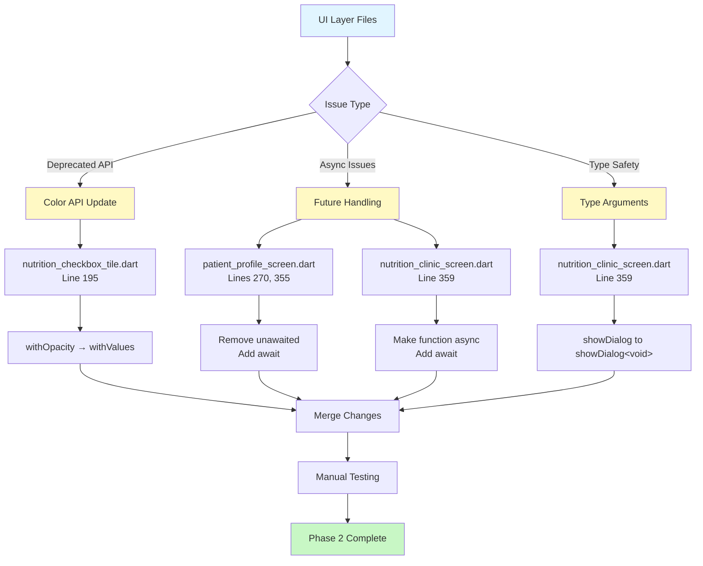
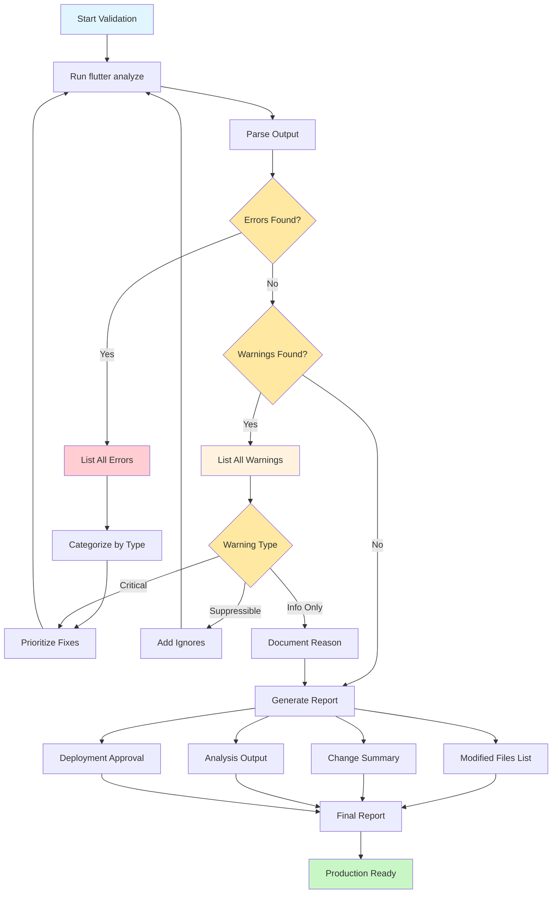
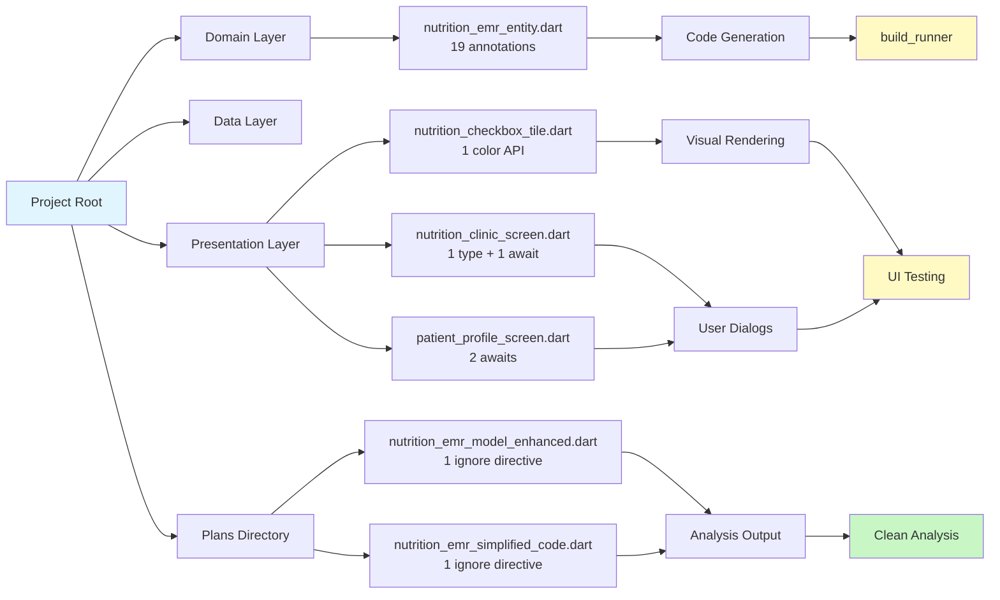
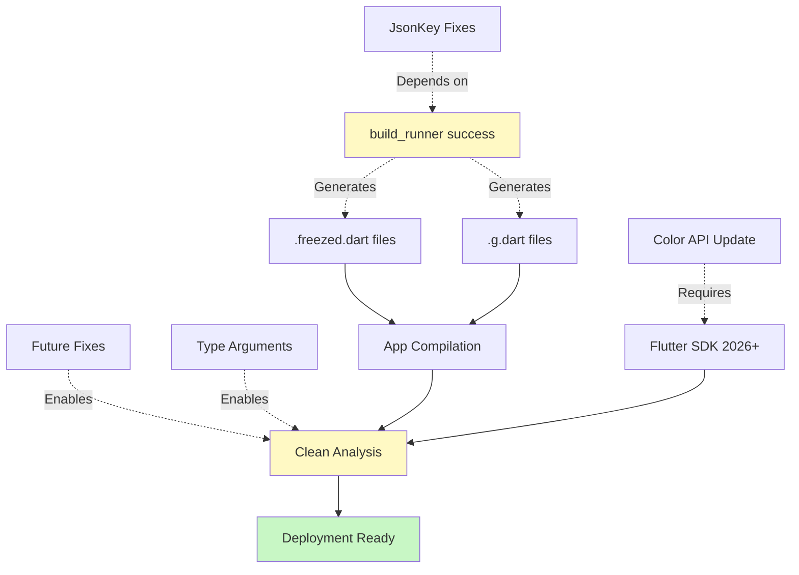
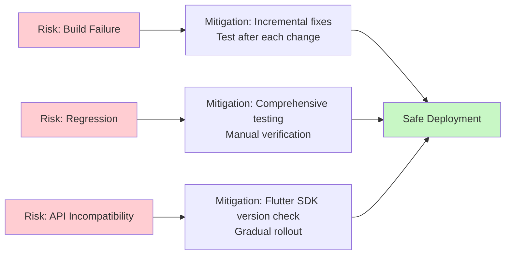

// ignore_for_file: all  
# 🏗️ Code Quality Fix Architecture & Strategy

## 📊 Fix Strategy Overview



---

## 🔧 Phase 1: Data Infrastructure Fix Strategy



### Annotation Fix Pattern

```dart
// ❌ INCORRECT Multi-line
@Default(false)
@JsonKey(name: 'field_name')
bool fieldName,

// ✅ CORRECT Single-line
@Default(false) @JsonKey(name: 'field_name') bool fieldName,
```

---

## 🎨 Phase 2: UI Performance & Type Safety



---

## ✅ Phase 3: Validation Pipeline



---

## 📁 File Impact Map



---

## 🔍 Critical Dependencies



---

## 🎯 Success Criteria Matrix

| Phase | Criterion | Verification Method | Status |
|-------|-----------|---------------------|--------|
| 1.1 | All 19 JsonKey annotations fixed | Code review | Pending |
| 1.2 | Draft files ignored | Analyzer output | Pending |
| 1.3 | Build runner success | Command output | Pending |
| 2.1 | Color API updated | Code search | Pending |
| 2.2 | All futures awaited | Analyzer output | Pending |
| 2.3 | Type arguments added | Analyzer output | Pending |
| 3.1 | Flutter analyze executed | Command run | Pending |
| 3.2 | Zero errors/warnings | Output verification | Pending |
| 3.3 | Report generated | File created | Pending |

---

## 🚀 Deployment Readiness Checklist

- [ ] **Code Quality**
  - [ ] No Freezed generation errors
  - [ ] No deprecated API usage
  - [ ] No async/await warnings
  - [ ] No type safety issues

- [ ] **Testing**
  - [ ] Build runner completes successfully
  - [ ] Flutter analyze shows zero issues
  - [ ] Manual UI testing passed (nutrition wizard)
  - [ ] Dialog interactions verified

- [ ] **Documentation**
  - [ ] All changes documented in report
  - [ ] Modified files list complete
  - [ ] Analysis results included
  - [ ] Deployment approval obtained

- [ ] **Production**
  - [ ] Code committed with conventional format
  - [ ] CI/CD pipeline passes
  - [ ] Staging deployment successful
  - [ ] Production deployment approved

---

## 📊 Risk Mitigation



---

**Architecture Status**: ✅ Design Complete  
**Ready for**: Code Mode Implementation  
**Complexity**: Medium  
**Impact**: High Quality Improvement
