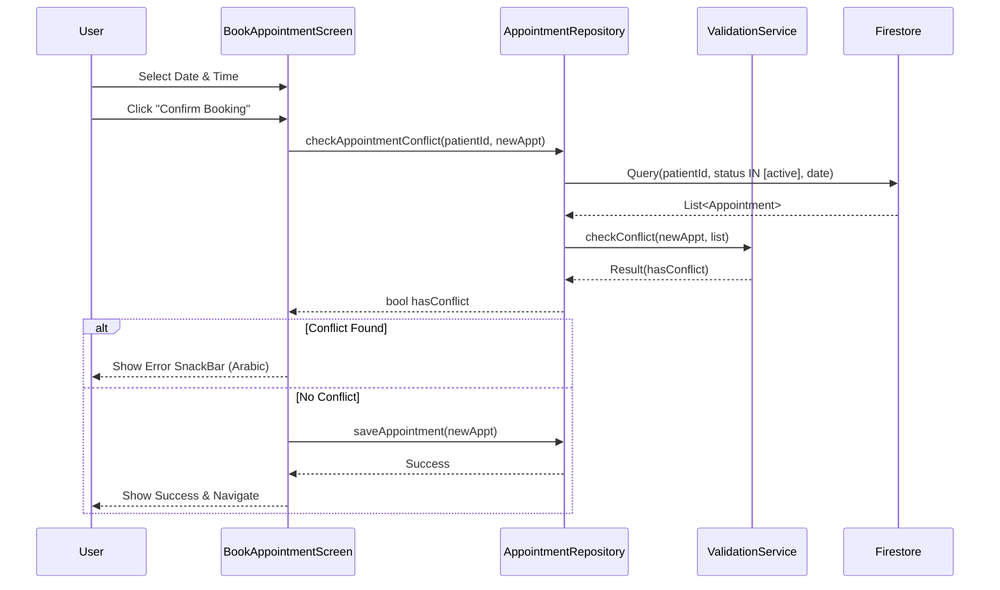

// ignore_for_file: all  
// ignore_for_file: all
# Anti-Double Booking Implementation Plan

## 1. Core Conflict Detection Logic (Algorithm)

### Overlap Formula
We will implement the standard interval intersection check in `AppointmentConflictValidationService`.
The formula is:
`Conflict = (NewStart < ExistingEnd) && (NewEnd > ExistingStart)`

### Status Filtering
We will strictly consider only "Active" appointments to prevent false positives from cancelled or rejected bookings.
**Active Statuses:**
- `pending`
- `confirmed`
- `scheduled` (if applicable)

**Excluded Statuses:**
- `cancelled`
- `completed`
- `rejected`

### Edge Case Handling
- **Exact Boundary:** If `NewStart == ExistingEnd`, it is **NOT** a conflict.
- **Same Start Time:** If `NewStart == ExistingStart`, it **IS** a conflict.
- **Duration:** We will standardize the duration calculation. If `endTime` is not explicitly stored, we will calculate it as `startTime + 30 minutes` (default slot duration).

## 2. Data Layer Architecture (Firestore & Repository)

### Query Optimization Strategy
To avoid fetching the entire appointment history of a patient, we will implement a targeted query in `AppointmentRepository`.

**New Method:** `getActiveAppointmentsForDate`
**Query Filters:**
1.  `patientId` == `currentPatientId`
2.  `status` IN `['pending', 'confirmed', 'scheduled']`
3.  `appointmentDate` == `targetDate` (Normalized to midnight ISO string)

*Rationale:* This query drastically reduces the read cost and latency by fetching only the relevant active appointments for the specific day of the requested booking.

### Repository Implementation (`AppointmentRepositoryImpl`)
We will modify `checkAppointmentConflict` to use this optimized query instead of `getAppointmentsForPatient`.

```dart
// Conceptual Implementation
Future<Either<Failure, bool>> checkAppointmentConflict({
  required String patientId,
  required AppointmentModel newAppointment,
}) async {
  // 1. Fetch active appointments for the specific date
  final appointmentsResult = await getActiveAppointmentsForDate(
    patientId, 
    newAppointment.appointmentDate
  );
  
  // 2. Validate in memory using Service
  return appointmentsResult.fold(
    Left.new,
    (existingAppointments) {
      final validationResult = AppointmentConflictValidationService.instance
          .checkConflict(
            newAppointment: newAppointment,
            existingAppointments: existingAppointments,
          );
      return Right(validationResult.hasConflict);
    },
  );
}
```

## 3. User Experience (UI/UX)

### Interception Point
The check will be triggered in `BookAppointmentScreen` (or its corresponding Provider) **before** the `createAppointment` call.

### Feedback Mechanism
If a conflict is detected:
1.  **Stop** the booking process.
2.  **Show** a `SnackBar` (or `CustomAlertDialog`) with the following Arabic message:
    > "عذراً، لا يمكن إتمام الحجز لوجود تعارض مع موعد آخر في نفس التوقيت. يرجى اختيار وقت مختلف."

### Flow Diagram


## 4. Code Quality & Debugging

### Null Safety
- Ensure `AppointmentModel` fields like `appointmentTimestamp` are handled safely.
- Use `DateTime.tryParse` where necessary.

### Observability (Logging)
We will add structured logging to `checkAppointmentConflict`:

```dart
debugPrint('--- Conflict Check ---');
debugPrint('Input: ${newAppointment.fullDateTime} - ${newAppointment.fullDateTime.add(duration)}');
debugPrint('Fetched: ${existingAppointments.length} active appointments');
if (validationResult.hasConflict) {
  debugPrint('❌ Conflict Found with Appt ID: ${validationResult.conflictingAppointment?.id}');
} else {
  debugPrint('✅ No Conflict Found');
}
```

## 5. Implementation Steps

1.  **Update Service:** Modify `AppointmentConflictValidationService` to accept a custom duration and refine the overlap logic.
2.  **Update Repository Interface:** Add `getActiveAppointmentsForDate` to `AppointmentRepository`.
3.  **Update Repository Implementation:** Implement the optimized Firestore query in `AppointmentRepositoryImpl`.
4.  **Integrate in UI:** Update `BookAppointmentScreen` to call the repository check before booking.
5.  **Add Feedback:** Implement the error message display.
