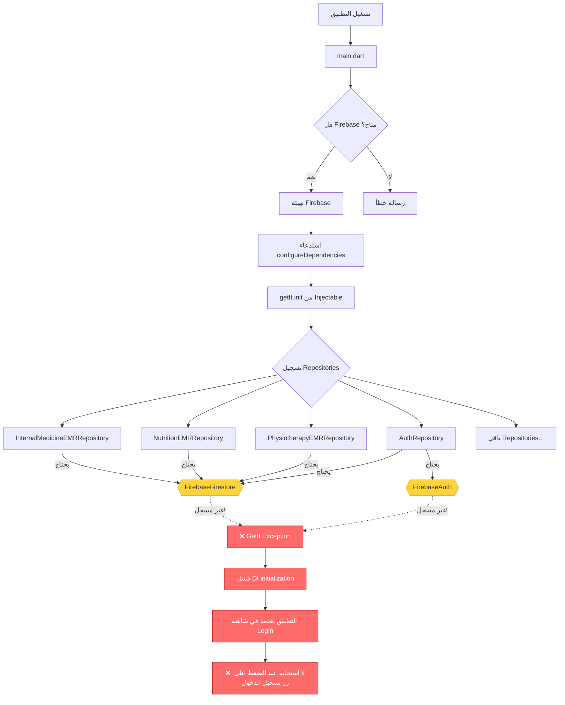
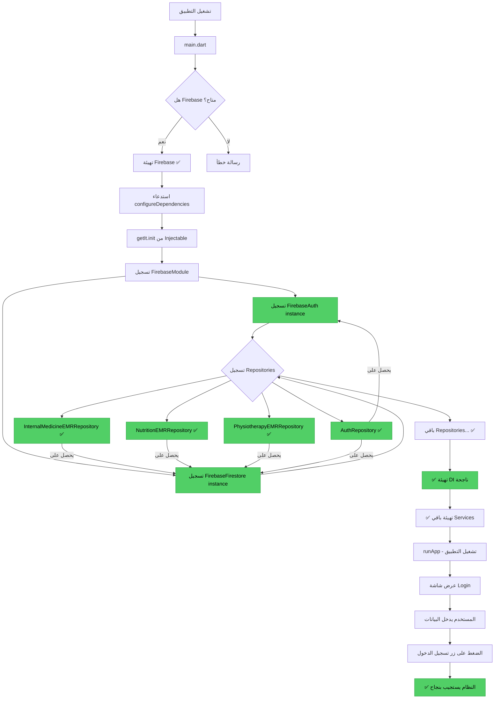
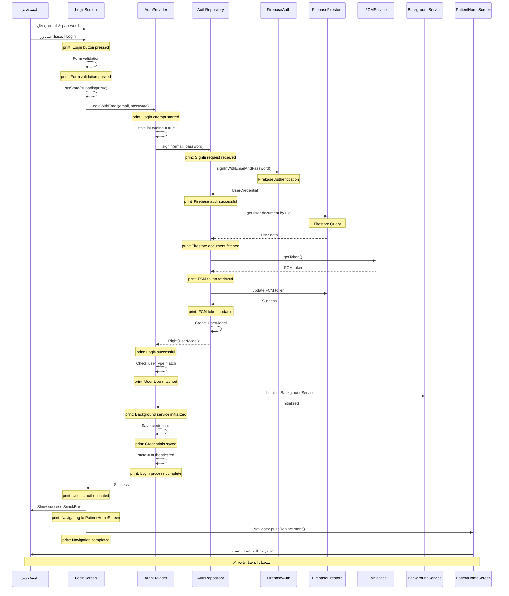
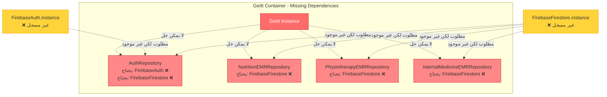
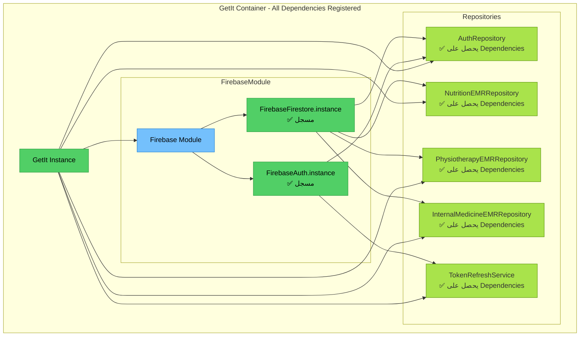
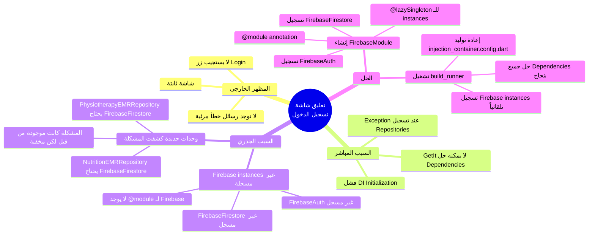
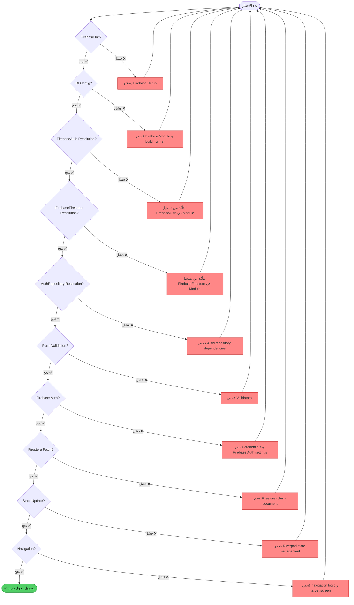

// ignore_for_file: all  
// ignore_for_file: all
# 📊 مخططات توضيحية لمشكلة تعليق تسجيل الدخول

## 🔴 المخطط 1: تدفق المشكلة - الوضع الحالي (قبل الإصلاح)



## 🟢 المخطط 2: تدفق الحل - الوضع المستهدف (بعد الإصلاح)



## 🔄 المخطط 3: تدفق عملية تسجيل الدخول الكاملة (بعد الإصلاح)



## 🏗️ المخطط 4: بنية Dependency Injection - قبل وبعد

### قبل الإصلاح ❌



### بعد الإصلاح ✅



## 🔧 المخطط 5: مقارنة طرق التسجيل

```mermaid
graph LR
    subgraph الطريقة الخاطئة ❌
        A1[Repository Implementation]
        A2[يحتاج FirebaseFirestore في Constructor]
        A3[Injectable يبحث في GetIt]
        A4[❌ لا يجد - Exception!]
        
        A1 --> A2 --> A3 --> A4
        
        style A4 fill:#ff6b6b,stroke:#c92a2a,color:#fff
    end
    
    subgraph الطريقة الصحيحة ✅
        B1[FirebaseModule]
        B2[@module annotation]
        B3[@lazySingleton getter]
        B4[إرجاع FirebaseFirestore.instance]
        B5[Injectable يسجله في GetIt]
        B6[Repository يحصل عليه]
        B7[✅ النظام يعمل بنجاح]
        
        B1 --> B2 --> B3 --> B4 --> B5 --> B6 --> B7
        
        style B7 fill:#51cf66,stroke:#2f9e44,color:#000
    end
```

## 📊 المخطط 6: تحليل السبب الجذري Root Cause Analysis



## 🎯 المخطط 7: نقاط التحقق والاختبار



---

**آخر تحديث**: ${DateTime.now().toIso8601String()}
**الغرض**: توضيح مرئي للمشكلة والحل
