// ignore_for_file: all  
// ignore_for_file: all
# 🏗️ Nutrition EMR Presentation Layer - Architecture Diagrams

## 📐 System Architecture Overview

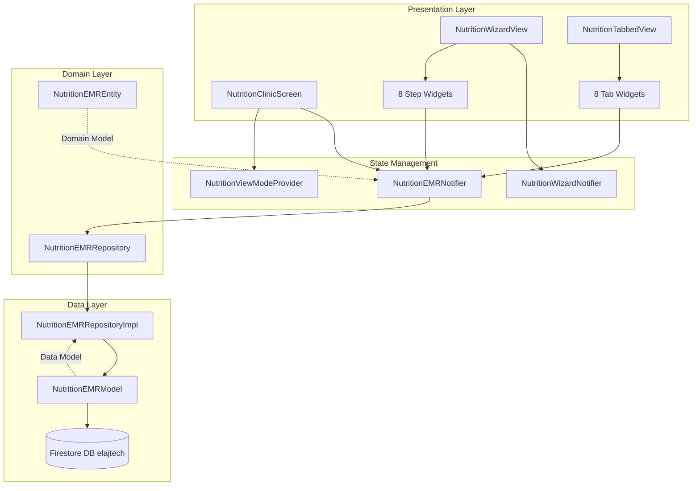

## 🔄 State Flow Diagram

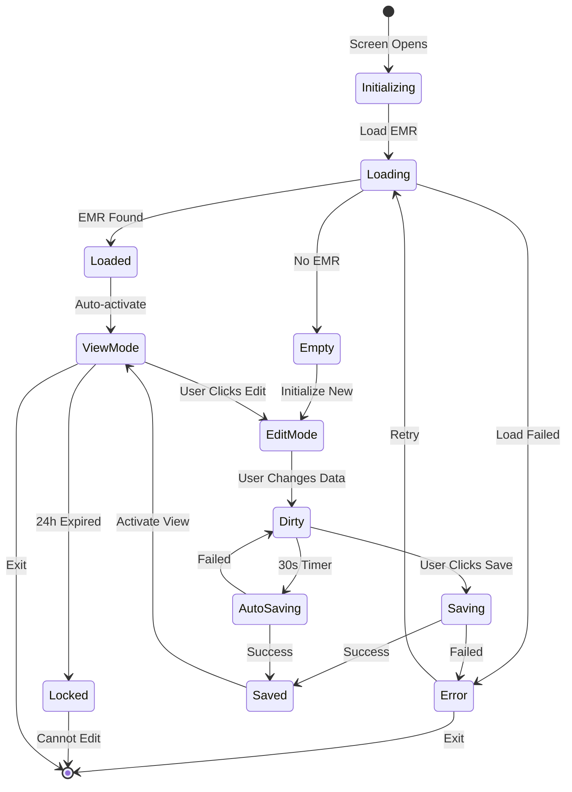

## 🎯 Component Interaction Flow

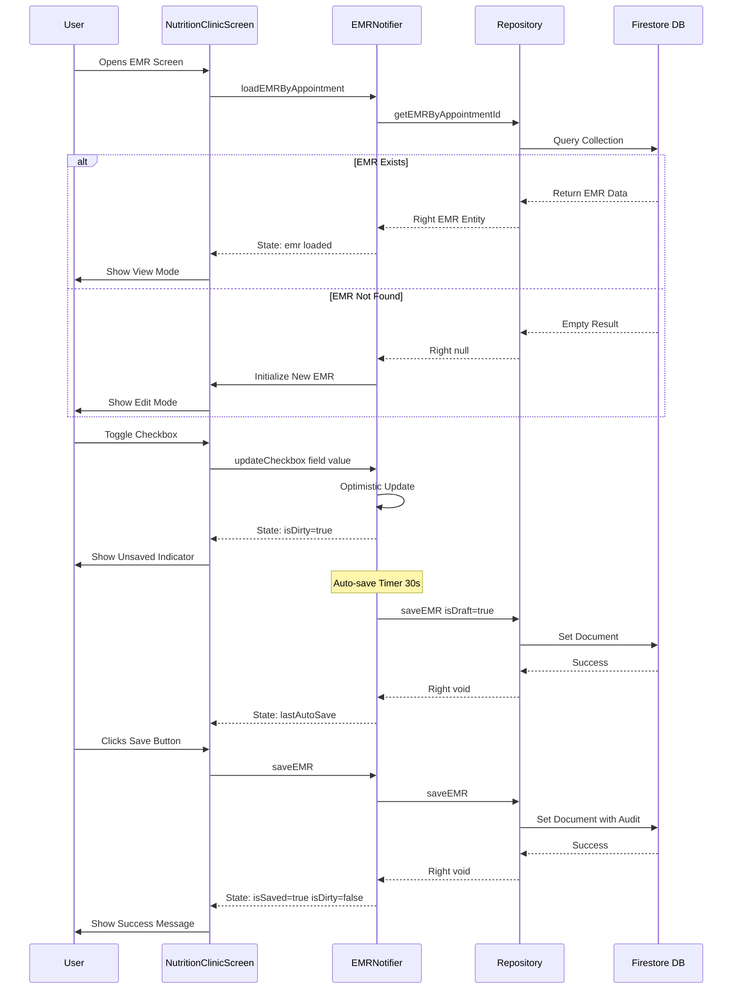

## 🧩 Widget Tree Structure

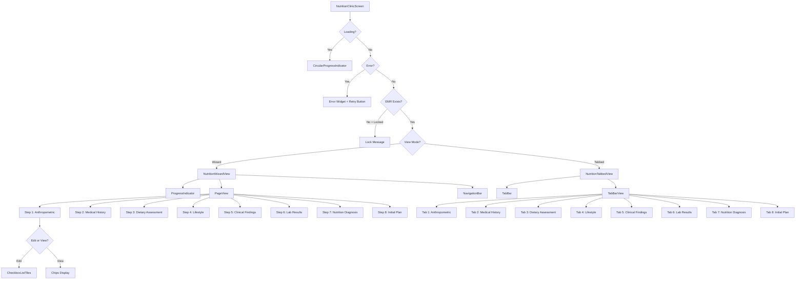

## 📊 Data Model Relationships

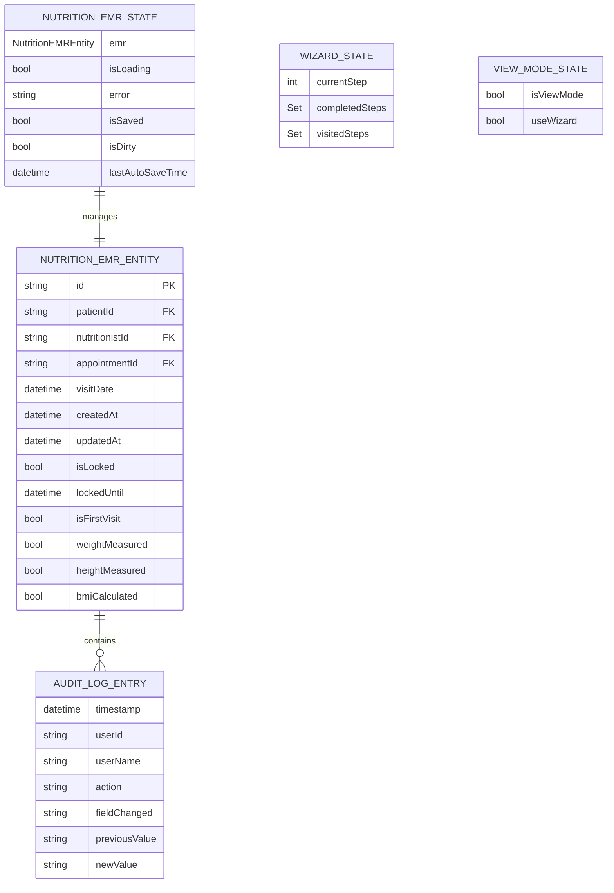

## 🔐 Lock Mechanism Flow

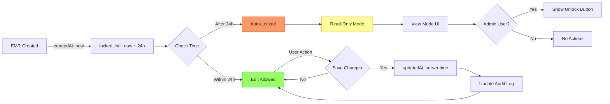

## 🎨 Auto-Save Mechanism

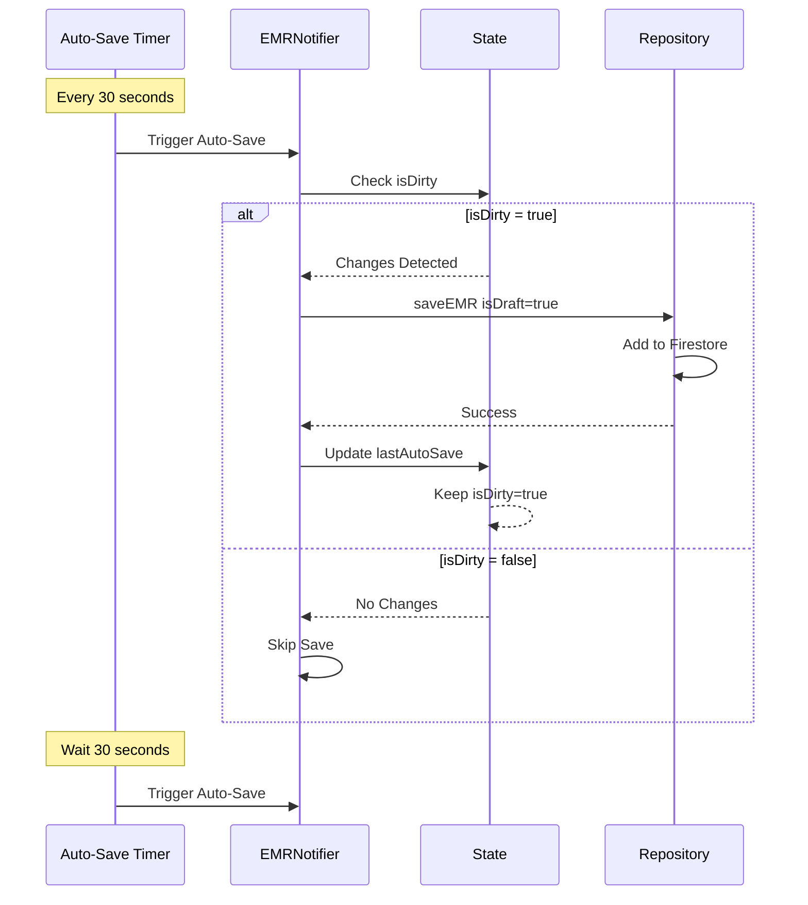

## 🚀 Navigation Flow in Wizard

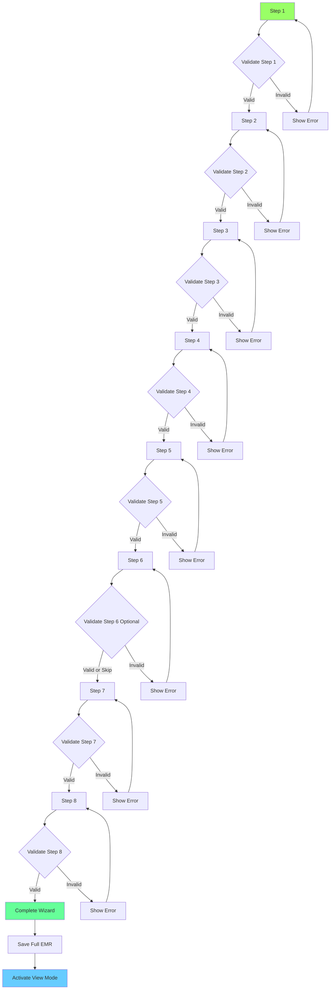

## 🔄 Provider Dependency Graph

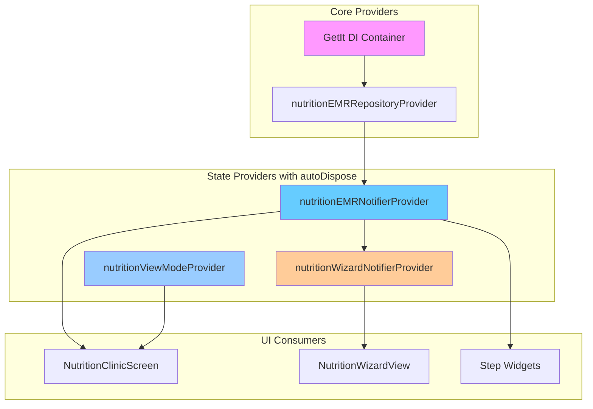

## 📱 Responsive Breakpoints

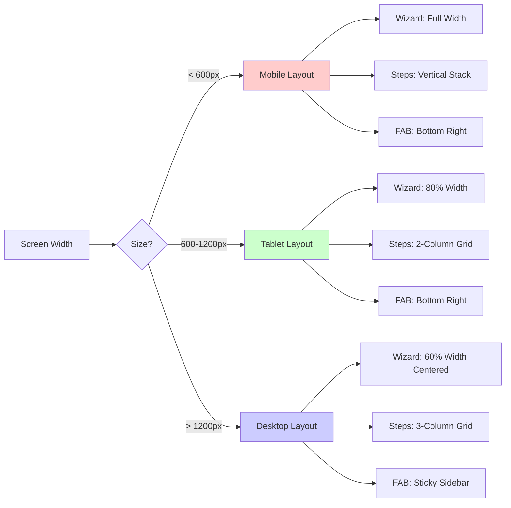

## 🎭 Mode Transitions

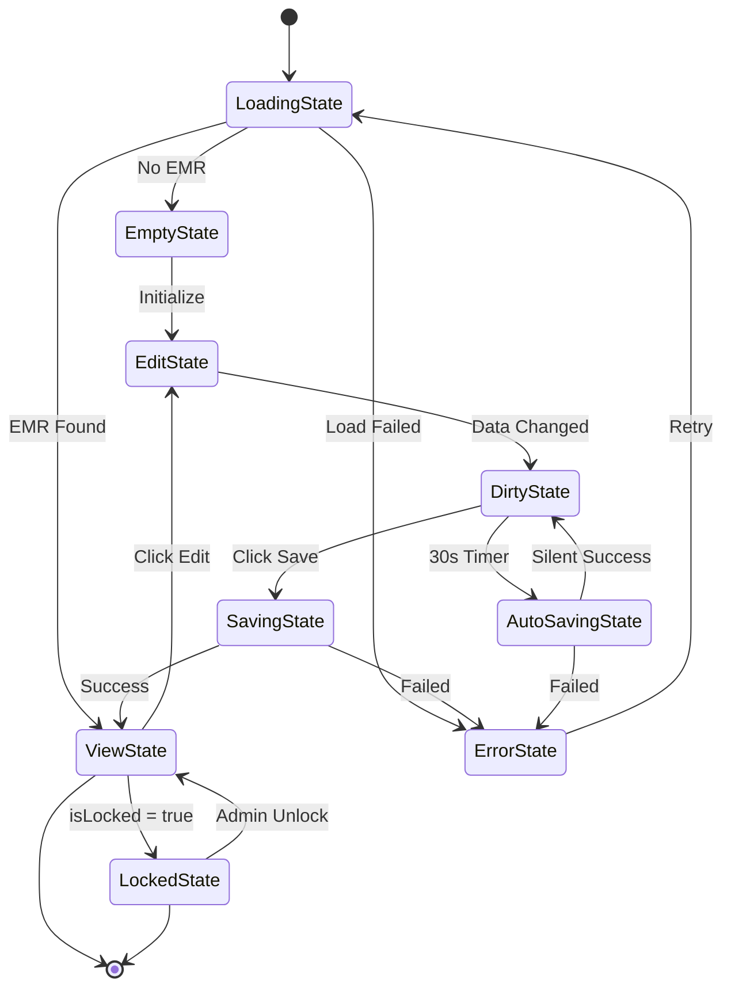

---

## 📊 Performance Optimization Strategy

### Widget Rebuild Optimization

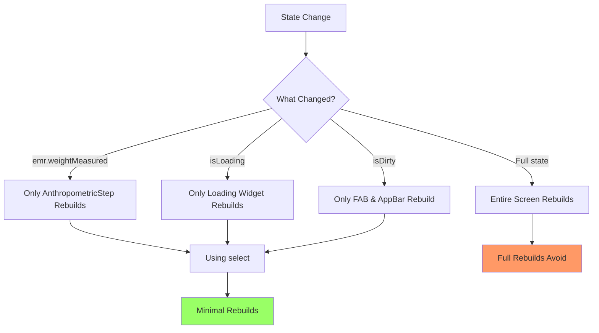

### Memory Management

```mermaid
graph LR
    A[Screen Opens] --> B[Provider Created]
    B --> C[Notifier Initialized]
    C --> D[Timer Started]
    
    D --> E[Screen Active]
    E --> F[User Navigates Away]
    
    F --> G[autoDispose Triggered]
    G --> H[Timer Cancelled]
    H --> I[Notifier Disposed]
    I --> J[Memory Released]
    
    style G fill:#9f6
    style J fill:#6f9
```

---

## 🔍 Step Validation Rules

| Step | Required Fields | Validation Logic |
|------|-----------------|------------------|
| **1. Anthropometric** | At least 1 checkbox | `weightMeasured OR heightMeasured` |
| **2. Medical History** | Required | `medicalHistoryReviewed = true` |
| **3. Dietary Assessment** | At least 1 checkbox | `dietary24HRecall OR foodFrequencyChecked` |
| **4. Lifestyle** | Optional | Always valid |
| **5. Clinical Findings** | Optional | Always valid |
| **6. Lab Results** | Optional | Always valid |
| **7. Nutrition Diagnosis** | At least 1 checkbox | `inadequateIntakeDiagnosed OR excessiveIntakeDiagnosed OR ...` |
| **8. Initial Plan** | At least 2 checkboxes | Count >= 2 |

---

## 🎯 UI Component Reusability

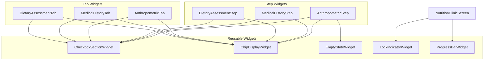

---

**Document Version:** 1.0  
**Last Updated:** 2026-01-22  
**Status:** Architecture Design Phase
