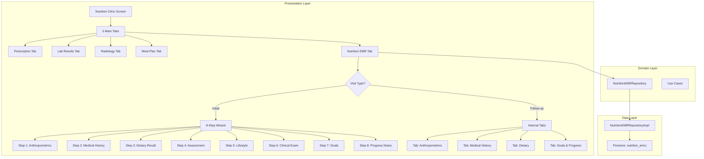

// ignore_for_file: all  
// ignore_for_file: all
# Nutrition EMR Implementation Plan - خطة التنفيذ الكاملة

## 📋 Executive Summary

هذا المستند يحتوي على الخطة التنفيذية الكاملة لتطوير نظام Nutrition EMR المتكامل لعيادة السمنة والتغذية العلاجية في مشروع elajtech. النظام يتبع Clean Architecture مع Feature-First Structure ويستخدم Riverpod للـ State Management.

---

## 🎯 Project Objectives

### الأهداف الرئيسية:
1. ✅ نموذج بيانات شامل يغطي 8 أقسام طبية أساسية
2. ✅ واجهة مستخدم متسقة مع 5 تبويبات رئيسية
3. ✅ نظام Wizard تفاعلي للزيارة الأولى (8 خطوات)
4. ✅ نظام تبويبات داخلية للزيارات اللاحقة
5. ✅ آلية قفل السجلات ا24 ساعة)
6. ✅ Audit Trail كامل لتتبع التغييرات
7. ✅ دعم View Mode و Edit Mode
8. ✅ تكامل مع databaseId: 'elajtech'

---

## 🏗️ Architecture Overview



---

## 📁 File Structure

### المجلدات والملفات المطلوبة:

```
lib/
├── shared/
│   └── models/
│       ├── nutrition_emr_model.dart              ← MODEL الأساسي (Freezed)
│       ├── nutrition_emr_model.freezed.dart      ← Generated
│       ├── nutrition_emr_model.g.dart            ← Generated
│       └── nutrition_questions.dart               ← الأسئلة والخيارات (موجود)
│
├── features/
│   ├── emr/
│   │   ├── domain/
│   │   │   └── repositories/
│   │   │       └── nutrition_emr_repository.dart       ← Interface
│   │   └── data/
│   │       └── repositories/
│   │           └── nutrition_emr_repository_impl.dart  ← Implementation
│   │
│   └── doctor/
│       └── nutrition_clinic/                            ← NEW FEATURE!
│           ├── data/
│           │   └── providers/
│           │       ├── nutrition_emr_state_provider.dart
│           │       └── nutrition_wizard_provider.dart
│           │
│           ├── domain/
│           │   ├── entities/
│           │   │   └── wizard_step.dart
│           │   └── use_cases/
│           │       ├── fetch_nutrition_emr_use_case.dart
│           │       ├── save_nutrition_emr_use_case.dart
│           │       └── lock_nutrition_emr_use_case.dart
│           │
│           └── presentation/
│               ├── screens/
│               │   └── nutrition_clinic_screen.dart      ← Main 5-tab screen
│               │
│               ├── widgets/
│               │   ├── tabs/
│               │   │   ├── prescription_tab.dart
│               │   │   ├── lab_results_tab.dart
│               │   │   ├── radiology_tab.dart
│               │   │   ├── meal_plan_tab.dart
│               │   │   └── nutrition_emr_tab.dart        ← Smart EMR tab
│               │   │
│               │   ├── wizard/
│               │   │   ├── nutrition_wizard_container.dart
│               │   │   ├── wizard_step_indicator.dart
│               │   │   ├── wizard_navigation_buttons.dart
│               │   │   └── steps/
│               │   │       ├── step_1_anthropometrics.dart
│               │   │       ├── step_2_medical_history.dart
│               │   │       ├── step_3_dietary_recall.dart
│               │   │       ├── step_4_nutritional_assessment.dart
│               │   │       ├── step_5_lifestyle_evaluation.dart
│               │   │       ├── step_6_clinical_examination.dart
│               │   │       ├── step_7_treatment_goals.dart
│               │   │       └── step_8_progress_notes.dart
│               │   │
│               │   ├── followup_tabs/
│               │   │   ├── anthropometrics_tab_view.dart
│               │   │   ├── medical_history_tab_view.dart
│               │   │   ├── dietary_tab_view.dart
│               │   │   └── goals_progress_tab_view.dart
│               │   │
│               │   └── common/
│               │       ├── emr_header_card.dart
│               │       ├── emr_data_chip.dart
│               │       ├── emr_section_card.dart
│               │       ├── measurement_input_field.dart
│               │       └── locked_record_overlay.dart
│               │
│               └── providers/
│                   ├── nutrition_clinic_provider.dart
│                   └── emr_lock_provider.dart
│
└── core/
    └── utils/
        ├── nutrition_calculations.dart            ← BMI, BMR, TDEE calculations
        └── validation/
            └── nutrition_validators.dart           ← Field validation
```

---

## 🧩 Implementation Phases

### **Phase 1: Data Layer Foundation** (Priority: Critical)

#### 1.1 Update Nutrition EMR Model
**File:** `lib/shared/models/nutrition_emr_model.dart`

**Tasks:**
- [ ] Replace current model with Enhanced Freezed model (195 fields)
- [ ] Add `ChangeLogEntry` freezed class for audit trail
- [ ] Configure JSON serialization with proper nullable handling
- [ ] Add custom parsers for complex types (DateTime, Lists)

**Dependencies:**
```yaml
dependencies:
  freezed_annotation: ^latest
  json_annotation: ^latest

dev_dependencies:
  freezed: ^latest
  build_runner: ^latest
  json_serializable: ^latest
```

**Commands:**
```bash
flutter pub add freezed_annotation json_annotation
flutter pub add --dev freezed build_runner json_serializable
flutter pub run build_runner build --delete-conflicting-outputs
```

**Validation:**
- ✅ No build_runner errors
- ✅ .freezed.dart and .g.dart files generated
- ✅ `flutter analyze` passes without errors

---

#### 1.2 Update Repository Implementation
**File:** `lib/features/emr/data/repositories/nutrition_emr_repository_impl.dart`

**Current Issues:**
```dart
// ❌ WRONG: Uses default Firestore instance
await _firestore.collection(collectionName).doc(emr.id).set(emr.toJson());
```

**Required Changes:**
```dart
// ✅ CORRECT: Already uses injected Firestore with databaseId: 'elajtech'
// From firebase_module.dart injection - no changes needed!

// Add enhanced methods:
@override
Future<Either<Failure, void>> saveEMR(NutritionEMRModel emr) async {
  try {
    // Add debug logging
    if (kDebugMode) {
      debugPrint('🍎 [Nutrition EMR] Saving EMR for:');
      debugPrint('  - Patient ID: ${emr.patientId}');
      debugPrint('  - Appointment ID: ${emr.appointmentId}');
      debugPrint('  - Visit Type: ${emr.isInitialVisit ? "Initial" : "Follow-up"}');
      debugPrint('  - Is Locked: ${emr.isLocked}');
    }
    
    // Validate appointmentId
    if (emr.appointmentId.isEmpty) {
      return const Left(
        ServerFailure('appointmentId is required to save Nutrition EMR'),
      );
    }
    
    // Add audit trail entry
    final updatedEmr = emr.copyWith(
      lastModifiedAt: DateTime.now(),
      changeLog: [
        ...?emr.changeLog,
        ChangeLogEntry(
          timestamp: DateTime.now(),
          userId: emr.doctorId,
          userName: emr.doctorName,
          action: emr.changeLog == null ? 'Created' : 'Updated',
        ),
      ],
    );
    
    await _firestore
        .collection(collectionName)
        .doc(updatedEmr.id)
        .set(updatedEmr.toJson());
        
    if (kDebugMode) {
      debugPrint('✅ [Nutrition EMR] Successfully saved EMR: ${updatedEmr.id}');
    }
    
    return const Right(null);
  } on FirebaseException catch (e) {
    if (e.code == 'permission-denied') {
      return const Left(
        ServerFailure(
          'Sorry, the time limit for adding/modifying medical data for this appointment has expired (24 hours)',
        ),
      );
    }
    if (kDebugMode) {
      debugPrint('❌ [Nutrition EMR] Firebase Error: ${e.code} - ${e.message}');
    }
    return Left(ServerFailure(e.toString()));
  } catch (e, stackTrace) {
    if (kDebugMode) {
      debugPrint('❌ [Nutrition EMR] Error saving EMR: $e');
      debugPrint('Stack Trace: $stackTrace');
    }
    return Left(ServerFailure('Failed to save Nutrition EMR: $e'));
  }
}

// Add new method for locking
@override
Future<Either<Failure, void>> lockEMRRecord(String emrId) async {
  try {
    await _firestore
        .collection(collectionName)
        .doc(emrId)
        .update({'isLocked': true});
    return const Right(null);
  } catch (e) {
    return Left(ServerFailure('Failed to lock EMR: $e'));
  }
}

// Add method to check if appointment is expired (24h rule)
@override
Future<Either<Failure, bool>> isAppointmentExpired(
  String appointmentId,
) async {
  try {
    final appointmentDoc = await _firestore
        .collection('appointments')
        .doc(appointmentId)
        .get();
        
    if (!appointmentDoc.exists) {
      return const Left(ServerFailure('Appointment not found'));
    }
    
    final appointmentData = appointmentDoc.data()!;
    final appointmentDate = DateTime.parse(appointmentData['date'] as String);
    final dayEnd = DateTime(
      appointmentDate.year,
      appointmentDate.month,
      appointmentDate.day,
      23,
      59,
      59,
    );
    
    final isExpired = DateTime.now().isAfter(dayEnd);
    return Right(isExpired);
  } catch (e) {
    return Left(ServerFailure('Failed to check appointment expiry: $e'));
  }
}
```

**Update Repository Interface:**
**File:** `lib/features/emr/domain/repositories/nutrition_emr_repository.dart`

```dart
abstract class NutritionEMRRepository {
  Future<Either<Failure, void>> saveEMR(NutritionEMRModel emr);
  
  Future<Either<Failure, NutritionEMRModel?>> getEMRByAppointmentId(
    String appointmentId,
  );
  
  Future<Either<Failure, List<NutritionEMRModel>>> getEMRByPatientId(
    String patientId,
  );
  
  // NEW METHODS:
  Future<Either<Failure, void>> lockEMRRecord(String emrId);
  
  Future<Either<Failure, bool>> isAppointmentExpired(String appointmentId);
}
```

---

### **Phase 2: Core Utilities** (Priority: High)

#### 2.1 Calculation Utilities
**File:** `lib/core/utils/nutrition_calculations.dart`

```dart
/// Nutrition-specific calculations
class NutritionCalculations {
  NutritionCalculations._();
  
  /// Calculate BMI from height (cm) and weight (kg)
  static double calculateBMI({
    required double heightCm,
    required double weightKg,
  }) {
    final heightM = heightCm / 100;
    return weightKg / (heightM * heightM);
  }
  
  /// Get BMI classification
  static String getBMIClassification(double bmi) {
    if (bmi < 18.5) return 'Underweight';
    if (bmi < 25) return 'Normal';
    if (bmi < 30) return 'Overweight';
    if (bmi < 35) return 'Obese Class I';
    if (bmi < 40) return 'Obese Class II';
    return 'Obese Class III';
  }
  
  /// Calculate Waist-to-Hip Ratio
  static double calculateWHR({
    required double waistCm,
    required double hipCm,
  }) {
    return waistCm / hipCm;
  }
  
  /// Get waist risk level
  static String getWaistRiskLevel({
    required double waistCm,
    required String gender,
  }) {
    if (gender == 'Male') {
      if (waistCm < 94) return 'Normal';
      if (waistCm < 102) return 'Increased Risk';
      return 'High Risk';
    } else {
      if (waistCm < 80) return 'Normal';
      if (waistCm < 88) return 'Increased Risk';
      return 'High Risk';
    }
  }
  
  /// Calculate BMR using Mifflin-St Jeor Equation
  static double calculateBMR({
    required double weightKg,
    required double heightCm,
    required int ageYears,
    required String gender,
  }) {
    final base = (10 * weightKg) + (6.25 * heightCm) - (5 * ageYears);
    return gender == 'Male' ? base + 5 : base - 161;
  }
  
  /// Calculate TDEE based on activity level
  static double calculateTDEE({
    required double bmr,
    required String activityLevel,
  }) {
    final multipliers = {
      'Sedentary': 1.2,
      'Lightly Active': 1.375,
      'Moderately Active': 1.55,
      'Very Active': 1.725,
      'Extremely Active': 1.9,
    };
    
    return bmr * (multipliers[activityLevel] ?? 1.2);
  }
  
  /// Calculate target calories for weight goal
  static double calculateTargetCalories({
    required double tdee,
    required String goal, // 'Weight Loss', 'Weight Gain', 'Maintenance'
    double? weeklyGoalKg,
  }) {
    if (goal == 'Maintenance') return tdee;
    
    final weeklyGoal = weeklyGoalKg ?? 0.5; // Default 0.5 kg/week
    final dailyCalorieDeficit = (weeklyGoal * 7700) / 7; // 7700 kcal per kg
    
    if (goal == 'Weight Loss') {
      return tdee - dailyCalorieDeficit;
    } else {
      return tdee + dailyCalorieDeficit;
    }
  }
  
  /// Calculate macronutrient distribution
  static Map<String, double> calculateMacros({
    required double targetCalories,
    double proteinPercent = 30,
    double carbPercent = 40,
    double fatPercent = 30,
  }) {
    return {
      'proteinG': (targetCalories * (proteinPercent / 100)) / 4,
      'carbG': (targetCalories * (carbPercent / 100)) / 4,
      'fatG': (targetCalories * (fatPercent / 100)) / 9,
    };
  }
}
```

#### 2.2 Validation Utilities
**File:** `lib/core/utils/validation/nutrition_validators.dart`

```dart
/// Validators for nutrition EMR data
class NutritionValidators {
  NutritionValidators._();
  
  /// Validate height (cm)
  static String? validateHeight(double? height) {
    if (height == null) return 'Height is required';
    if (height < 50 || height > 250) {
      return 'Height must be between 50-250 cm';
    }
    return null;
  }
  
  /// Validate weight (kg)
  static String? validateWeight(double? weight) {
    if (weight == null) return 'Weight is required';
    if (weight < 20 || weight > 300) {
      return 'Weight must be between 20-300 kg';
    }
    return null;
  }
  
  /// Validate blood pressure
  static String? validateBloodPressure(double? systolic, double? diastolic) {
    if (systolic == null || diastolic == null) {
      return 'Blood pressure is required';
    }
    if (systolic < 70 || systolic > 250) {
      return 'Systolic BP must be between 70-250 mmHg';
    }
    if (diastolic < 40 || diastolic > 150) {
      return 'Diastolic BP must be between 40-150 mmHg';
    }
    if (systolic <= diastolic) {
      return 'Systolic must be greater than diastolic';
    }
    return null;
  }
  
  /// Validate calorie intake
  static String? validateCalories(double? calories) {
    if (calories == null) return null; // Optional field
    if (calories < 500 || calories > 5000) {
      return 'Calories must be between 500-5000 kcal';
    }
    return null;
  }
  
  /// Check data completeness
  static double calculateCompleteness(NutritionEMRModel emr) {
    int totalFields = 0;
    int filledFields = 0;
    
    // Count core fields
    totalFields += 10;
    if (emr.heightCm != null) filledFields++;
    if (emr.weightKg != null) filledFields++;
    if (emr.bmi != null) filledFields++;
    if (emr.activityLevel != null) filledFields++;
    if (emr.dietaryPattern != null) filledFields++;
    if (emr.targetCalories != null) filledFields++;
    if (emr.targetWeightKg != null) filledFields++;
    if (emr.nutritionDiagnosis != null) filledFields++;
    if (emr.dietaryRecommendations != null) filledFields++;
    if (emr.followUpFrequency != null) filledFields++;
    
    return (filledFields / totalFields) * 100;
  }
}
```

---

### **Phase 3: Presentation Layer - Wizard System** (Priority: High)

#### 3.1 Wizard State Provider
**File:** `lib/features/doctor/nutrition_clinic/data/providers/nutrition_wizard_provider.dart`

```dart
import 'package:flutter_riverpod/flutter_riverpod.dart';
import 'package:elajtech/shared/models/nutrition_emr_model.dart';

/// Current wizard step (0-7)
final wizardStepProvider = StateProvider<int>((ref) => 0);

/// Draft EMR data being built in wizard
final wizardDraftProvider = StateProvider<NutritionEMRModel?>((ref) => null);

/// Wizard validation state
final wizardValidationProvider = StateProvider<Map<int, bool>>((ref) {
  return {
    0: false, // Step 1 not validated
    1: false,
    2: false,
    3: false,
    4: false,
    5: false,
    6: false,
    7: false,
  };
});

/// Check if current step is valid
final isCurrentStepValidProvider = Provider<bool>((ref) {
  final currentStep = ref.watch(wizardStepProvider);
  final validationState = ref.watch(wizardValidationProvider);
  return validationState[currentStep] ?? false;
});

/// Can proceed to next step
final canProceedProvider = Provider<bool>((ref) {
  return ref.watch(isCurrentStepValidProvider);
});

/// Can go back
final canGoBackProvider = Provider<bool>((ref) {
  final currentStep = ref.watch(wizardStepProvider);
  return currentStep > 0;
});

/// Is on last step
final isLastStepProvider = Provider<bool>((ref) {
  final currentStep = ref.watch(wizardStepProvider);
  return currentStep == 7; // 8th step (0-indexed)
});
```

#### 3.2 Wizard Container Widget
**File:** `lib/features/doctor/nutrition_clinic/presentation/widgets/wizard/nutrition_wizard_container.dart`

```dart
import 'package:flutter/material.dart';
import 'package:flutter_riverpod/flutter_riverpod.dart';

class NutritionWizardContainer extends ConsumerWidget {
  const NutritionWizardContainer({
    required this.appointment,
    required this.patientId,
    super.key,
  });
  
  final AppointmentModel appointment;
  final String patientId;

  @override
  Widget build(BuildContext context, WidgetRef ref) {
    final currentStep = ref.watch(wizardStepProvider);
    
    return Directionality(
      textDirection: TextDirection.ltr, // For English medical terms
      child: Column(
        children: [
          // Step Indicator
          WizardStepIndicator(currentStep: currentStep),
          
          const SizedBox(height: 16),
          
          // Step Content
          Expanded(
            child: _buildStepContent(currentStep),
          ),
          
          const SizedBox(height: 16),
          
          // Navigation Buttons
          WizardNavigationButtons(
            onNext: () => _handleNext(ref),
            onBack: () => _handleBack(ref),
            onSave: () => _handleSave(ref, context),
          ),
        ],
      ),
    );
  }
  
  Widget _buildStepContent(int step) {
    switch (step) {
      case 0:
        return const Step1Anthropometrics();
      case 1:
        return const Step2MedicalHistory();
      case 2:
        return const Step3DietaryRecall();
      case 3:
        return const Step4NutritionalAssessment();
      case 4:
        return const Step5LifestyleEvaluation();
      case 5:
        return const Step6ClinicalExamination();
      case 6:
        return const Step7TreatmentGoals();
      case 7:
        return const Step8ProgressNotes();
      default:
        return const SizedBox();
    }
  }
  
  void _handleNext(WidgetRef ref) {
    final currentStep = ref.read(wizardStepProvider);
    if (currentStep < 7) {
      ref.read(wizardStepProvider.notifier).state = currentStep + 1;
    }
  }
  
  void _handleBack(WidgetRef ref) {
    final currentStep = ref.read(wizardStepProvider);
    if (currentStep > 0) {
      ref.read(wizardStepProvider.notifier).state = currentStep - 1;
    }
  }
  
  Future<void> _handleSave(WidgetRef ref, BuildContext context) async {
    // Save logic here
    // Will be implemented in Phase 4
  }
}
```

#### 3.3 Individual Wizard Steps
**Example:** `lib/features/doctor/nutrition_clinic/presentation/widgets/wizard/steps/step_1_anthropometrics.dart`

```dart
class Step1Anthropometrics extends ConsumerStatefulWidget {
  const Step1Anthropometrics({super.key});

  @override
  ConsumerState<Step1Anthropometrics> createState() =>
      _Step1AnthropometricsState();
}

class _Step1AnthropometricsState extends ConsumerState<Step1Anthropometrics> {
  final _heightController = TextEditingController();
  final _weightController = TextEditingController();
  final _waistController = TextEditingController();
  final _hipController = TextEditingController();
  
  double? _bmi;
  String? _bmiClass;
  double? _whr;
  
  @override
  Widget build(BuildContext context) {
    return SingleChildScrollView(
      padding: const EdgeInsets.all(16),
      child: Directionality(
        textDirection: TextDirection.ltr,
        child: Column(
          crossAxisAlignment: CrossAxisAlignment.start,
          children: [
            Text(
              'Anthropometric Measurements',
              style: Theme.of(context).textTheme.headlineSmall,
            ),
            const SizedBox(height: 24),
            
            // Height Input
            MeasurementInputField(
              controller: _heightController,
              label: 'Height',
              unit: 'cm',
              onChanged: (value) => _calculateBMI(),
              validator: (value) {
                final height = double.tryParse(value ?? '');
                return NutritionValidators.validateHeight(height);
              },
            ),
            
            const SizedBox(height: 16),
            
            // Weight Input
            MeasurementInputField(
              controller: _weightController,
              label: 'Weight',
              unit: 'kg',
              onChanged: (value) => _calculateBMI(),
              validator: (value) {
                final weight = double.tryParse(value ?? '');
                return NutritionValidators.validateWeight(weight);
              },
            ),
            
            const SizedBox(height: 16),
            
            // BMI Display
            if (_bmi != null) ...[
              EMRSectionCard(
                title: 'Body Mass Index (BMI)',
                child: Column(
                  children: [
                    Text(
                      _bmi!.toStringAsFixed(1),
                      style: Theme.of(context).textTheme.displaySmall,
                    ),
                    Text(
                      _bmiClass ?? '',
                      style: Theme.of(context).textTheme.titleMedium?.copyWith(
                        color: _getBMIColor(_bmi!),
                      ),
                    ),
                  ],
                ),
              ),
              
              const SizedBox(height: 16),
            ],
            
            // Waist Circumference
            MeasurementInputField(
              controller: _waistController,
              label: 'Waist Circumference',
              unit: 'cm',
              onChanged: (value) => _calculateWHR(),
            ),
            
            const SizedBox(height: 16),
            
            // Hip Circumference
            MeasurementInputField(
              controller: _hipController,
              label: 'Hip Circumference',
              unit: 'cm',
              onChanged: (value) => _calculateWHR(),
            ),
            
            // Additional measurements...
          ],
        ),
      ),
    );
  }
  
  void _calculateBMI() {
    final height = double.tryParse(_heightController.text);
    final weight = double.tryParse(_weightController.text);
    
    if (height != null && weight != null) {
      setState(() {
        _bmi = NutritionCalculations.calculateBMI(
          heightCm: height,
          weightKg: weight,
        );
        _bmiClass = NutritionCalculations.getBMIClassification(_bmi!);
      });
      
      // Update draft EMR
      // Implementation in next phase
    }
  }
  
  void _calculateWHR() {
    final waist = double.tryParse(_waistController.text);
    final hip = double.tryParse(_hipController.text);
    
    if (waist != null && hip != null) {
      setState(() {
        _whr = NutritionCalculations.calculateWHR(
          waistCm: waist,
          hipCm: hip,
        );
      });
    }
  }
  
  Color _getBMIColor(double bmi) {
    if (bmi < 18.5) return Colors.blue;
    if (bmi < 25) return Colors.green;
    if (bmi < 30) return Colors.orange;
    return Colors.red;
  }
  
  @override
  void dispose() {
    _heightController.dispose();
    _weightController.dispose();
    _waistController.dispose();
    _hipController.dispose();
    super.dispose();
  }
}
```

---

### **Phase 4: Presentation Layer - Follow-up Tabs** (Priority: Medium)

#### 4.1 Follow-up Tab Container
**File:** `lib/features/doctor/nutrition_clinic/presentation/widgets/followup_tabs/followup_tabs_container.dart`

```dart
class FollowupTabsContainer extends ConsumerStatefulWidget {
  const FollowupTabsContainer({
    required this.existingEMR,
    required this.appointment,
    super.key,
  });
  
  final NutritionEMRModel existingEMR;
  final AppointmentModel appointment;

  @override
  ConsumerState<FollowupTabsContainer> createState() =>
      _FollowupTabsContainerState();
}

class _FollowupTabsContainerState extends ConsumerState<FollowupTabsContainer>
    with SingleTickerProviderStateMixin {
  late TabController _tabController;
  
  @override
  void initState() {
    super.initState();
    _tabController = TabController(length: 4, vsync: this);
  }

  @override
  Widget build(BuildContext context) {
    return Column(
      children: [
        TabBar(
          controller: _tabController,
          isScrollable: true,
          tabs: const [
            Tab(text: 'Anthropometrics'),
            Tab(text: 'Medical History'),
            Tab(text: 'Dietary & Lifestyle'),
            Tab(text: 'Goals & Progress'),
          ],
        ),
        Expanded(
          child: TabBarView(
            controller: _tabController,
            children: [
              AnthropometricsTabView(emr: widget.existingEMR),
              MedicalHistoryTabView(emr: widget.existingEMR),
              DietaryTabView(emr: widget.existingEMR),
              GoalsProgressTabView(emr: widget.existingEMR),
            ],
          ),
        ),
      ],
    );
  }

  @override
  void dispose() {
    _tabController.dispose();
    super.dispose();
  }
}
```

---

### **Phase 5: Main Clinic Screen Integration** (Priority: High)

#### 5.1 Nutrition Clinic Screen
**File:** `lib/features/doctor/nutrition_clinic/presentation/screens/nutrition_clinic_screen.dart`

```dart
class NutritionClinicScreen extends ConsumerStatefulWidget {
  const NutritionClinicScreen({
    required this.appointment,
    required this.patientId,
    super.key,
  });
  
  final AppointmentModel appointment;
  final String patientId;

  @override
  ConsumerState<NutritionClinicScreen> createState() =>
      _NutritionClinicScreenState();
}

class _NutritionClinicScreenState extends ConsumerState<NutritionClinicScreen>
    with SingleTickerProviderStateMixin {
  late TabController _mainTabController;

  @override
  void initState() {
    super.initState();
    _mainTabController = TabController(length: 5, vsync: this);
  }

  @override
  Widget build(BuildContext context) {
    return Scaffold(
      appBar: AppBar(
        title: const Text('عيادة السمنة والتغذية العلاجية'),
        bottom: TabBar(
          controller: _mainTabController,
          isScrollable: true,
          tabs: const [
            Tab(icon: Icon(Icons.medication), text: 'الوصفة الطبية'),
            Tab(icon: Icon(Icons.biotech), text: 'التحاليل'),
            Tab(icon: Icon(Icons.medical_services), text: 'الأشعة'),
            Tab(icon: Icon(Icons.restaurant_menu), text: 'الخطة الغذائية'),
            Tab(icon: Icon(Icons.assignment), text: 'السجل الطبي'),
          ],
        ),
      ),
      body: TabBarView(
        controller: _mainTabController,
        children: [
          PrescriptionTab(appointment: widget.appointment),
          LabResultsTab(appointment: widget.appointment),
          RadiologyTab(appointment: widget.appointment),
          MealPlanTab(appointment: widget.appointment),
          NutritionEMRTab(
            appointment: widget.appointment,
            patientId: widget.patientId,
          ),
        ],
      ),
    );
  }

  @override
  void dispose() {
    _mainTabController.dispose();
    super.dispose();
  }
}
```

#### 5.2 Smart EMR Tab
**File:** `lib/features/doctor/nutrition_clinic/presentation/widgets/tabs/nutrition_emr_tab.dart`

```dart
class NutritionEMRTab extends ConsumerWidget {
  const NutritionEMRTab({
    required this.appointment,
    required this.patientId,
    super.key,
  });
  
  final AppointmentModel appointment;
  final String patientId;

  @override
  Widget build(BuildContext context, WidgetRef ref) {
    // Fetch existing EMR
    final emrAsyncValue = ref.watch(
      nutritionEMRByAppointmentProvider(appointment.id),
    );
    
    return emrAsyncValue.when(
      data: (emr) {
        // If EMR exists, show follow-up tabs
        if (emr != null) {
          return FollowupTabsContainer(
            existingEMR: emr,
            appointment: appointment,
          );
        }
        
        // If no EMR, show wizard for initial visit
        return NutritionWizardContainer(
          appointment: appointment,
          patientId: patientId,
        );
      },
      loading: () => const Center(
        child: CircularProgressIndicator(),
      ),
      error: (error, stack) => Center(
        child: Text('Error loading EMR: $error'),
      ),
    );
  }
}
```

---

### **Phase 6: Security & Locking** (Priority: Critical)

#### 6.1 Record Locking Logic
**File:** `lib/features/doctor/nutrition_clinic/presentation/providers/emr_lock_provider.dart`

```dart
/// Check if EMR is editable (not locked and within 24h)
final isEMREditableProvider = FutureProvider.family<bool, String>(
  (ref, appointmentId) async {
    final repository = ref.read(nutritionEMRRepositoryProvider);
    
    // Check if appointment expired
    final expiryResult = await repository.isAppointmentExpired(appointmentId);
    
    return expiryResult.fold(
      (failure) => false, // On error, don't allow editing
      (isExpired) => !isExpired,
    );
  },
);

/// Auto-lock EMR when appointment expires
Future<void> autoLockEMRIfExpired({
  required String appointmentId,
  required String emrId,
  required NutritionEMRRepository repository,
}) async {
  final expiryResult = await repository.isAppointmentExpired(appointmentId);
  
  expiryResult.fold(
    (failure) {
      // Log error
      if (kDebugMode) {
        debugPrint('❌ [Auto-Lock] Failed to check expiry: $failure');
      }
    },
    (isExpired) async {
      if (isExpired) {
        // Lock the EMR
        await repository.lockEMRRecord(emrId);
        
        if (kDebugMode) {
          debugPrint('🔒 [Auto-Lock] EMR locked: $emrId');
        }
      }
    },
  );
}
```

#### 6.2 Firestore Security Rules
**File:** `firestore.rules`

```javascript
// Nutrition EMR Collection Rules
match /nutrition_emrs/{emrId} {
  // Read: Doctor who created it or patient
  allow read: if isDoctor() || isPatient(resource.data.patientId);
  
  // Create: Only doctors
  allow create: if isDoctor() 
    && request.resource.data.appointmentId != null
    && isAppointmentOnSameDay(request.resource.data.appointmentId);
  
  // Update: Only within 24 hours of appointment
  allow update: if isDoctor()
    && resource.data.doctorId == request.auth.uid
    && isAppointmentOnSameDay(resource.data.appointmentId)
    && resource.data.isLocked == false;
  
  // Delete: Never allowed
  allow delete: if false;
}

// Helper function: Check if appointment is on same day
function isAppointmentOnSameDay(appointmentId) {
  let appointment = get(/databases/$(database)/documents/appointments/$(appointmentId));
  let appointmentDate = appointment.data.date.toDate();
  let appointmentDayEnd = appointmentDate.setHours(23, 59, 59, 999);
  return request.time < appointmentDayEnd;
}

// Helper: Check if user is a doctor
function isDoctor() {
  return request.auth != null 
    && request.auth.token.userType == 'doctor';
}

// Helper: Check if user is a patient
function isPatient(patientId) {
  return request.auth != null 
    && request.auth.uid == patientId;
}
```

---

## 📊 Testing Strategy

### Unit Tests
```dart
// test/nutrition_calculations_test.dart
void main() {
  group('NutritionCalculations', () {
    test('calculateBMI returns correct value', () {
      final bmi = NutritionCalculations.calculateBMI(
        heightCm: 170,
        weightKg: 70,
      );
      expect(bmi, closeTo(24.22, 0.01));
    });
    
    test('getBMIClassification returns correct classification', () {
      expect(NutritionCalculations.getBMIClassification(17), 'Underweight');
      expect(NutritionCalculations.getBMIClassification(22), 'Normal');
      expect(NutritionCalculations.getBMIClassification(27), 'Overweight');
      expect(NutritionCalculations.getBMIClassification(32), 'Obese Class I');
    });
  });
}
```

### Integration Tests
- Test full wizard flow
- Test follow-up tab navigation
- Test record locking mechanism
- Test Firestore operations

### Widget Tests
- Test individual wizard steps
- Test measurement input fields
- Test data chips display
- Test locked overlay

---

## 🗓️ Implementation Timeline

### Week 1: Foundation
- ✅ Day 1-2: Implement Enhanced NutritionEMRModel (Freezed)
- ✅ Day 3-4: Update Repository Implementation
- ✅ Day 5: Create Calculation & Validation Utilities
- ✅ Day 6-7: Testing & Code Review

### Week 2: Wizard System
- ✅ Day 1-2: Create Wizard State Providers
- ✅ Day 3-4: Build Wizard Container & Navigation
- ✅ Day 5-6: Implement Steps 1-4
- ✅ Day 7: Implement Steps 5-8

### Week 3: Follow-up & Integration
- ✅ Day 1-2: Build Follow-up Tab System
- ✅ Day 3-4: Create Main Clinic Screen
- ✅ Day 5: Integrate Smart EMR Tab
- ✅ Day 6-7: Testing & Bug Fixes

### Week 4: Security & Polish
- ✅ Day 1-2: Implement Record Locking
- ✅ Day 3: Update Firestore Rules
- ✅ Day 4-5: Audit Trail Implementation
- ✅ Day 6: Final Testing
- ✅ Day 7: Documentation & Handover

**Total Duration: 4 Weeks**

---

## ✅ Acceptance Criteria

### Functional Requirements
1. ✅ Initial visit uses 8-step wizard
2. ✅ Follow-up visits use streamlined tabs
3. ✅ All 195 fields captured correctly
4. ✅ Automatic calculations (BMI, BMR, TDEE) work
5. ✅ Records lock after 24 hours
6. ✅ Audit trail tracks all changes
7. ✅ View/Edit modes function properly
8. ✅ Data persists to Firestore with databaseId: 'elajtech'

### Technical Requirements
1. ✅ No build_runner errors
2. ✅ `flutter analyze` passes
3. ✅ All unit tests pass
4. ✅ Integration tests pass
5. ✅ Responsive on mobile, tablet, and web
6. ✅ RTL/LTR text direction handled correctly
7. ✅ Uses Freezed for immutability
8. ✅ Follows existing code patterns

### Performance Requirements
1. ✅ Wizard transitions < 100ms
2. ✅ Tab switching < 50ms
3. ✅ Save operation < 2s
4. ✅ Load EMR < 1s

---

## 🚨 Risk Mitigation

### Risk 1: Data Migration
**Issue:** Existing EMRs use old model structure
**Mitigation:** 
- Create migration script
- Support both old and new formats during transition
- Provide fallback parsing in `fromJson`

### Risk 2: Firestore Rules Complexity
**Issue:** 24-hour rule might conflict with existing rules
**Mitigation:**
- Test rules in Firestore emulator
- Document rule logic clearly
- Add monitoring for permission denials

### Risk 3: Performance with Large EMRs
**Issue:** 195 fields might slow down UI
**Mitigation:**
- Use lazy loading for tabs
- Paginate change log
- Index frequently queried fields

### Risk 4: Type Safety Migration
**Issue:** Converting `Map<String, List<String>>` to typed fields
**Mitigation:**
- Provide helper methods for data transformation
- Add validation layer
- Test with real data samples

---

## 📚 Documentation Deliverables

1. ✅ **This Implementation Plan** (Complete roadmap)
2. ✅ **Enhanced Model Documentation** (Field definitions)
3. ⏳ **API Reference** (All public methods)
4. ⏳ **User Guide** (How to use wizard & tabs)
5. ⏳ **Developer Guide** (How to extend model)
6. ⏳ **Testing Guide** (How to test features)

---

## 🎓 Training & Handover

### For Developers
- Code walkthrough session
- Freezed best practices
- Provider pattern explanation
- Security rules training

### For Users (Doctors)
- Wizard workflow demo
- Follow-up tabs demo
- Data entry best practices
- Record locking explanation

---

## 📞 Support & Maintenance

### Post-Launch Support
- Monitor Firestore logs for errors
- Track user feedback
- Monitor performance metrics
- Address bugs within 24 hours

### Future Enhancements
- [ ] PDF export of complete EMR
- [ ] Visual charts for weight progression
- [ ] Meal plan templates library
- [ ] Integration with nutrition databases (USDA, etc.)
- [ ] AI-powered nutrition recommendations
- [ ] Patient mobile app view of EMR

---

## 🏁 Conclusion

This implementation plan provides a comprehensive roadmap for developing the Nutrition EMR system. The system will be:

- **Robust**: Using Freezed for immutability and type safety
- **Secure**: With 24-hour locking and audit trails
- **User-Friendly**: Smart wizard for initial visits, quick tabs for follow-ups
- **Comprehensive**: 195 fields covering all nutrition clinical aspects
- **Maintainable**: Clean Architecture with clear separation of concerns
- **Scalable**: Easy to extend with new features

**Ready for approval and implementation!** 🚀

---

**Document Version:** 1.0  
**Last Updated:** 2026-01-21  
**Status:** Ready for Review  
**Approval Required From:** Medical Staff, Technical Lead, Project Manager
