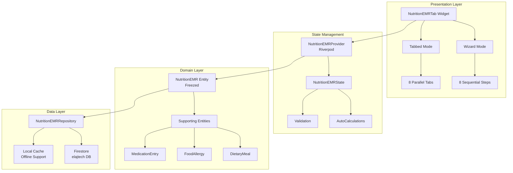
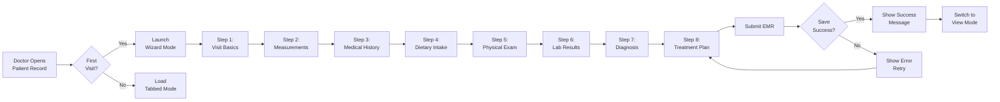
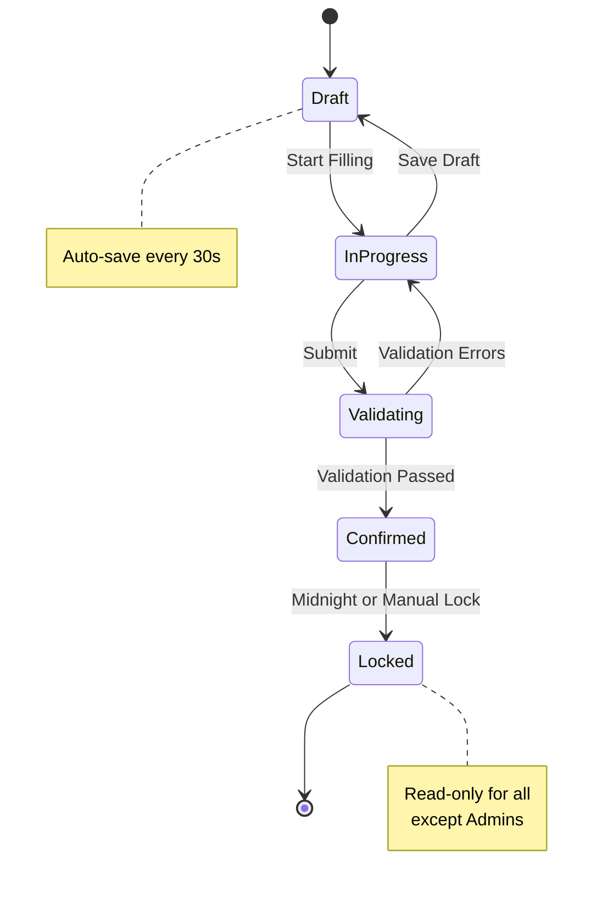

// ignore_for_file: all  
// ignore_for_file: all
# 🎨 Nutrition EMR - Visual Architecture & User Flow

## 📊 System Architecture Diagram



## 🔄 User Flow - Initial Visit



## 📱 UI Layout Strategy - Wizard Mode

### Step Structure

```
┌─────────────────────────────────────────────────────────┐
│  Nutrition EMR - Step 3 of 8: Medical History         │
│  ████████████░░░░░░░░░░░░ 37% Complete               │
├─────────────────────────────────────────────────────────┤
│                                                         │
│  ┌─────────────────────────────────────────────┐       │
│  │  Section Progress:  ██████░░░░  60%        │       │
│  └─────────────────────────────────────────────┘       │
│                                                         │
│  ▼ Diabetes                                  [Done ✓]  │
│    ☑ Type 2 Diabetes                                   │
│    ☐ Type 1 Diabetes                                   │
│    ☐ Gestational Diabetes                              │
│    ☐ Prediabetes                                       │
│    Diagnosis Date: [____/____/____]                    │
│    Control Status: [Good ▼]                            │
│                                                         │
│  ▼ Hypertension                           [Incomplete] │
│    ☐ Yes  ☐ No                                         │
│    ...                                                  │
│                                                         │
│  ▶ Dyslipidemia                          [Not Started] │
│  ▶ Chronic Kidney Disease                [Not Started] │
│  ▶ Other Conditions                      [Not Started] │
│                                                         │
│  ┌─────────────────────────────────────────────┐       │
│  │  💾 Auto-saved 30 seconds ago              │       │
│  └─────────────────────────────────────────────┘       │
│                                                         │
│  [< Previous]  [Save Draft]  [Next >]                  │
│                                                         │
└─────────────────────────────────────────────────────────┘
```

## 🎯 Information Grouping Strategy

### Anthropometric Section - Smart Layout

```
┌───────────────────────────────────────────────────┐
│  📏 Measurements & Body Composition               │
├───────────────────────────────────────────────────┤
│                                                   │
│  Current Measurements                             │
│  ┌─────────┬─────────┬─────────────────┐         │
│  │ Weight  │ Height  │      BMI        │         │
│  │ [85.0]  │ [165]   │  31.2           │         │
│  │  kg     │  cm     │  Obesity I      │         │
│  └─────────┴─────────┴─────────────────┘         │
│                                                   │
│  Weight History                                   │
│  ┌───────────────────────────────────────┐       │
│  │  📈                                   │       │
│  │   90                                  │       │
│  │   85  ●────●────●                    │       │
│  │   80              ●────●             │       │
│  │   75                    ●            │       │
│  │   ──┬─────┬─────┬─────┬─────┬──     │       │
│  │    Jan   Feb   Mar   Apr   May      │       │
│  └───────────────────────────────────────┘       │
│                                                   │
│  Body Composition                                 │
│  ☑ Waist: [92] cm    ☐ Body Fat: [__] %         │
│  ☑ Hip:   [105] cm   ☐ Muscle Mass: [__] %      │
│  WHR: 0.88 (Calculated)                          │
│                                                   │
│  Goals                                            │
│  Target Weight: [75] kg                          │
│  Goal: ● Weight Loss  ○ Maintenance              │
│                                                   │
└───────────────────────────────────────────────────┘
```

## 🍽️ Dietary Assessment - Dynamic Entry

```
┌───────────────────────────────────────────────────┐
│  🍴 24-Hour Dietary Recall                        │
├───────────────────────────────────────────────────┤
│                                                   │
│  Recorded Meals: [3 of 5 typical meals]          │
│                                                   │
│  ┌──────────────────────────────────────┐        │
│  │ 🍳 Breakfast  -  7:00 AM            │        │
│  │ ─────────────────────────────────────│        │
│  │ • 2 eggs (fried)                     │        │
│  │ • 2 slices white bread               │        │
│  │ • Coffee with 2 tsp sugar            │        │
│  │                                       │        │
│  │ Portion: Medium  | [Edit] [Delete]   │        │
│  └──────────────────────────────────────┘        │
│                                                   │
│  ┌──────────────────────────────────────┐        │
│  │ 🍛 Lunch  -  1:30 PM                │        │
│  │ ─────────────────────────────────────│        │
│  │ • Rice (1.5 cups)                    │        │
│  │ • Chicken curry                      │        │
│  │ • Soft drink (300ml)                 │        │
│  │                                       │        │
│  │ Portion: Large   | [Edit] [Delete]   │        │
│  └──────────────────────────────────────┘        │
│                                                   │
│  ┌──────────────────────────────────────┐        │
│  │ 🍝 Dinner  -  8:00 PM               │        │
│  │ ─────────────────────────────────────│        │
│  │ • Pasta with cream sauce             │        │
│  │ • Garlic bread                       │        │
│  │ • Ice cream (1 scoop)                │        │
│  │                                       │        │
│  │ Portion: Large   | [Edit] [Delete]   │        │
│  └──────────────────────────────────────┘        │
│                                                   │
│  [+ Add Snack]                                    │
│                                                   │
│  Quick Analysis:                                  │
│  Estimated Calories: ~2400 kcal                  │
│  Carbs: High | Protein: Moderate | Fat: High     │
│                                                   │
└───────────────────────────────────────────────────┘
```

## 💊 Medication Management - Interaction Alerts

```
┌───────────────────────────────────────────────────┐
│  💊 Current Medications                           │
├───────────────────────────────────────────────────┤
│                                                   │
│  ┌──────────────────────────────────────┐        │
│  │ ⚠️ Metformin 500mg                   │        │
│  │ ─────────────────────────────────────│        │
│  │ Frequency: Twice daily               │        │
│  │ Indication: Type 2 Diabetes          │        │
│  │                                       │        │
│  │ ⚠️ Food Interactions Detected:       │        │
│  │ • Take with food to reduce GI upset  │        │
│  │ • Avoid alcohol                      │        │
│  │ • May affect Vitamin B12 absorption  │        │
│  │                                       │        │
│  │ [Edit] [Remove]                      │        │
│  └──────────────────────────────────────┘        │
│                                                   │
│  ┌──────────────────────────────────────┐        │
│  │ Atorvastatin 20mg                    │        │
│  │ ─────────────────────────────────────│        │
│  │ Frequency: Once daily at bedtime     │        │
│  │ Indication: Dyslipidemia             │        │
│  │                                       │        │
│  │ ℹ️ Dietary Note:                     │        │
│  │ • Avoid grapefruit juice             │        │
│  │ • Take with low-fat meal             │        │
│  │                                       │        │
│  │ [Edit] [Remove]                      │        │
│  └──────────────────────────────────────┘        │
│                                                   │
│  [+ Add Medication]                               │
│                                                   │
└───────────────────────────────────────────────────┘
```

## 🔬 Lab Results - Smart Input & Trending

```
┌───────────────────────────────────────────────────┐
│  🔬 Laboratory Results                            │
├───────────────────────────────────────────────────┤
│                                                   │
│  ▼ Glucose & Diabetes Markers              [New] │
│    ┌──────────────────────────────────┐          │
│    │ HbA1c:  [7.2] %  Date: [Today]  │          │
│    │ ───────────────────────────────  │          │
│    │ Status: ⚠️ Above Target (>7%)   │          │
│    │                                  │          │
│    │ Trend (Last 6 months):           │          │
│    │  8.1 → 7.8 → 7.5 → 7.2  ↓       │          │
│    │  Improving                       │          │
│    │                                  │          │
│    │ Fasting Glucose: [142] mg/dL    │          │
│    │ Status: ⚠️ High (>126)          │          │
│    └──────────────────────────────────┘          │
│                                                   │
│  ▼ Lipid Profile                      [Complete] │
│    ┌──────────────────────────────────┐          │
│    │ Total Cholesterol: [235] mg/dL   │          │
│    │ LDL:  [152] mg/dL  ⚠️ High       │          │
│    │ HDL:  [38] mg/dL   ⚠️ Low        │          │
│    │ Triglycerides: [220] mg/dL  ⚠️   │          │
│    │                                  │          │
│    │ Cardiovascular Risk: HIGH        │          │
│    └──────────────────────────────────┘          │
│                                                   │
│  ▶ Renal Function                  [Not Entered] │
│  ▶ Liver Function                  [Not Entered] │
│  ▶ Vitamins & Minerals             [Not Entered] │
│                                                   │
│  💡 Tip: At least HbA1c and Lipid Profile        │
│     recommended for initial assessment            │
│                                                   │
└───────────────────────────────────────────────────┘
```

## 📋 Treatment Plan - Interactive Calculator

```
┌───────────────────────────────────────────────────┐
│  📋 Nutrition Intervention Plan                   │
├───────────────────────────────────────────────────┤
│                                                   │
│  Calorie Calculation Wizard                       │
│  ┌──────────────────────────────────────┐        │
│  │ Method: ● Mifflin-St Jeor           │        │
│  │         ○ Harris-Benedict            │        │
│  │         ○ Custom                     │        │
│  │                                       │        │
│  │ Activity Level: [Sedentary ▼]       │        │
│  │ Goal: [Weight Loss ▼]               │        │
│  │ Rate: [0.5 kg/week ▼]               │        │
│  │                                       │        │
│  │ ─────────────────────────────────────│        │
│  │ Calculated Needs:                    │        │
│  │ BMR:     1,580 kcal/day             │        │
│  │ TDEE:    1,896 kcal/day             │        │
│  │ Deficit: -500 kcal/day              │        │
│  │                                       │        │
│  │ Recommended: 1,400 kcal/day         │        │
│  │ ─────────────────────────────────────│        │
│  │ Apply Recommendation  [✓]            │        │
│  └──────────────────────────────────────┘        │
│                                                   │
│  Macronutrient Distribution                       │
│  ┌──────────────────────────────────────┐        │
│  │ Carbohydrates:                       │        │
│  │ ████████████░░░░░░░░ 45% (158g)     │        │
│  │                                       │        │
│  │ Protein:                             │        │
│  │ ██████░░░░░░░░░░░░░░ 25% (88g)      │        │
│  │                                       │        │
│  │ Fat:                                 │        │
│  │ ████████░░░░░░░░░░░░ 30% (47g)      │        │
│  └──────────────────────────────────────┘        │
│                                                   │
│  Meal Plan Template: [Low-Carb Balanced ▼]       │
│                                                   │
│  Key Recommendations:                             │
│  ☑ Increase fiber intake (25-30g/day)            │
│  ☑ Reduce refined carbohydrates                  │
│  ☑ Include lean protein at each meal             │
│  ☑ Limit saturated fat                           │
│  ☑ Stay hydrated (8+ glasses water)              │
│                                                   │
│  Supplements:                                     │
│  • Vitamin D3: 2000 IU daily                     │
│  • Multivitamin: Once daily                      │
│                                                   │
│  Follow-up: [2 weeks ▼]  [Schedule →]            │
│                                                   │
└───────────────────────────────────────────────────┘
```

## 👁️ View Mode - Summary Dashboard

```
┌───────────────────────────────────────────────────┐
│  Nutrition Assessment Summary                     │
│  Patient: Ahmed Mohamed  |  Date: Jan 21, 2026   │
├───────────────────────────────────────────────────┤
│                                                   │
│  ┌─────────────────┬─────────────────────────┐   │
│  │ Current Status  │  Targets & Goals        │   │
│  ├─────────────────┼─────────────────────────┤   │
│  │ Weight: 85 kg   │  Target: 75 kg          │   │
│  │ BMI: 31.2       │  BMI Goal: 25-27        │   │
│  │ WHR: 0.88       │  Duration: 4-6 months   │   │
│  └─────────────────┴─────────────────────────┘   │
│                                                   │
│  Active Conditions:                               │
│  [Diabetes Type 2] [Hypertension] [Dyslipidemia] │
│                                                   │
│  Dietary Pattern:                                 │
│  • 3 main meals + 1 snack                        │
│  • Estimated intake: ~2400 kcal/day              │
│  • High carbohydrate, low fiber                  │
│                                                   │
│  Lab Highlights:                                  │
│  HbA1c: 7.2% ⚠️  |  LDL: 152 ⚠️  |  HDL: 38 ⚠️   │
│                                                   │
│  ┌───────────────────────────────────────┐       │
│  │ 📋 Prescribed Plan                    │       │
│  │ ───────────────────────────────────────│       │
│  │ Daily Calories: 1,400 kcal            │       │
│  │ Carbs: 45% | Protein: 25% | Fat: 30% │       │
│  │                                        │       │
│  │ Key Interventions:                    │       │
│  │ • Low-carb balanced meal plan         │       │
│  │ • Portion control education           │       │
│  │ • Physical activity 150 min/week      │       │
│  │ • Medication compliance               │       │
│  └───────────────────────────────────────┘       │
│                                                   │
│  Next Follow-up: Feb 4, 2026                     │
│                                                   │
│  [Edit EMR] [Print Summary] [Export PDF]         │
│                                                   │
└───────────────────────────────────────────────────┘
```

## 🔒 Record Locking - Visual Indicator

```
┌───────────────────────────────────────────────────┐
│  Nutrition Assessment - Jan 15, 2026              │
│  🔒 LOCKED - Read Only                           │
├───────────────────────────────────────────────────┤
│                                                   │
│  ℹ️ This record was automatically locked at      │
│     midnight following the visit date.            │
│                                                   │
│  Locked By: System                                │
│  Lock Time: Jan 16, 2026 at 12:00 AM             │
│  Reason: 24-hour editing window expired           │
│                                                   │
│  ⚙️ Admin users can request unlock through       │
│     system administrator.                         │
│                                                   │
│  [View Record] [Request Unlock (Admin Only)]     │
│                                                   │
└───────────────────────────────────────────────────┘
```

## 📊 Data Completeness Indicator

```
Overall Progress: ████████████████░░░░ 78%

┌────────────────────────────────────────┐
│ Section                      Status    │
├────────────────────────────────────────┤
│ ✅ Visit Basics              100%     │
│ ✅ Anthropometrics           100%     │
│ ⚠️ Medical History            85%     │
│ ⚠️ Dietary Assessment         70%     │
│ ❌ Physical Findings          40%     │
│ ⚠️ Lab Results                60%     │
│ ✅ Diagnosis                 100%     │
│ ✅ Treatment Plan            100%     │
└────────────────────────────────────────┘

Legend:
✅ Complete (≥90%)
⚠️ Incomplete (50-89%)
❌ Minimal (<50%)
```

## 🎨 Color Scheme & Visual Hierarchy

### Section Color Coding

```css
:root {
  --section-basics: #2196F3;        /* Blue */
  --section-anthropometrics: #4CAF50; /* Green */
  --section-dietary: #FF9800;        /* Orange */
  --section-medical: #F44336;        /* Red */
  --section-physical: #9C27B0;       /* Purple */
  --section-labs: #009688;           /* Teal */
  --section-diagnosis: #FFC107;      /* Amber */
  --section-treatment: #3F51B5;      /* Indigo */
}
```

### Priority Levels

```
Critical Fields:    🔴 Red Border
Important Fields:   🟡 Yellow Highlight
Optional Fields:    ⚪ Default Style
Auto-calculated:    🔵 Blue Background (Read-only)
```

## 🔄 State Transitions



## 📐 Responsive Breakpoints

### Mobile Layout (< 600px)

```
┌────────────────────┐
│   Single Column    │
│                    │
│  [Field 1]        │
│  [Field 2]        │
│  [Field 3]        │
│                    │
│  Stack vertically  │
└────────────────────┘
```

### Tablet Layout (600-1024px)

```
┌─────────────────────────────┐
│    Two Columns              │
│                             │
│  [Field 1]    [Field 2]    │
│  [Field 3]    [Field 4]    │
│                             │
│  Side-by-side where logical │
└─────────────────────────────┘
```

### Desktop Layout (> 1024px)

```
┌──────────────────────────────────────┐
│  Sidebar  │     Main Content         │
│  Nav      │                          │
│           │  [Field 1] [Field 2]    │
│  Step 1   │  [Field 3] [Field 4]    │
│  Step 2   │                          │
│  Step 3 ← │  Three-column grid       │
│  ...      │                          │
└──────────────────────────────────────┘
```

---

**End of Visual Architecture Document**
