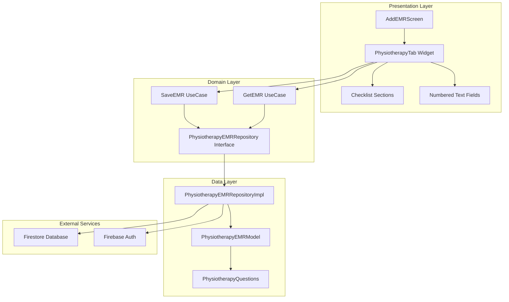
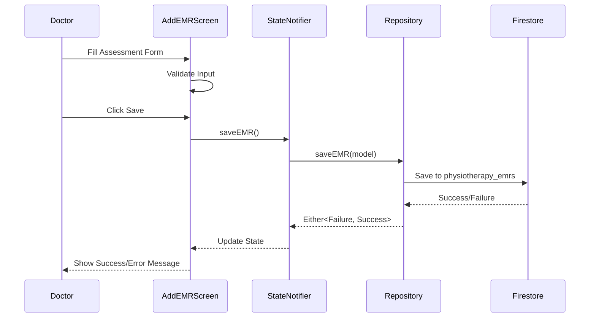

// ignore_for_file: all  
// ignore_for_file: all
# Physical Therapy EMR Tab - Comprehensive Implementation Plan

## 📋 Executive Summary

This document outlines the complete implementation plan for creating a comprehensive Physical Therapy EMR tab within the elajtech medical center application. The implementation follows Clean Architecture principles and integrates seamlessly with the existing EMR infrastructure.

---

## 🎯 Project Objectives

1. **Create a specialized EMR interface** for physical therapy assessments with structured checklists and text input fields
2. **Ensure data integrity** through proper validation and Firestore security rules
3. **Maintain architectural consistency** with existing nutrition and internal medicine EMR implementations
4. **Support bilingual interface** (Arabic/English) with proper RTL/LTR handling
5. **Enable comprehensive documentation** of physical therapy patient assessments

---

## 📊 Current State Analysis

### Existing Implementation

Based on codebase analysis, the project already has:

✅ **Data Models:**
- [`PhysiotherapyEMRModel`](lib/shared/models/physiotherapy_emr_model.dart) - Core data structure
- [`PhysiotherapyQuestions`](lib/shared/models/physiotherapy_questions.dart) - Question definitions

✅ **Repository Layer:**
- [`PhysiotherapyEMRRepository`](lib/features/emr/domain/repositories/physiotherapy_emr_repository.dart) - Interface
- [`PhysiotherapyEMRRepositoryImpl`](lib/features/emr/data/repositories/physiotherapy_emr_repository_impl.dart) - Implementation

✅ **UI Integration:**
- [`AddEMRScreen`](lib/features/doctor/medical_records/presentation/screens/add_emr_screen.dart) - Main EMR screen with physiotherapy tab

### Current Data Structure

The existing model supports:
- **5 Main Sections:** Patient Basics, History, Physical Examination, Assessment, Plan
- **Flexible Storage:** `Map<String, List<String>>` for checkbox selections
- **Smart Text Fields:** Primary Diagnosis and Management Plan
- **Firestore Integration:** Collection name: `physiotherapy_emrs`

---

## 🔍 Gap Analysis: Current vs. Required

### User Requirements (From Task Description)

The user requested **8 checklist sections** + **2 text input sections**:

#### Required Checklist Sections:
1. **Patient & Visit Basics** ✅ (Partially exists as "Patient Basics")
2. **Pain Assessment** ❌ (Missing)
3. **Functional Status** ❌ (Missing)
4. **Systems Screening** ❌ (Missing)
5. **Range of Motion** ❌ (Missing)
6. **Strength Testing** ❌ (Missing)
7. **Assistive Devices** ❌ (Missing)
8. **Plan** ✅ (Exists)

#### Required Text Input Sections:
1. **Primary Diagnosis** (3 numbered fields) ⚠️ (Exists but as single field)
2. **Management Plan** (3 numbered fields) ⚠️ (Exists but as single field)

### Critical Gaps Identified

1. **Missing 6 Assessment Sections:** Pain, Functional Status, Systems Screening, ROM, Strength, Assistive Devices
2. **Text Field Structure:** Current implementation uses single text fields instead of 3 numbered fields
3. **Question Content:** Existing questions don't match the detailed requirements from the task

---

## 🏗️ Proposed Architecture

### System Architecture Diagram



### Data Flow Diagram



---

## 📝 Detailed Implementation Plan

### Phase 1: Data Structure Enhancement

#### 1.1 Update PhysiotherapyQuestions Model

**File:** [`lib/shared/models/physiotherapy_questions.dart`](lib/shared/models/physiotherapy_questions.dart)

**Changes Required:**

```dart
class PhysiotherapyQuestions {
  // ==================== PATIENT & VISIT BASICS ====================
  static const Map<String, List<String>> patientVisitBasics = {
    'identity_consent': [
      'Identity verified',
      'Consent obtained',
      'Pain present',
      'Red flags screened',
      'Other',
    ],
  };

  // ==================== PAIN ASSESSMENT ====================
  static const Map<String, List<String>> painAssessment = {
    'pain_characteristics': [
      'Location',
      'Intensity (0-10)',
      'Duration',
      'Aggravating factors',
      'Relieving factors',
      'Other',
    ],
  };

  // ==================== FUNCTIONAL STATUS ====================
  static const Map<String, List<String>> functionalStatus = {
    'functional_abilities': [
      'Mobility',
      'Transfers',
      'Gait',
      'Balance',
      'ADLs',
      'Other',
    ],
  };

  // ==================== SYSTEMS SCREENING ====================
  static const Map<String, List<String>> systemsScreening = {
    'body_systems': [
      'Neurological',
      'Musculoskeletal',
      'Cardiorespiratory',
      'Integumentary',
      'Other',
    ],
  };

  // ==================== RANGE OF MOTION ====================
  static const Map<String, List<String>> rangeOfMotion = {
    'rom_areas': [
      'Cervical',
      'Thoracic',
      'Lumbar',
      'Upper limbs',
      'Lower limbs',
      'Other',
    ],
  };

  // ==================== STRENGTH TESTING ====================
  static const Map<String, List<String>> strengthTesting = {
    'strength_areas': [
      'Upper limb strength',
      'Lower limb strength',
      'Core strength',
      'Other',
    ],
  };

  // ==================== ASSISTIVE DEVICES ====================
  static const Map<String, List<String>> assistiveDevices = {
    'devices': [
      'No device',
      'Cane',
      'Crutches',
      'Walker',
      'Wheelchair',
      'Other',
    ],
  };

  // ==================== PLAN ====================
  static const Map<String, List<String>> plan = {
    'interventions': [
      'Home exercise program',
      'Manual therapy',
      'Electrotherapy',
      'Education',
      'Referral',
      'Other',
    ],
  };

  // Arabic Labels
  static const Map<String, String> patientVisitBasicsLabels = {
    'identity_consent': 'Patient & Visit Basics',
  };

  static const Map<String, String> painAssessmentLabels = {
    'pain_characteristics': 'Pain Assessment',
  };

  static const Map<String, String> functionalStatusLabels = {
    'functional_abilities': 'Functional Status',
  };

  static const Map<String, String> systemsScreeningLabels = {
    'body_systems': 'Systems Screening',
  };

  static const Map<String, String> rangeOfMotionLabels = {
    'rom_areas': 'Range of Motion',
  };

  static const Map<String, String> strengthTestingLabels = {
    'strength_areas': 'Strength Testing',
  };

  static const Map<String, String> assistiveDevicesLabels = {
    'devices': 'Assistive Devices',
  };

  static const Map<String, String> planLabels = {
    'interventions': 'Plan',
  };
}
```

#### 1.2 Update PhysiotherapyEMRModel

**File:** [`lib/shared/models/physiotherapy_emr_model.dart`](lib/shared/models/physiotherapy_emr_model.dart)

**Changes Required:**

```dart
class PhysiotherapyEMRModel {
  PhysiotherapyEMRModel({
    required this.id,
    required this.patientId,
    required this.doctorId,
    required this.doctorName,
    required this.appointmentId,
    required this.createdAt,
    // New structure matching user requirements
    required this.patientVisitBasics,
    required this.painAssessment,
    required this.functionalStatus,
    required this.systemsScreening,
    required this.rangeOfMotion,
    required this.strengthTesting,
    required this.assistiveDevices,
    required this.plan,
    // Numbered text fields (3 each)
    this.primaryDiagnosis1,
    this.primaryDiagnosis2,
    this.primaryDiagnosis3,
    this.managementPlan1,
    this.managementPlan2,
    this.managementPlan3,
    this.specialization = 'عيادة العلاج الطبيعي والتأهيل',
  });

  // Core Fields
  final String id;
  final String patientId;
  final String doctorId;
  final String doctorName;
  final String appointmentId;
  final DateTime createdAt;

  // Checklist Sections (8 sections)
  final Map<String, List<String>> patientVisitBasics;
  final Map<String, List<String>> painAssessment;
  final Map<String, List<String>> functionalStatus;
  final Map<String, List<String>> systemsScreening;
  final Map<String, List<String>> rangeOfMotion;
  final Map<String, List<String>> strengthTesting;
  final Map<String, List<String>> assistiveDevices;
  final Map<String, List<String>> plan;

  // Numbered Text Fields (3 each for Primary Diagnosis and Management Plan)
  final String? primaryDiagnosis1;
  final String? primaryDiagnosis2;
  final String? primaryDiagnosis3;
  final String? managementPlan1;
  final String? managementPlan2;
  final String? managementPlan3;

  final String specialization;

  // fromJson and toJson methods...
}
```

---

### Phase 2: UI Component Design

#### 2.1 Checklist Section Component

**Component Structure:**

```dart
Widget _buildChecklistSection(
  String title,
  Map<String, List<String>> options,
  Map<String, String> labels,
  Map<String, List<String>> selections,
) {
  return Card(
    elevation: 2,
    margin: const EdgeInsets.only(bottom: 16),
    child: ExpansionTile(
      title: Text(
        title,
        style: const TextStyle(
          fontSize: 18,
          fontWeight: FontWeight.bold,
          color: AppColors.primary,
        ),
      ),
      children: options.entries.map((entry) {
        final key = entry.key;
        final items = entry.value;
        final label = labels[key] ?? key;

        return Padding(
          padding: const EdgeInsets.symmetric(horizontal: 16, vertical: 8),
          child: Column(
            crossAxisAlignment: CrossAxisAlignment.start,
            children: [
              Text(
                label,
                style: const TextStyle(
                  fontSize: 16,
                  fontWeight: FontWeight.w600,
                ),
              ),
              ...items.map((item) => CheckboxListTile(
                title: Text(item),
                value: selections[key]?.contains(item) ?? false,
                onChanged: (checked) {
                  setState(() {
                    selections.putIfAbsent(key, () => []);
                    if (checked ?? false) {
                      selections[key]!.add(item);
                    } else {
                      selections[key]!.remove(item);
                    }
                  });
                },
                dense: true,
                controlAffinity: ListTileControlAffinity.leading,
              )),
            ],
          ),
        );
      }).toList(),
    ),
  );
}
```

#### 2.2 Numbered Text Field Component

**Component Structure:**

```dart
Widget _buildNumberedTextFields(
  String sectionTitle,
  List<TextEditingController> controllers,
) {
  return Column(
    crossAxisAlignment: CrossAxisAlignment.start,
    children: [
      _buildSectionHeader(sectionTitle),
      ...List.generate(3, (index) {
        return Padding(
          padding: const EdgeInsets.only(bottom: 12),
          child: TextFormField(
            controller: controllers[index],
            maxLines: 3,
            decoration: InputDecoration(
              labelText: '${index + 1}-',
              border: const OutlineInputBorder(),
              contentPadding: const EdgeInsets.all(16),
            ),
          ),
        );
      }),
    ],
  );
}
```

#### 2.3 Complete UI Layout Structure

```
┌─────────────────────────────────────────┐
│  Physical Therapy Assessment            │
├─────────────────────────────────────────┤
│  ▼ Patient & Visit Basics               │
│    □ Identity verified                  │
│    □ Consent obtained                   │
│    □ Pain present                       │
│    □ Red flags screened                 │
│    □ Other                              │
├─────────────────────────────────────────┤
│  ▼ Pain Assessment                      │
│    □ Location                           │
│    □ Intensity (0-10)                   │
│    □ Duration                           │
│    □ Aggravating factors                │
│    □ Relieving factors                  │
│    □ Other                              │
├─────────────────────────────────────────┤
│  ▼ Functional Status                    │
│    □ Mobility                           │
│    □ Transfers                          │
│    □ Gait                               │
│    □ Balance                            │
│    □ ADLs                               │
│    □ Other                              │
├─────────────────────────────────────────┤
│  ▼ Systems Screening                    │
│    □ Neurological                       │
│    □ Musculoskeletal                    │
│    □ Cardiorespiratory                  │
│    □ Integumentary                      │
│    □ Other                              │
├─────────────────────────────────────────┤
│  ▼ Range of Motion                      │
│    □ Cervical                           │
│    □ Thoracic                           │
│    □ Lumbar                             │
│    □ Upper limbs                        │
│    □ Lower limbs                        │
│    □ Other                              │
├─────────────────────────────────────────┤
│  ▼ Strength Testing                     │
│    □ Upper limb strength                │
│    □ Lower limb strength                │
│    □ Core strength                      │
│    □ Other                              │
├─────────────────────────────────────────┤
│  ▼ Assistive Devices                    │
│    □ No device                          │
│    □ Cane                               │
│    □ Crutches                           │
│    □ Walker                             │
│    □ Wheelchair                         │
│    □ Other                              │
├─────────────────────────────────────────┤
│  ▼ Plan                                 │
│    □ Home exercise program              │
│    □ Manual therapy                     │
│    □ Electrotherapy                     │
│    □ Education                          │
│    □ Referral                           │
│    □ Other                              │
├─────────────────────────────────────────┤
│  Primary Diagnosis                      │
│  ┌─────────────────────────────────┐   │
│  │ 1- [                          ] │   │
│  └─────────────────────────────────┘   │
│  ┌─────────────────────────────────┐   │
│  │ 2- [                          ] │   │
│  └─────────────────────────────────┘   │
│  ┌─────────────────────────────────┐   │
│  │ 3- [                          ] │   │
│  └─────────────────────────────────┘   │
├─────────────────────────────────────────┤
│  Management Plan                        │
│  ┌─────────────────────────────────┐   │
│  │ 1- [                          ] │   │
│  └─────────────────────────────────┘   │
│  ┌─────────────────────────────────┐   │
│  │ 2- [                          ] │   │
│  └─────────────────────────────────┘   │
│  ┌─────────────────────────────────┐   │
│  │ 3- [                          ] │   │
│  └─────────────────────────────────┘   │
├─────────────────────────────────────────┤
│         [Save Record Button]            │
└─────────────────────────────────────────┘
```

---

### Phase 3: Backend Implementation

#### 3.1 Repository Updates

**No changes required** - The existing [`PhysiotherapyEMRRepositoryImpl`](lib/features/emr/data/repositories/physiotherapy_emr_repository_impl.dart) already supports:
- ✅ `saveEMR()` - Save EMR with 24-hour validation
- ✅ `getEMRByAppointmentId()` - Retrieve by appointment
- ✅ `getEMRByPatientId()` - Retrieve patient history

#### 3.2 Firestore Security Rules

**File:** `firestore.rules`

**Required Rules:**

```javascript
match /physiotherapy_emrs/{emrId} {
  // Allow doctors to create EMR within 24 hours of appointment
  allow create: if request.auth != null
    && request.auth.token.userType == 'doctor'
    && request.resource.data.doctorId == request.auth.uid
    && request.resource.data.appointmentId != null
    && isWithin24Hours(request.resource.data.appointmentId);

  // Allow doctors to read their own EMRs
  allow read: if request.auth != null
    && request.auth.token.userType == 'doctor'
    && resource.data.doctorId == request.auth.uid;

  // Allow patients to read their own EMRs
  allow read: if request.auth != null
    && request.auth.token.userType == 'patient'
    && resource.data.patientId == request.auth.uid;

  // Allow doctors to update within 24 hours
  allow update: if request.auth != null
    && request.auth.token.userType == 'doctor'
    && resource.data.doctorId == request.auth.uid
    && isWithin24Hours(resource.data.appointmentId);
}

// Helper function to check 24-hour window
function isWithin24Hours(appointmentId) {
  let appointment = get(/databases/$(database)/documents/appointments/$(appointmentId));
  let appointmentDate = appointment.data.appointmentDate;
  let now = request.time;
  let timeDiff = now.toMillis() - appointmentDate.toMillis();
  return timeDiff < 86400000; // 24 hours in milliseconds
}
```

#### 3.3 Dependency Injection

**File:** [`lib/core/di/injection_container.dart`](lib/core/di/injection_container.dart)

**Verification Required:**

```dart
@module
abstract class FirebaseModule {
  @lazySingleton
  FirebaseFirestore get firestore => FirebaseFirestore.instanceFor(
    app: Firebase.app(),
    databaseId: 'elajtech', // Critical: Use custom database ID
  );
}
```

**Note:** After any changes to `@injectable` classes, run:
```bash
flutter pub run build_runner build --delete-conflicting-outputs
```

---

### Phase 4: UI Screen Implementation

#### 4.1 Update AddEMRScreen

**File:** [`lib/features/doctor/medical_records/presentation/screens/add_emr_screen.dart`](lib/features/doctor/medical_records/presentation/screens/add_emr_screen.dart)

**Changes Required:**

1. **Add State Variables:**

```dart
// Physical Therapy EMR Data (Updated Structure)
final Map<String, List<String>> _patientVisitBasicsSelections = {};
final Map<String, List<String>> _painAssessmentSelections = {};
final Map<String, List<String>> _functionalStatusSelections = {};
final Map<String, List<String>> _systemsScreeningSelections = {};
final Map<String, List<String>> _rangeOfMotionSelections = {};
final Map<String, List<String>> _strengthTestingSelections = {};
final Map<String, List<String>> _assistiveDevicesSelections = {};
final Map<String, List<String>> _planSelections = {};

// Numbered Text Fields (3 each)
final _primaryDiagnosis1Controller = TextEditingController();
final _primaryDiagnosis2Controller = TextEditingController();
final _primaryDiagnosis3Controller = TextEditingController();
final _managementPlan1Controller = TextEditingController();
final _managementPlan2Controller = TextEditingController();
final _managementPlan3Controller = TextEditingController();
```

2. **Update Build Method:**

```dart
Widget _buildPhysiotherapyTab() {
  return Directionality(
    textDirection: TextDirection.ltr,
    child: SingleChildScrollView(
      padding: const EdgeInsets.all(16),
      child: Column(
        crossAxisAlignment: CrossAxisAlignment.start,
        children: [
          _buildSectionHeader('Physical Therapy Assessment'),
          
          // 8 Checklist Sections
          _buildChecklistSection(
            'Patient & Visit Basics',
            PhysiotherapyQuestions.patientVisitBasics,
            PhysiotherapyQuestions.patientVisitBasicsLabels,
            _patientVisitBasicsSelections,
          ),
          
          _buildChecklistSection(
            'Pain Assessment',
            PhysiotherapyQuestions.painAssessment,
            PhysiotherapyQuestions.painAssessmentLabels,
            _painAssessmentSelections,
          ),
          
          _buildChecklistSection(
            'Functional Status',
            PhysiotherapyQuestions.functionalStatus,
            PhysiotherapyQuestions.functionalStatusLabels,
            _functionalStatusSelections,
          ),
          
          _buildChecklistSection(
            'Systems Screening',
            PhysiotherapyQuestions.systemsScreening,
            PhysiotherapyQuestions.systemsScreeningLabels,
            _systemsScreeningSelections,
          ),
          
          _buildChecklistSection(
            'Range of Motion',
            PhysiotherapyQuestions.rangeOfMotion,
            PhysiotherapyQuestions.rangeOfMotionLabels,
            _rangeOfMotionSelections,
          ),
          
          _buildChecklistSection(
            'Strength Testing',
            PhysiotherapyQuestions.strengthTesting,
            PhysiotherapyQuestions.strengthTestingLabels,
            _strengthTestingSelections,
          ),
          
          _buildChecklistSection(
            'Assistive Devices',
            PhysiotherapyQuestions.assistiveDevices,
            PhysiotherapyQuestions.assistiveDevicesLabels,
            _assistiveDevicesSelections,
          ),
          
          _buildChecklistSection(
            'Plan',
            PhysiotherapyQuestions.plan,
            PhysiotherapyQuestions.planLabels,
            _planSelections,
          ),
          
          // Primary Diagnosis (3 numbered fields)
          _buildNumberedTextFields(
            'Primary Diagnosis',
            [
              _primaryDiagnosis1Controller,
              _primaryDiagnosis2Controller,
              _primaryDiagnosis3Controller,
            ],
          ),
          
          // Management Plan (3 numbered fields)
          _buildNumberedTextFields(
            'Management Plan',
            [
              _managementPlan1Controller,
              _managementPlan2Controller,
              _managementPlan3Controller,
            ],
          ),
        ],
      ),
    ),
  );
}
```

3. **Update Save Method:**

```dart
if (_isPhysiotherapyDoctor) {
  final physioEMR = PhysiotherapyEMRModel(
    id: const Uuid().v4(),
    patientId: widget.patientId,
    doctorId: user.id,
    doctorName: user.fullName,
    appointmentId: widget.appointmentId,
    createdAt: DateTime.now(),
    // 8 Checklist Sections
    patientVisitBasics: _patientVisitBasicsSelections,
    painAssessment: _painAssessmentSelections,
    functionalStatus: _functionalStatusSelections,
    systemsScreening: _systemsScreeningSelections,
    rangeOfMotion: _rangeOfMotionSelections,
    strengthTesting: _strengthTestingSelections,
    assistiveDevices: _assistiveDevicesSelections,
    plan: _planSelections,
    // Numbered Text Fields
    primaryDiagnosis1: _primaryDiagnosis1Controller.text.trim().isEmpty
        ? null
        : _primaryDiagnosis1Controller.text.trim(),
    primaryDiagnosis2: _primaryDiagnosis2Controller.text.trim().isEmpty
        ? null
        : _primaryDiagnosis2Controller.text.trim(),
    primaryDiagnosis3: _primaryDiagnosis3Controller.text.trim().isEmpty
        ? null
        : _primaryDiagnosis3Controller.text.trim(),
    managementPlan1: _managementPlan1Controller.text.trim().isEmpty
        ? null
        : _managementPlan1Controller.text.trim(),
    managementPlan2: _managementPlan2Controller.text.trim().isEmpty
        ? null
        : _managementPlan2Controller.text.trim(),
    managementPlan3: _managementPlan3Controller.text.trim().isEmpty
        ? null
        : _managementPlan3Controller.text.trim(),
    specialization: user.specializations?.first ?? 'عام',
  );

  final physioResult = await GetIt.I<PhysiotherapyEMRRepository>()
      .saveEMR(physioEMR);
  physioResult.fold(
    (failure) => throw Exception(failure.message),
    (_) => null,
  );
}
```

---

### Phase 5: Validation & Error Handling

#### 5.1 Form Validation Rules

```dart
String? _validateTextField(String? value, String fieldName) {
  if (value == null || value.trim().isEmpty) {
    return null; // Optional fields
  }
  if (value.trim().length < 3) {
    return '$fieldName must be at least 3 characters';
  }
  return null;
}
```

#### 5.2 Error Handling Strategy

```dart
try {
  // Save EMR
  final result = await repository.saveEMR(emr);
  
  result.fold(
    (failure) {
      if (failure is ServerFailure) {
        if (failure.message.contains('24 hours')) {
          _showError('Time limit expired for this appointment');
        } else if (failure.message.contains('permission-denied')) {
          _showError('You do not have permission to save this EMR');
        } else {
          _showError('Server error: ${failure.message}');
        }
      } else {
        _showError('An unexpected error occurred');
      }
    },
    (_) => _showSuccess('EMR saved successfully'),
  );
} catch (e) {
  _showError('Failed to save EMR: $e');
}
```

---

### Phase 6: Print-Friendly View

#### 6.1 Create Print Widget

**File:** `lib/features/medical_records/presentation/widgets/physiotherapy_emr_print_view.dart`

```dart
class PhysiotherapyEMRPrintView extends StatelessWidget {
  const PhysiotherapyEMRPrintView({
    required this.emr,
    super.key,
  });

  final PhysiotherapyEMRModel emr;

  @override
  Widget build(BuildContext context) {
    return Scaffold(
      appBar: AppBar(
        title: const Text('Physical Therapy EMR'),
        actions: [
          IconButton(
            icon: const Icon(Icons.print),
            onPressed: () => _printEMR(context),
          ),
        ],
      ),
      body: SingleChildScrollView(
        padding: const EdgeInsets.all(24),
        child: Column(
          crossAxisAlignment: CrossAxisAlignment.start,
          children: [
            _buildHeader(),
            const Divider(thickness: 2),
            _buildChecklistSections(),
            _buildTextSections(),
            _buildFooter(),
          ],
        ),
      ),
    );
  }

  Future<void> _printEMR(BuildContext context) async {
    // Use pdf package to generate PDF
    final pdf = pw.Document();
    
    pdf.addPage(
      pw.Page(
        build: (context) => pw.Column(
          crossAxisAlignment: pw.CrossAxisAlignment.start,
          children: [
            // Add EMR content
          ],
        ),
      ),
    );
    
    // Print or save PDF
    await Printing.layoutPdf(
      onLayout: (format) async => pdf.save(),
    );
  }
}
```

---

### Phase 7: Testing Strategy

#### 7.1 Unit Tests

**File:** `test/features/emr/data/repositories/physiotherapy_emr_repository_test.dart`

```dart
void main() {
  group('PhysiotherapyEMRRepository', () {
    test('should save EMR successfully', () async {
      // Arrange
      final mockFirestore = MockFirebaseFirestore();
      final repository = PhysiotherapyEMRRepositoryImpl(mockFirestore);
      final emr = PhysiotherapyEMRModel(/* ... */);
      
      // Act
      final result = await repository.saveEMR(emr);
      
      // Assert
      expect(result.isRight(), true);
    });
    
    test('should return failure when appointmentId is empty', () async {
      // Arrange
      final mockFirestore = MockFirebaseFirestore();
      final repository = PhysiotherapyEMRRepositoryImpl(mockFirestore);
      final emr = PhysiotherapyEMRModel(appointmentId: '');
      
      // Act
      final result = await repository.saveEMR(emr);
      
      // Assert
      expect(result.isLeft(), true);
    });
  });
}
```

#### 7.2 Widget Tests

**File:** `test/features/doctor/medical_records/presentation/screens/add_emr_screen_test.dart`

```dart
void main() {
  testWidgets('should display physiotherapy tab for physiotherapy doctors', 
    (tester) async {
    // Arrange
    final mockAuthProvider = MockAuthProvider();
    when(mockAuthProvider.user).thenReturn(
      UserModel(specializations: ['عيادة العلاج الطبيعي والتأهيل']),
    );
    
    // Act
    await tester.pumpWidget(
      ProviderScope(
        overrides: [
          authProvider.overrideWith((ref) => mockAuthProvider),
        ],
        child: const AddEMRScreen(
          patientId: 'test-patient',
          patientName: 'Test Patient',
          appointmentId: 'test-appointment',
        ),
      ),
    );
    
    // Assert
    expect(find.text('Physical Therapy Assessment'), findsOneWidget);
    expect(find.text('Patient & Visit Basics'), findsOneWidget);
  });
}
```

#### 7.3 Integration Tests

**File:** `integration_test/physiotherapy_emr_flow_test.dart`

```dart
void main() {
  testWidgets('complete physiotherapy EMR flow', (tester) async {
    // 1. Login as physiotherapy doctor
    // 2. Navigate to patient record
    // 3. Open EMR screen
    // 4. Fill all sections
    // 5. Save EMR
    // 6. Verify success message
    // 7. Verify data in Firestore
  });
}
```

---

### Phase 8: Documentation

#### 8.1 Code Documentation

**Required Documentation:**

1. **Model Documentation:**
   - Add `///` doc comments to all public classes
   - Explain field purposes and constraints
   - Provide usage examples

2. **Repository Documentation:**
   - Document method parameters
   - Explain return types (Either pattern)
   - Document error scenarios

3. **UI Documentation:**
   - Document widget purposes
   - Explain state management
   - Document user interactions

#### 8.2 User Manual

**File:** `docs/user_manuals/physiotherapy_emr_user_guide.md`

**Contents:**
- How to access the EMR screen
- Step-by-step guide for filling assessments
- Explanation of each section
- How to save and retrieve EMRs
- Troubleshooting common issues

#### 8.3 API Documentation

**File:** `docs/api/physiotherapy_emr_api.md`

**Contents:**
- Firestore collection structure
- Data model schema
- Security rules explanation
- Query examples

---

## 🔒 Security Considerations

### 1. Authentication & Authorization

- ✅ **Role-Based Access Control (RBAC):** Only doctors with physiotherapy specialization can create EMRs
- ✅ **User Identity Verification:** Use `userType` field (not `role` or `status`)
- ✅ **Appointment Validation:** Verify doctor is assigned to the appointment

### 2. Data Protection

- ✅ **Encryption:** Use Firebase's built-in encryption at rest
- ✅ **HTTPS:** All data transmitted over secure connections
- ✅ **Field-Level Security:** Firestore rules validate each field

### 3. Time-Based Restrictions

- ✅ **24-Hour Window:** EMRs can only be created/modified within 24 hours of appointment
- ✅ **Audit Trail:** Track `createdAt` timestamp for all records

### 4. Input Validation

- ✅ **Client-Side:** Validate in Flutter before submission
- ✅ **Server-Side:** Firestore rules validate data structure
- ✅ **Sanitization:** Trim whitespace, prevent injection attacks

---

## 🌐 Internationalization (i18n)

### RTL/LTR Support

```dart
Widget _buildPhysiotherapyTab() {
  return Directionality(
    textDirection: TextDirection.ltr, // English content
    child: Column(
      children: [
        // English labels for medical terms
        Text('Pain Assessment'),
        
        // Wrap Arabic content in RTL
        Directionality(
          textDirection: TextDirection.rtl,
          child: Text('تقييم الألم'),
        ),
      ],
    ),
  );
}
```

### Language Support

- **English:** Medical terminology, checklist items
- **Arabic:** UI labels, section headers, error messages

---

## 📊 Performance Optimization

### 1. Lazy Loading

```dart
// Load EMR data only when tab is visible
TabBarView(
  children: [
    // Other tabs
    if (_isPhysiotherapyDoctor)
      _buildPhysiotherapyTab(), // Lazy loaded
  ],
)
```

### 2. Efficient State Management

```dart
// Use local state for form inputs
final Map<String, List<String>> _selections = {};

// Only update Firestore on save
void _save() async {
  await repository.saveEMR(emr);
}
```

### 3. Firestore Query Optimization

```dart
// Use indexed queries
await _firestore
  .collection('physiotherapy_emrs')
  .where('patientId', isEqualTo: patientId)
  .orderBy('createdAt', descending: true)
  .limit(10) // Limit results
  .get();
```

---

## 🚀 Deployment Strategy

### Phase 1: Development Environment

1. **Setup:**
   - Create feature branch: `feature/physiotherapy-emr-enhancement`
   - Update models and questions
   - Implement UI changes

2. **Testing:**
   - Run unit tests
   - Run widget tests
   - Manual testing on emulator

### Phase 2: Staging Environment

1. **Deployment:**
   - Deploy to staging Firestore database
   - Update security rules
   - Run integration tests

2. **User Acceptance Testing (UAT):**
   - Select 2-3 physiotherapy doctors
   - Provide test accounts
   - Gather feedback

### Phase 3: Production Deployment

1. **Pre-Deployment:**
   - Backup Firestore data
   - Prepare rollback plan
   - Schedule maintenance window

2. **Deployment:**
   - Deploy to production
   - Monitor error logs
   - Verify functionality

3. **Post-Deployment:**
   - Monitor performance metrics
   - Collect user feedback
   - Address any issues

---

## 📈 Success Metrics

### Quantitative Metrics

1. **Form Completion Rate:** Target 95%
2. **Average Time to Complete:** Target < 10 minutes
3. **Data Accuracy:** Target 99% (no validation errors)
4. **System Uptime:** Target 99.9%
5. **Error Rate:** Target < 1%

### Qualitative Metrics

1. **User Satisfaction:** Survey score > 4/5
2. **Ease of Use:** Survey score > 4/5
3. **Feature Completeness:** All required sections implemented
4. **Documentation Quality:** Comprehensive and clear

---

## 🛠️ Maintenance Plan

### Regular Maintenance

1. **Weekly:**
   - Monitor error logs
   - Review user feedback
   - Check system performance

2. **Monthly:**
   - Update dependencies
   - Review security rules
   - Optimize queries

3. **Quarterly:**
   - Conduct security audit
   - Review and update documentation
   - Plan feature enhancements

### Support Channels

1. **Help Desk:** Email support for technical issues
2. **User Forum:** Community support and discussions
3. **Training Sessions:** Monthly webinars for new features

---

## 📋 Implementation Checklist

### Data Layer
- [ ] Update [`PhysiotherapyQuestions`](lib/shared/models/physiotherapy_questions.dart) with 8 new sections
- [ ] Update [`PhysiotherapyEMRModel`](lib/shared/models/physiotherapy_emr_model.dart) with numbered text fields
- [ ] Verify [`PhysiotherapyEMRRepository`](lib/features/emr/domain/repositories/physiotherapy_emr_repository.dart) interface
- [ ] Test [`PhysiotherapyEMRRepositoryImpl`](lib/features/emr/data/repositories/physiotherapy_emr_repository_impl.dart)

### UI Layer
- [ ] Update [`AddEMRScreen`](lib/features/doctor/medical_records/presentation/screens/add_emr_screen.dart)
- [ ] Add 8 checklist sections
- [ ] Add 6 numbered text fields (3 for diagnosis, 3 for plan)
- [ ] Implement form validation
- [ ] Add error handling
- [ ] Test RTL/LTR support

### Backend
- [ ] Update Firestore security rules
- [ ] Verify dependency injection setup
- [ ] Run `build_runner` to regenerate DI code
- [ ] Test 24-hour appointment validation

### Testing
- [ ] Write unit tests for repository
- [ ] Write widget tests for UI components
- [ ] Write integration tests for complete flow
- [ ] Conduct manual testing
- [ ] Perform UAT with real doctors

### Documentation
- [ ] Add code documentation (/// comments)
- [ ] Create user manual (Arabic/English)
- [ ] Document API endpoints
- [ ] Create troubleshooting guide

### Deployment
- [ ] Deploy to staging
- [ ] Conduct UAT
- [ ] Deploy to production
- [ ] Monitor post-deployment

---

## 🔄 Migration Strategy

### Existing Data Migration

If there are existing physiotherapy EMRs in the database:

```dart
Future<void> migrateExistingEMRs() async {
  final snapshot = await _firestore
    .collection('physiotherapy_emrs')
    .get();
  
  for (final doc in snapshot.docs) {
    final data = doc.data();
    
    // Check if old structure
    if (!data.containsKey('painAssessment')) {
      // Migrate to new structure
      await doc.reference.update({
        'painAssessment': {},
        'functionalStatus': {},
        'systemsScreening': {},
        'rangeOfMotion': {},
        'strengthTesting': {},
        'assistiveDevices': {},
        // Split old primaryDiagnosis into 3 fields
        'primaryDiagnosis1': data['primaryDiagnosis'],
        'primaryDiagnosis2': null,
        'primaryDiagnosis3': null,
        // Split old managementPlan into 3 fields
        'managementPlan1': data['managementPlan'],
        'managementPlan2': null,
        'managementPlan3': null,
      });
    }
  }
}
```

---

## 🎓 Training Materials

### For Doctors

1. **Video Tutorial:** 10-minute walkthrough of the EMR screen
2. **Quick Reference Guide:** One-page PDF with key features
3. **FAQ Document:** Common questions and answers

### For Administrators

1. **Technical Documentation:** System architecture and data flow
2. **Troubleshooting Guide:** Common issues and solutions
3. **Security Best Practices:** Guidelines for data protection

---

## 📞 Support & Escalation

### Support Tiers

1. **Tier 1 - Help Desk:**
   - Email: support@elajtech.com
   - Response time: 24 hours
   - Handles: Basic questions, password resets

2. **Tier 2 - Technical Support:**
   - Email: tech@elajtech.com
   - Response time: 4 hours
   - Handles: Technical issues, bugs

3. **Tier 3 - Development Team:**
   - Email: dev@elajtech.com
   - Response time: 1 hour (critical issues)
   - Handles: System failures, security issues

---

## 🔮 Future Enhancements

### Phase 2 Features (Post-Launch)

1. **Auto-Save Functionality:**
   - Save draft EMRs automatically every 2 minutes
   - Prevent data loss on accidental navigation

2. **Template System:**
   - Allow doctors to create custom templates
   - Pre-fill common assessment patterns

3. **Voice Input:**
   - Speech-to-text for text fields
   - Improve data entry speed

4. **Analytics Dashboard:**
   - Track common diagnoses
   - Identify treatment patterns
   - Generate reports

5. **Integration with External Systems:**
   - Export to HL7/FHIR format
   - Integration with insurance systems
   - Connection to lab systems

---

## 📚 References

### Technical Documentation

1. **Flutter Documentation:** https://flutter.dev/docs
2. **Riverpod Documentation:** https://riverpod.dev
3. **Firebase Documentation:** https://firebase.google.com/docs
4. **Dartz (Either Pattern):** https://pub.dev/packages/dartz

### Medical Standards

1. **Physical Therapy Assessment Guidelines:** APTA standards
2. **EMR Best Practices:** HIPAA compliance guidelines
3. **Data Security Standards:** Healthcare data protection regulations

---

## ✅ Conclusion

This implementation plan provides a comprehensive roadmap for creating a robust Physical Therapy EMR tab that:

- ✅ Meets all user requirements (8 checklist sections + 2 text input sections)
- ✅ Follows Clean Architecture principles
- ✅ Maintains consistency with existing codebase
- ✅ Ensures data security and compliance
- ✅ Provides excellent user experience
- ✅ Supports future scalability

The plan is structured in phases to allow for iterative development, testing, and deployment. Each phase builds upon the previous one, ensuring a solid foundation before moving forward.

---

## 📝 Next Steps

1. **Review this plan** with the development team
2. **Prioritize features** based on business needs
3. **Assign tasks** to team members
4. **Set timeline** for each phase
5. **Begin implementation** starting with Phase 1

---

**Document Version:** 1.0  
**Last Updated:** 2026-01-19  
**Author:** Kilo Code (Architect Mode)  
**Status:** Ready for Review
