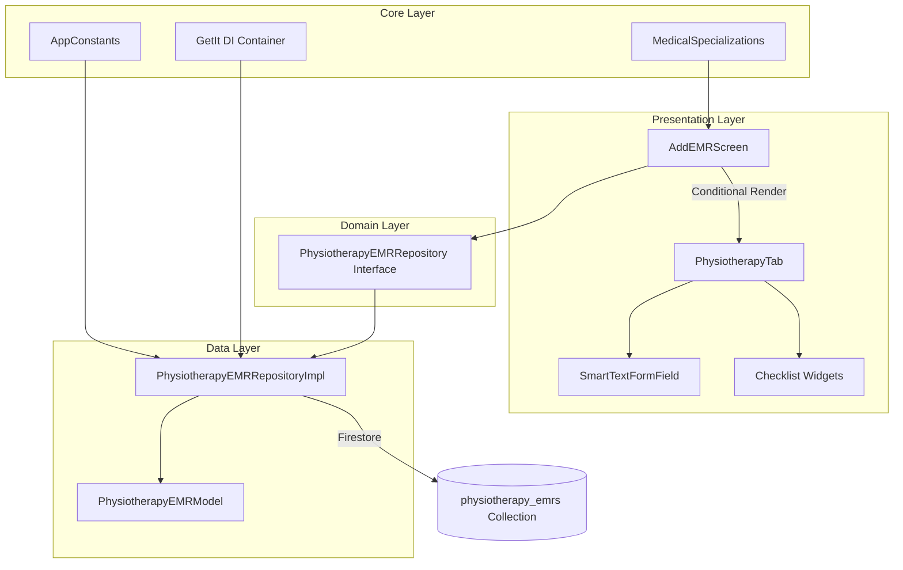
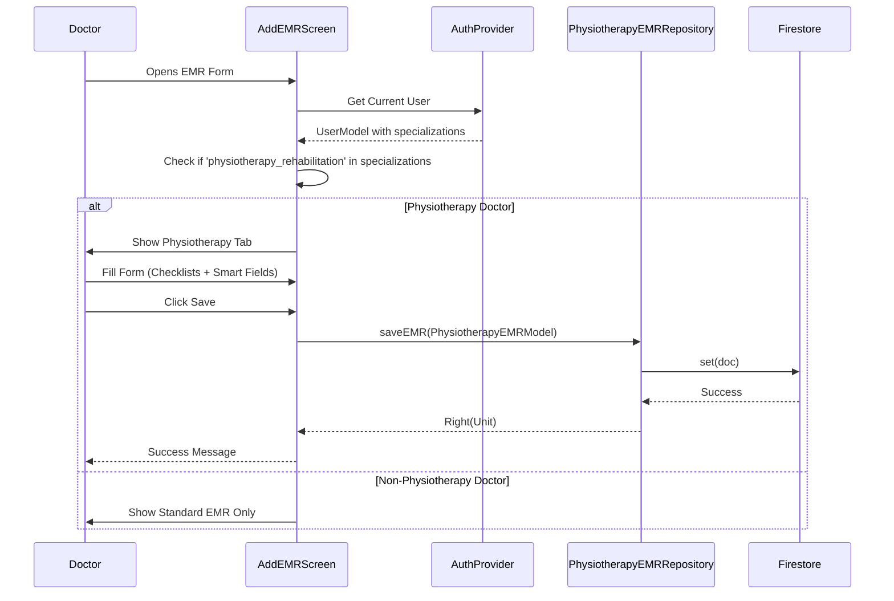

// ignore_for_file: all  
// ignore_for_file: all
# Physiotherapy Specialized EMR Implementation Plan

## Overview
This document outlines the implementation of a physiotherapy-specific EMR (Electronic Medical Record) tab that conditionally appears for doctors with `physiotherapy_rehabilitation` specialization.

## Requirements Summary

### Visibility Logic
- Display physiotherapy questions **ONLY** when `doctor.specializations` contains `physiotherapy_rehabilitation`
- For other specializations, the EMR page remains unchanged

### Directionality Control
- Wrap entire physiotherapy section with `Directionality(textDirection: TextDirection.ltr)`
- Ensure English content flows left-to-right
- Left-align checkboxes within the LTR container

### UI Elements
- **Checklist Items**: All sections as multi-select checkboxes
- **Smart Text Fields**: For "Primary Diagnosis" and "Management Plan" with auto-formatting on Enter key (bullet points or numbering)

### Backend Integration
- Save answers as a Map within the EMR document
- Include `appointmentId` to bypass Firestore security rules

---

## Architecture Overview



---

## Data Flow Diagram



---

## Implementation Steps

### Step 1: Update Medical Specializations Constants
**File**: `lib/core/constants/medical_specializations.dart`

Add `physiotherapy_rehabilitation` to the specializations hierarchy:

```dart
static const Map<String, List<String>> hierarchy = {
  andrologyClinic: [
    'طب الذكورة',
    'تأخر الإنجاب والعقم لدى الرجال',
    'صحة البروستات',
    'الأمراض الجنسية المعدية',
  ],
  otherClinics: [
    'عيادة الأمراض المزمنة',
    'عيادة السمنة والتغذية العلاجية',
    'عيادة العلاج الطبيعي والتأهيل', // Arabic name
    'physiotherapy_rehabilitation', // English constant for code matching
    'عيادة الباطنة وطب الأسرة',
  ],
};
```

### Step 2: Create PhysiotherapyEMRModel
**File**: `lib/shared/models/physiotherapy_emr_model.dart`

```dart
/// Physiotherapy EMR Model
class PhysiotherapyEMRModel {
  PhysiotherapyEMRModel({
    required this.id,
    required this.patientId,
    required this.doctorId,
    required this.doctorName,
    required this.appointmentId,
    required this.createdAt,
    // Patient Basics
    required this.patientBasics,
    // History
    required this.history,
    // Physical Examination
    required this.physicalExamination,
    // Assessment
    required this.assessment,
    // Plan
    required this.plan,
  });

  // Core Fields
  final String id;
  final String patientId;
  final String doctorId;
  final String doctorName;
  final String appointmentId;
  final DateTime createdAt;

  // Question Sections (Maps for flexible data storage)
  final Map<String, List<String>> patientBasics;
  final Map<String, List<String>> history;
  final Map<String, List<String>> physicalExamination;
  final Map<String, List<String>> assessment;
  final Map<String, List<String>> plan;

  // Factory from JSON
  factory PhysiotherapyEMRModel.fromJson(Map<String, dynamic> json) {
    return PhysiotherapyEMRModel(
      id: json['id'] as String,
      patientId: json['patientId'] as String,
      doctorId: json['doctorId'] as String,
      doctorName: json['doctorName'] as String,
      appointmentId: json['appointmentId'] as String? ?? '',
      createdAt: DateTime.parse(json['createdAt'] as String),
      patientBasics: _parseMap(json['patientBasics']),
      history: _parseMap(json['history']),
      physicalExamination: _parseMap(json['physicalExamination']),
      assessment: _parseMap(json['assessment']),
      plan: _parseMap(json['plan']),
    );
  }

  static Map<String, List<String>> _parseMap(dynamic data) {
    if (data == null) return {};
    return (data as Map<String, dynamic>).map(
      (key, value) => MapEntry(
        key,
        (value as List<dynamic>).map((e) => e as String).toList(),
      ),
    );
  }

  // To JSON
  Map<String, dynamic> toJson() {
    return {
      'id': id,
      'patientId': patientId,
      'doctorId': doctorId,
      'doctorName': doctorName,
      'appointmentId': appointmentId,
      'createdAt': createdAt.toIso8601String(),
      'patientBasics': patientBasics,
      'history': history,
      'physicalExamination': physicalExamination,
      'assessment': assessment,
      'plan': plan,
    };
  }
}
```

### Step 3: Create Repository Interface
**File**: `lib/features/emr/domain/repositories/physiotherapy_emr_repository.dart`

```dart
import 'package:dartz/dartz.dart';
import 'package:elajtech/core/error/failures.dart';
import 'package:elajtech/shared/models/physiotherapy_emr_model.dart';

/// Physiotherapy EMR Repository Interface
abstract class PhysiotherapyEMRRepository {
  /// Save a Physiotherapy EMR record
  Future<Either<Failure, void>> saveEMR(PhysiotherapyEMRModel emr);

  /// Get Physiotherapy EMR by appointment ID
  Future<Either<Failure, PhysiotherapyEMRModel?>> getEMRByAppointmentId(
    String appointmentId,
  );

  /// Get all Physiotherapy EMRs for a patient
  Future<Either<Failure, List<PhysiotherapyEMRModel>>> getEMRByPatientId(
    String patientId,
  );
}
```

### Step 4: Create Repository Implementation
**File**: `lib/features/emr/data/repositories/physiotherapy_emr_repository_impl.dart`

```dart
import 'package:cloud_firestore/cloud_firestore.dart';
import 'package:dartz/dartz.dart';
import 'package:elajtech/core/constants/app_constants.dart';
import 'package:elajtech/core/error/failures.dart';
import 'package:elajtech/features/emr/domain/repositories/physiotherapy_emr_repository.dart';
import 'package:elajtech/shared/models/physiotherapy_emr_model.dart';
import 'package:injectable/injectable.dart';

/// Implementation of Physiotherapy EMR Repository using Firestore
@LazySingleton(as: PhysiotherapyEMRRepository)
class PhysiotherapyEMRRepositoryImpl implements PhysiotherapyEMRRepository {
  PhysiotherapyEMRRepositoryImpl(this._firestore);
  final FirebaseFirestore _firestore;

  @override
  Future<Either<Failure, void>> saveEMR(PhysiotherapyEMRModel emr) async {
    try {
      // Validate appointmentId for security rules
      if (emr.appointmentId.isEmpty) {
        return const Left(
          ServerFailure('appointmentId is required to save Physiotherapy EMR'),
        );
      }

      await _firestore
          .collection('physiotherapy_emrs')
          .doc(emr.id)
          .set(emr.toJson());
      return const Right(null);
    } on FirebaseException catch (e) {
      if (e.code == 'permission-denied') {
        return const Left(
          ServerFailure(
            'Sorry, the time limit for adding/modifying medical data for this appointment has expired (24 hours)',
          ),
        );
      }
      return Left(ServerFailure(e.toString()));
    } catch (e) {
      return Left(ServerFailure('Failed to save Physiotherapy EMR: $e'));
    }
  }

  @override
  Future<Either<Failure, PhysiotherapyEMRModel?>> getEMRByAppointmentId(
    String appointmentId,
  ) async {
    try {
      final querySnapshot = await _firestore
          .collection('physiotherapy_emrs')
          .where('appointmentId', isEqualTo: appointmentId)
          .limit(1)
          .get();

      if (querySnapshot.docs.isEmpty) {
        return const Right(null);
      }

      final emr = PhysiotherapyEMRModel.fromJson(
        querySnapshot.docs.first.data(),
      );
      return Right(emr);
    } catch (e) {
      return Left(
        ServerFailure('Failed to get Physiotherapy EMR by appointment: $e'),
      );
    }
  }

  @override
  Future<Either<Failure, List<PhysiotherapyEMRModel>>> getEMRByPatientId(
    String patientId,
  ) async {
    try {
      final querySnapshot = await _firestore
          .collection('physiotherapy_emrs')
          .where('patientId', isEqualTo: patientId)
          .orderBy('createdAt', descending: true)
          .get();

      final emrs = querySnapshot.docs
          .map((doc) => PhysiotherapyEMRModel.fromJson(doc.data()))
          .toList();

      return Right(emrs);
    } catch (e) {
      return Left(
        ServerFailure('Failed to get Physiotherapy EMRs by patient: $e'),
      );
    }
  }
}
```

### Step 5: Create SmartTextFormField Widget
**File**: `lib/shared/widgets/smart_text_form_field.dart`

```dart
import 'package:flutter/material.dart';
import 'package:flutter/services.dart';

/// Smart TextFormField with auto-formatting on Enter key
/// Supports bullet points (•) and auto-numbering (1-, 2-, etc.)
class SmartTextFormField extends StatefulWidget {
  const SmartTextFormField({
    required this.controller,
    required this.label,
    this.maxLines = 3,
    this.formatType = SmartFormatType.bullet,
    super.key,
  });

  final TextEditingController controller;
  final String label;
  final int maxLines;
  final SmartFormatType formatType;

  @override
  State<SmartTextFormField> createState() => _SmartTextFormFieldState();
}

enum SmartFormatType { bullet, numbered }

class _SmartTextFormFieldState extends State<SmartTextFormField> {
  int _lineNumber = 1;

  @override
  Widget build(BuildContext context) {
    return TextFormField(
      controller: widget.controller,
      style: const TextStyle(fontSize: 16, fontWeight: FontWeight.w500),
      decoration: InputDecoration(
        labelText: widget.label,
        labelStyle: const TextStyle(
          fontSize: 16,
          color: Colors.grey,
          fontWeight: FontWeight.w500,
        ),
        floatingLabelStyle: const TextStyle(
          fontSize: 18,
          color: Colors.blue,
          fontWeight: FontWeight.bold,
        ),
        border: const OutlineInputBorder(),
        contentPadding: const EdgeInsets.symmetric(
          horizontal: 16,
          vertical: 16,
        ),
        isDense: true,
      ),
      maxLines: widget.maxLines,
      keyboardType: TextInputType.multiline,
      textInputAction: TextInputAction.newline,
      onChanged: _handleTextChange,
    );
  }

  void _handleTextChange(String text) {
    // Count newlines to determine current line number
    final newlines = '\n'.allMatches(text).length;
    _lineNumber = newlines + 1;
  }

  @override
  void initState() {
    super.initState();
    widget.controller.addListener(_handleTextChange);
  }

  @override
  void dispose() {
    widget.controller.removeListener(_handleTextChange);
    super.dispose();
  }
}

/// Text Input Formatter for Smart Fields
class SmartTextInputFormatter extends TextInputFormatter {
  SmartTextInputFormatter({required this.formatType});

  final SmartFormatType formatType;
  int _lineNumber = 1;

  @override
  TextEditingValue formatEditUpdate(
    TextEditingValue oldValue,
    TextEditingValue newValue,
  ) {
    // Detect Enter key press (newline added)
    if (newValue.text.length > oldValue.text.length &&
        newValue.text.endsWith('\n')) {
      final prefix = formatType == SmartFormatType.bullet
          ? '• '
          : '$_lineNumber- ';

      _lineNumber++;

      return TextEditingValue(
        text: newValue.text + prefix,
        selection: TextSelection.collapsed(offset: newValue.text.length + prefix.length),
      );
    }

    return newValue;
  }
}
```

### Step 6: Define Physiotherapy Question Options
**File**: `lib/shared/models/physiotherapy_emr_model.dart` (append to model file)

```dart
/// Physiotherapy Question Options
class PhysiotherapyQuestions {
  // Patient Basics
  static const Map<String, List<String>> patientBasics = {
    'chief_complaint': ['Pain', 'Weakness', 'Stiffness', 'Numbness', 'Balance issues'],
    'onset': ['Acute', 'Gradual', 'Traumatic', 'Post-surgical'],
    'duration': ['< 1 week', '1-4 weeks', '1-3 months', '> 3 months', 'Chronic'],
    'pain_scale': ['0-2 (Mild)', '3-5 (Moderate)', '6-8 (Severe)', '9-10 (Extreme)'],
  };

  static const Map<String, String> patientBasicsLabels = {
    'chief_complaint': 'Chief Complaint',
    'onset': 'Onset',
    'duration': 'Duration',
    'pain_scale': 'Pain Scale',
  };

  // History
  static const Map<String, List<String>> history = {
    'medical_history': ['Diabetes', 'Hypertension', 'Heart Disease', 'Cancer', 'Neurological conditions'],
    'surgical_history': ['Orthopedic surgery', 'Spinal surgery', 'Joint replacement', 'None'],
    'medications': ['NSAIDs', 'Muscle relaxants', 'Pain medication', 'Blood thinners'],
    'previous_therapy': ['Physical therapy', 'Occupational therapy', 'Chiropractic', 'None'],
  };

  static const Map<String, String> historyLabels = {
    'medical_history': 'Medical History',
    'surgical_history': 'Surgical History',
    'medications': 'Current Medications',
    'previous_therapy': 'Previous Therapy',
  };

  // Physical Examination
  static const Map<String, List<String>> physicalExamination = {
    'observation': ['Gait abnormality', 'Posture deviation', 'Swelling', 'Deformity', 'Atrophy'],
    'palpation': ['Tenderness', 'Trigger points', 'Muscle spasm', 'Temperature change'],
    'rom': ['Decreased flexion', 'Decreased extension', 'Decreased rotation', 'Limited'],
    'strength': ['0/5 (No contraction)', '1-2/5 (Poor)', '3/5 (Fair)', '4-5/5 (Normal)'],
    'sensory': ['Intact', 'Diminished', 'Absent', 'Hyperesthesia'],
    'reflexes': ['Normal', 'Hypo-reflexic', 'Hyper-reflexic', 'Absent'],
  };

  static const Map<String, String> physicalExaminationLabels = {
    'observation': 'Observation',
    'palpation': 'Palpation',
    'rom': 'Range of Motion',
    'strength': 'Muscle Strength',
    'sensory': 'Sensory Testing',
    'reflexes': 'Reflexes',
  };

  // Assessment
  static const Map<String, List<String>> assessment = {
    'diagnosis_categories': ['Musculoskeletal', 'Neurological', 'Cardiopulmonary', 'Post-surgical', 'Chronic pain'],
    'functional_limitations': ['ADL limitations', 'Work limitations', 'Sports limitations', 'None'],
    'prognosis': ['Excellent', 'Good', 'Fair', 'Guarded', 'Poor'],
  };

  static const Map<String, String> assessmentLabels = {
    'diagnosis_categories': 'Diagnosis Categories',
    'functional_limitations': 'Functional Limitations',
    'prognosis': 'Prognosis',
  };

  // Plan
  static const Map<String, List<String>> plan = {
    'treatment_modalities': ['Therapeutic exercise', 'Manual therapy', 'Modalities (heat/ice/e-stim)', 'Gait training', 'Balance training'],
    'frequency': ['1x/week', '2x/week', '3x/week', 'Daily home program'],
    'duration': ['2-4 weeks', '4-8 weeks', '8-12 weeks', 'Ongoing'],
    'home_exercise': ['Stretching', 'Strengthening', 'Aerobic conditioning', 'Pain management techniques'],
    'goals': ['Pain reduction', 'Improved ROM', 'Increased strength', 'Return to ADLs', 'Return to work/sports'],
  };

  static const Map<String, String> planLabels = {
    'treatment_modalities': 'Treatment Modalities',
    'frequency': 'Frequency',
    'duration': 'Treatment Duration',
    'home_exercise': 'Home Exercise Program',
    'goals': 'Treatment Goals',
  };
}
```

### Step 7: Modify AddEMRScreen
**File**: `lib/features/doctor/medical_records/presentation/screens/add_emr_screen.dart`

Key modifications:

1. **Add State Variables for Physiotherapy Data**:
```dart
// Physiotherapy EMR Data
final Map<String, List<String>> _patientBasicsSelections = {};
final Map<String, List<String>> _historySelections = {};
final Map<String, List<String>> _physicalExamSelections = {};
final Map<String, List<String>> _assessmentSelections = {};
final Map<String, List<String>> _planSelections = {};

// Smart Text Fields
final _primaryDiagnosisController = TextEditingController();
final _managementPlanController = TextEditingController();
```

2. **Add Visibility Check**:
```dart
bool get _isPhysiotherapyDoctor {
  final user = ref.read(authProvider).user;
  return user?.specializations?.contains('physiotherapy_rehabilitation') ?? false;
}
```

3. **Build Method - Add Conditional Tab**:
```dart
@override
Widget build(BuildContext context) {
  return Scaffold(
    appBar: AppBar(title: const Text('إضافة سجل EMR')),
    body: Form(
      key: _formKey,
      child: ListView(
        padding: const EdgeInsets.all(16),
        children: [
          // Existing EMR sections...
          _buildSectionHeader('I. Sexual Function Assessment'),
          // ... existing fields ...

          // Physiotherapy Tab (Conditional)
          if (_isPhysiotherapyDoctor) _buildPhysiotherapyTab(),

          const SizedBox(height: 24),
          SizedBox(
            width: double.infinity,
            height: 50,
            child: ElevatedButton(
              onPressed: _isLoading ? null : _save,
              // ... button styling
            ),
          ),
        ],
      ),
    ),
  );
}
```

4. **Build Physiotherapy Tab with LTR Directionality**:
```dart
Widget _buildPhysiotherapyTab() {
  return Directionality(
    textDirection: TextDirection.ltr,
    child: Column(
      crossAxisAlignment: CrossAxisAlignment.start,
      children: [
        const SizedBox(height: 24),
        _buildSectionHeader('Physiotherapy Assessment'),
        
        // Patient Basics
        _buildPhysiotherapySection(
          'Patient Basics',
          PhysiotherapyQuestions.patientBasics,
          PhysiotherapyQuestions.patientBasicsLabels,
          _patientBasicsSelections,
        ),
        
        // History
        _buildPhysiotherapySection(
          'History',
          PhysiotherapyQuestions.history,
          PhysiotherapyQuestions.historyLabels,
          _historySelections,
        ),
        
        // Physical Examination
        _buildPhysiotherapySection(
          'Physical Examination',
          PhysiotherapyQuestions.physicalExamination,
          PhysiotherapyQuestions.physicalExaminationLabels,
          _physicalExamSelections,
        ),
        
        // Assessment
        _buildPhysiotherapySection(
          'Assessment',
          PhysiotherapyQuestions.assessment,
          PhysiotherapyQuestions.assessmentLabels,
          _assessmentSelections,
        ),
        
        // Primary Diagnosis (Smart Field)
        _buildSubSectionHeader('Primary Diagnosis'),
        SmartTextFormField(
          controller: _primaryDiagnosisController,
          label: 'Primary Diagnosis',
          maxLines: 3,
          formatType: SmartFormatType.bullet,
        ),
        
        // Plan
        _buildPhysiotherapySection(
          'Plan',
          PhysiotherapyQuestions.plan,
          PhysiotherapyQuestions.planLabels,
          _planSelections,
        ),
        
        // Management Plan (Smart Field)
        _buildSubSectionHeader('Management Plan'),
        SmartTextFormField(
          controller: _managementPlanController,
          label: 'Management Plan',
          maxLines: 4,
          formatType: SmartFormatType.numbered,
        ),
      ],
    ),
  );
}
```

5. **Build Checklist Section Helper**:
```dart
Widget _buildPhysiotherapySection(
  String title,
  Map<String, List<String>> options,
  Map<String, String> labels,
  Map<String, List<String>> selections,
) {
  return Column(
    crossAxisAlignment: CrossAxisAlignment.start,
    children: [
      _buildSectionHeader(title),
      ...options.entries.map((entry) {
        final key = entry.key;
        final items = entry.value;
        final label = labels[key] ?? key;

        return Card(
          margin: const EdgeInsets.only(bottom: 12),
          elevation: 2,
          child: ExpansionTile(
            title: Text(
              label,
              style: const TextStyle(fontWeight: FontWeight.w600, fontSize: 16),
            ),
            children: [
              Padding(
                padding: const EdgeInsets.symmetric(horizontal: 16, vertical: 8),
                child: Column(
                  children: items.map(
                    (item) => CheckboxListTile(
                      title: Text(item),
                      value: selections[key]?.contains(item) ?? false,
                      onChanged: (checked) {
                        setState(() {
                          selections.putIfAbsent(key, () => []);
                          if (checked == true) {
                            selections[key]!.add(item);
                          } else {
                            selections[key]!.remove(item);
                          }
                        });
                      },
                      dense: true,
                      controlAffinity: ListTileControlAffinity.leading,
                    ),
                  ).toList(),
                ),
              ),
            ],
          ),
        );
      }).toList(),
    ],
  );
}
```

6. **Update _save Method**:
```dart
Future<void> _save() async {
  if (!_formKey.currentState!.validate()) {
    ScaffoldMessenger.of(context).showSnackBar(
      const SnackBar(content: Text('يرجى ملء جميع الحقول المطلوبة')),
    );
    return;
  }

  setState(() => _isLoading = true);

  try {
    final user = ref.read(authProvider).user!;

    // Save Standard EMR
    final emr = EMRModel(/* ... existing fields ... */);
    final emrResult = await GetIt.I<EMRRepository>().saveEMR(emr);
    emrResult.fold(
      (failure) => throw Exception(failure.message),
      (_) => null,
    );

    // Save Physiotherapy EMR if applicable
    if (_isPhysiotherapyDoctor) {
      final physioEMR = PhysiotherapyEMRModel(
        id: const Uuid().v4(),
        patientId: widget.patientId,
        doctorId: user.id,
        doctorName: user.fullName,
        appointmentId: widget.appointmentId,
        createdAt: DateTime.now(),
        patientBasics: _patientBasicsSelections,
        history: _historySelections,
        physicalExamination: _physicalExamSelections,
        assessment: _assessmentSelections,
        plan: _planSelections,
      );

      final physioResult = await GetIt.I<PhysiotherapyEMRRepository>().saveEMR(physioEMR);
      physioResult.fold(
        (failure) => throw Exception(failure.message),
        (_) => null,
      );
    }

    if (mounted) {
      Navigator.pop(context);
      ScaffoldMessenger.of(context).showSnackBar(
        const SnackBar(content: Text('تم حفظ السجل بنجاح')),
      );
    }
  } catch (e) {
    if (mounted) {
      ScaffoldMessenger.of(context).showSnackBar(
        SnackBar(content: Text('حدث خطأ: $e')),
      );
    }
  } finally {
    if (mounted) setState(() => _isLoading = false);
  }
}
```

---

## File Structure

```
lib/
├── core/
│   ├── constants/
│   │   └── medical_specializations.dart      [MODIFY]
│   └── di/
│       └── injection_container.dart          [AUTO-UPDATE via build_runner]
├── features/
│   └── emr/
│       ├── domain/
│       │   └── repositories/
│       │       └── physiotherapy_emr_repository.dart      [NEW]
│       └── data/
│           └── repositories/
│               └── physiotherapy_emr_repository_impl.dart  [NEW]
├── shared/
│   ├── models/
│   │   └── physiotherapy_emr_model.dart    [NEW]
│   └── widgets/
│       └── smart_text_form_field.dart         [NEW]
└── features/doctor/medical_records/presentation/screens/
    └── add_emr_screen.dart                  [MODIFY]
```

---

## Testing Checklist

- [ ] Tab appears only for doctors with `physiotherapy_rehabilitation` specialization
- [ ] Tab does NOT appear for other specializations
- [ ] All content within physiotherapy tab is LTR (left-to-right)
- [ ] Checkboxes are left-aligned within the LTR container
- [ ] Smart text fields add bullet points on Enter key (Primary Diagnosis)
- [ ] Smart text fields add numbering on Enter key (Management Plan)
- [ ] All checklist items are selectable/deselectable
- [ ] Data is saved to Firestore `physiotherapy_emrs` collection
- [ ] `appointmentId` is included in saved document
- [ ] Firestore security rules allow saving with valid `appointmentId`
- [ ] Error handling for permission-denied (24-hour timeout)
- [ ] Form validation works correctly
- [ ] Loading states display properly
- [ ] Success/error messages show appropriately

---

## Notes

1. **DI Registration**: The `@LazySingleton` annotation on `PhysiotherapyEMRRepositoryImpl` will automatically register it with GetIt when running `build_runner`.

2. **Firestore Collection**: The data will be saved to a separate `physiotherapy_emrs` collection, following the pattern used by `internal_medicine_emrs`.

3. **Directionality**: The entire physiotherapy section is wrapped in `Directionality(textDirection: TextDirection.ltr)` to ensure English content displays correctly regardless of the app's overall RTL setting.

4. **Smart Text Fields**: The custom `SmartTextFormField` widget provides auto-formatting for better data organization. Pressing Enter automatically adds bullet points or numbering.

5. **Clean Architecture**: The implementation follows the existing Clean Architecture pattern with clear separation between Data, Domain, and Presentation layers.
