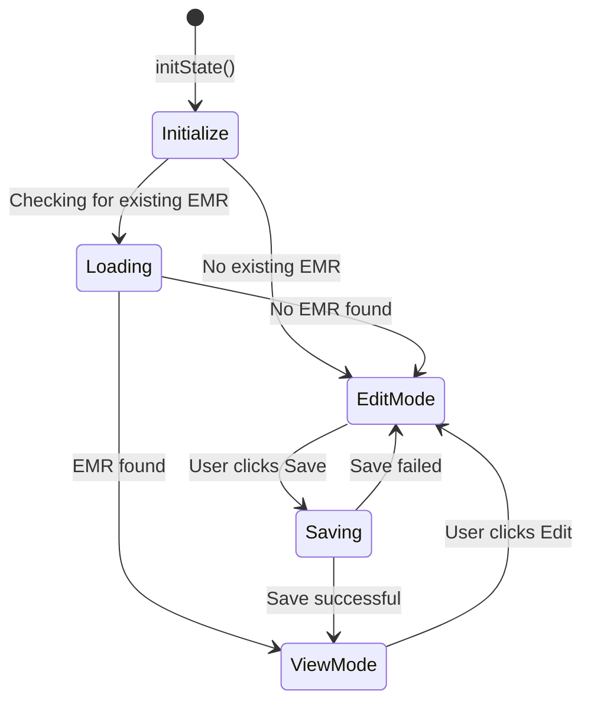
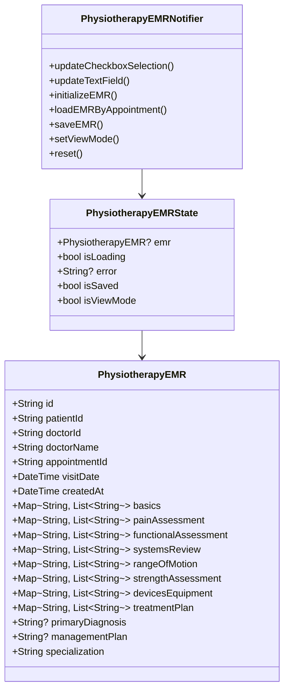

// ignore_for_file: all  
// ignore_for_file: all
# خطة تنفيذ ميزة "وضع عرض الملخص" (View Mode) - PhysiotherapyEMRTab

## نظرة عامة
هذه الخطة التقنية التفصيلية تهدف إلى تصميم وتنفيذ ميزة "وضع عرض الملخص" داخل تبويب PhysiotherapyEMRTab، والذي يتم تفعيله بعد حفظ البيانات بنجاح في Firestore.

---

## المحور الأول: منطق استعادة البيانات وإدارة الحالة

### 1.1 استرجاع البيانات من Firestore

#### منهجية الربط مع Firestore
- **معرف قاعدة البيانات**: استخدام `databaseId: 'elajtech'` بشكل صارم
- **الاستعلام**: استخدام `getPhysiotherapyEMRByVisit(appointmentId)` من [`PhysiotherapyEMRRepository`](lib/features/doctor/medical_records/data/repositories/physiotherapy_emr_repository.dart:92)
- **الحقول المسترجعة**:
  - `basics`: خريطة تحتوي على العناصر المحددة من قسم "Patient & Visit Basics"
  - `painAssessment`: خريطة تحتوي على العناصر المحددة من قسم "Pain Assessment"
  - `functionalAssessment`: خريطة تحتوي على العناصر المحددة من قسم "Functional Status"
  - `systemsReview`: خريطة تحتوي على العناصر المحددة من قسم "Systems Screening"
  - `rangeOfMotion`: خريطة تحتوي على العناصر المحددة من قسم "Range of Motion"
  - `strengthAssessment`: خريطة تحتوي على العناصر المحددة من قسم "Strength Testing"
  - `devicesEquipment`: خريطة تحتوي على العناصر المحددة من قسم "Assistive Devices"
  - `treatmentPlan`: خريطة تحتوي على العناصر المحددة من قسم "Plan"
  - `primaryDiagnosis`: نص التشخيص الأساسي
  - `managementPlan`: نص خطة العلاج

#### التحقق من دقة البيانات المسترجعة
```dart
// في PhysiotherapyEMRModel.fromFirestore
if (kDebugMode) {
  debugPrint('📄 [PhysiotherapyEMRModel] Parsing document: ${snapshot.id}');
  debugPrint('   Data keys: ${data.keys.join(", ")}');
  debugPrint('   basics: ${data['basics']}');
  debugPrint('   painAssessment: ${data['painAssessment']}');
  debugPrint('   functionalAssessment: ${data['functionalAssessment']}');
}
```

#### التحقق مقابل الخرائط المحفوظة
- **قبل الحفظ**: تسجيل البيانات المرسلة للـ Firestore عبر `debugPrint`
- **بعد الاسترجاع**: مقارنة البيانات المسترجعة مع البيانات المحفوظة للتأكد من التطابق
- **معالجة الأخطاء**: استخدام try-catch في [`fromFirestore`](lib/features/doctor/medical_records/data/models/physiotherapy_emr_model.dart:40) مع تسجيل StackTrace

### 1.2 استراتيجية إدارة الحالة (State Management)

#### إضافة حالة جديدة في PhysiotherapyEMRState
```dart
class PhysiotherapyEMRState {
  const PhysiotherapyEMRState({
    this.emr,
    this.isLoading = false,
    this.error,
    this.isSaved = false,
    this.isViewMode = false,  // حالة جديدة
  });

  final PhysiotherapyEMR? emr;
  final bool isLoading;
  final String? error;
  final bool isSaved;
  final bool isViewMode;  // حالة جديدة
}
```

#### التبديل بين "وضع التعديل" و"وضع العرض"
1. **وضع التعديل (Edit Mode)** - الوضع الافتراضي:
   - عرض جميع صناديق الاختيار (CheckboxListTile)
   - السماح بالتعديل على جميع الحقول
   - `isViewMode = false`

2. **وضع العرض (View Mode)** - بعد الحفظ بنجاح:
   - عرض العناصر المحددة فقط باستخدام Chips أو بطاقات نصية
   - منع التعديل (read-only)
   - `isViewMode = true`

#### آلية التبديل الآمن
```dart
// في PhysiotherapyEMRNotifier
void setViewMode(bool isViewMode) {
  state = state.copyWith(isViewMode: isViewMode);
}

// بعد الحفظ بنجاح
Future<void> saveEMR() async {
  // ... حفظ البيانات
  result.fold(
    (failure) => {...},
    (_) {
      state = state.copyWith(
        isLoading: false,
        isSaved: true,
        isViewMode: true,  // تفعيل وضع العرض
      );
    },
  );
}
```

### 1.3 تحميل البيانات المحفوظة
```dart
// في PhysiotherapyEMRTabState.initState
@override
void initState() {
  super.initState();
  
  // التحقق من وجود EMR محفوظ
  WidgetsBinding.instance.addPostFrameCallback((_) async {
    final result = await ref.read(physiotherapyEMRNotifierProvider.notifier)
        .loadEMRByAppointment(widget.appointmentId);
    
    result.fold(
      (failure) => {...},
      (emr) {
        if (emr != null) {
          // تفعيل وضع العرض تلقائياً
          ref.read(physiotherapyEMRNotifierProvider.notifier)
              .setViewMode(true);
        }
      },
    );
  });
}
```

---

## المحور الثاني: تصميم واجهة المستخدم للملخص

### 2.1 التخطيط المتجاوب (Responsive Layout)

#### استبدال القائمة الكاملة بصناديق الاختيار
- **في وضع التعديل**: عرض `CheckboxListTile` لجميع العناصر
- **في وضع العرض**: عرض `Chip` أو `Card` للعناصر المحددة فقط

### 2.2 تصميم Chips للعناصر المحددة

#### مكون ChipWidget
```dart
Widget _buildSelectedChip(String item) {
  return Chip(
    label: Text(
      item,
      style: const TextStyle(fontSize: 14),
    ),
    backgroundColor: AppColors.primary.withOpacity(0.1),
    side: BorderSide(color: AppColors.primary),
    padding: const EdgeInsets.symmetric(horizontal: 8, vertical: 4),
  );
}
```

#### عرض العناصر المحددة في Wrap
```dart
Widget _buildSelectedItemsSection(
  String sectionTitle,
  List<String> selectedItems,
) {
  if (selectedItems.isEmpty) {
    return _buildEmptySectionMessage(sectionTitle);
  }

  return Card(
    margin: const EdgeInsets.only(bottom: 16),
    elevation: 2,
    child: Padding(
      padding: const EdgeInsets.all(16),
      child: Column(
        crossAxisAlignment: CrossAxisAlignment.start,
        children: [
          Text(
            sectionTitle,
            style: const TextStyle(
              fontSize: 18,
              fontWeight: FontWeight.bold,
              color: AppColors.primary,
            ),
          ),
          const SizedBox(height: 12),
          Wrap(
            spacing: 8,
            runSpacing: 8,
            children: selectedItems.map(_buildSelectedChip).toList(),
          ),
        ],
      ),
    ),
  );
}
```

### 2.3 عرض الأقسام الفارغة

#### رسالة "لا توجد عناصر محددة"
```dart
Widget _buildEmptySectionMessage(String sectionTitle) {
  return Card(
    margin: const EdgeInsets.only(bottom: 16),
    elevation: 1,
    child: Padding(
      padding: const EdgeInsets.all(16),
      child: Row(
        children: [
          Icon(
            Icons.info_outline,
            color: Colors.grey[600],
          ),
          const SizedBox(width: 8),
          Text(
            'No items selected in $sectionTitle',
            style: TextStyle(
              fontSize: 14,
              color: Colors.grey[600],
              fontStyle: FontStyle.italic,
            ),
          ),
        ],
      ),
    ),
  );
}
```

### 2.4 البنية الكاملة لوضع العرض

#### عرض الأقسام الثمانية
```dart
Widget _buildViewModeContent() {
  final emr = state.emr;
  if (emr == null) return const SizedBox.shrink();

  return Column(
    children: [
      // 1. Patient & Visit Basics
      _buildSelectedItemsSection(
        'Patient & Visit Basics',
        emr.basics['selected'] ?? [],
      ),
      
      // 2. Pain Assessment
      _buildSelectedItemsSection(
        'Pain Assessment',
        emr.painAssessment['selected'] ?? [],
      ),
      
      // 3. Functional Status
      _buildSelectedItemsSection(
        'Functional Status',
        emr.functionalAssessment['selected'] ?? [],
      ),
      
      // 4. Systems Screening
      _buildSelectedItemsSection(
        'Systems Screening',
        emr.systemsReview['selected'] ?? [],
      ),
      
      // 5. Range of Motion
      _buildSelectedItemsSection(
        'Range of Motion',
        emr.rangeOfMotion['selected'] ?? [],
      ),
      
      // 6. Strength Testing
      _buildSelectedItemsSection(
        'Strength Testing',
        emr.strengthAssessment['selected'] ?? [],
      ),
      
      // 7. Assistive Devices
      _buildSelectedItemsSection(
        'Assistive Devices',
        emr.devicesEquipment['selected'] ?? [],
      ),
      
      // 8. Plan
      _buildSelectedItemsSection(
        'Plan',
        emr.treatmentPlan['selected'] ?? [],
      ),
      
      // 9. Primary Diagnosis
      if (emr.primaryDiagnosis != null && emr.primaryDiagnosis!.isNotEmpty)
        _buildTextSection('Primary Diagnosis', emr.primaryDiagnosis!),
      
      // 10. Management Plan
      if (emr.managementPlan != null && emr.managementPlan!.isNotEmpty)
        _buildTextSection('Management Plan', emr.managementPlan!),
    ],
  );
}
```

#### عرض الحقول النصية
```dart
Widget _buildTextSection(String title, String content) {
  return Card(
    margin: const EdgeInsets.only(bottom: 16),
    elevation: 2,
    child: Padding(
      padding: const EdgeInsets.all(16),
      child: Column(
        crossAxisAlignment: CrossAxisAlignment.start,
        children: [
          Text(
            title,
            style: const TextStyle(
              fontSize: 18,
              fontWeight: FontWeight.bold,
              color: AppColors.primary,
            ),
          ),
          const SizedBox(height: 12),
          Text(
            content,
            style: const TextStyle(fontSize: 16, height: 1.5),
          ),
        ],
      ),
    ),
  );
}
```

### 2.5 زر التبديل بين الوضعين

#### زر "Edit" للعودة إلى وضع التعديل
```dart
Widget _buildEditButton() {
  return ElevatedButton.icon(
    onPressed: () {
      ref.read(physiotherapyEMRNotifierProvider.notifier)
          .setViewMode(false);
    },
    icon: const Icon(Icons.edit),
    label: const Text('Edit EMR'),
    style: ElevatedButton.styleFrom(
      backgroundColor: AppColors.primary,
      foregroundColor: Colors.white,
    ),
  );
}
```

### 2.6 التخطيط النهائي في build method
```dart
@override
Widget build(BuildContext context) {
  final state = ref.watch(physiotherapyEMRNotifierProvider);
  
  return Directionality(
    textDirection: TextDirection.ltr,
    child: SingleChildScrollView(
      padding: const EdgeInsets.all(16),
      child: Column(
        children: [
          // Header
          _buildSectionHeader('Physical Therapy Assessment'),
          
          if (state.isViewMode) {
            // View Mode: عرض الملخص فقط
            _buildViewModeContent(),
            const SizedBox(height: 16),
            _buildEditButton(),
          } else {
            // Edit Mode: عرض النموذج الكامل
            ...PhysiotherapyQuestions.physiotherapyQuestions.entries.map(
              (entry) => _buildChecklistSection(entry.key),
            ),
            _buildUnifiedTextField('Primary Diagnosis', _primaryDiagnosisController),
            _buildUnifiedTextField('Management Plan', _managementPlanController),
          },
          
          const SizedBox(height: 48),
        ],
      ),
    ),
  );
}
```

---

## المحور الثالث: الالتزام بأفضل الممارسات البرمجية

### 3.1 تطبيق Null Safety بشكل صارم

#### التحقق من البيانات قبل الاستخدام
```dart
// في _buildViewModeContent
final emr = state.emr;
if (emr == null) {
  return const Center(child: Text('No EMR data available'));
}

// التحقق من الخرائط
final basicsSelected = emr.basics['selected'];
if (basicsSelected == null || basicsSelected.isEmpty) {
  return _buildEmptySectionMessage('Patient & Visit Basics');
}
```

#### استخدام null-aware operators
```dart
// استخراج العناصر المحددة بأمان
final selectedItems = emr.basics['selected'] ?? <String>[];

// التحقق من الحقول النصية
if (emr.primaryDiagnosis?.isNotEmpty ?? false) {
  _buildTextSection('Primary Diagnosis', emr.primaryDiagnosis!);
}
```

#### منع استخدام ! operator
```dart
// ❌ خطأ: استخدام ! بدون التحقق
final items = emr.basics['selected']!;

// ✅ صحيح: استخدام null-aware operator
final items = emr.basics['selected'] ?? <String>[];
```

### 3.2 سجلات دقيقة لعملية تصحيح الأخطاء (Debug Logging)

#### تسجيل عملية الحفظ
```dart
Future<void> saveEMR() async {
  if (kDebugMode) {
    debugPrint('═══════════════════════════════════════');
    debugPrint('💾 [PhysiotherapyEMR] Starting Save Operation');
    debugPrint('   User ID: ${state.emr?.doctorId}');
    debugPrint('   Patient ID: ${state.emr?.patientId}');
    debugPrint('   Appointment ID: ${state.emr?.appointmentId}');
    debugPrint('   Basics: ${state.emr?.basics}');
    debugPrint('   Pain Assessment: ${state.emr?.painAssessment}');
    debugPrint('   Functional Assessment: ${state.emr?.functionalAssessment}');
    debugPrint('═══════════════════════════════════════');
  }
  
  // ... عملية الحفظ
  
  result.fold(
    (failure) {
      if (kDebugMode) {
        debugPrint('❌ [PhysiotherapyEMR] Save failed: ${failure.message}');
      }
    },
    (_) {
      if (kDebugMode) {
        debugPrint('✅ [PhysiotherapyEMR] Saved successfully');
        debugPrint('   Switching to View Mode...');
      }
      state = state.copyWith(
        isLoading: false,
        isSaved: true,
        isViewMode: true,
      );
    },
  );
}
```

#### تسجيل عملية الاسترجاع
```dart
Future<void> loadEMRByAppointment(String appointmentId) async {
  if (kDebugMode) {
    debugPrint('═══════════════════════════════════════');
    debugPrint('📥 [PhysiotherapyEMR] Loading EMR by Appointment');
    debugPrint('   Appointment ID: $appointmentId');
    debugPrint('═══════════════════════════════════════');
  }
  
  state = state.copyWith(isLoading: true);
  
  final result = await _repository.getPhysiotherapyEMRByVisit(appointmentId);
  
  result.fold(
    (failure) {
      if (kDebugMode) {
        debugPrint('❌ [PhysiotherapyEMR] Load failed: ${failure.message}');
      }
      state = state.copyWith(
        isLoading: false,
        error: failure.message,
      );
    },
    (emr) {
      if (kDebugMode) {
        if (emr != null) {
          debugPrint('✅ [PhysiotherapyEMR] EMR loaded successfully');
          debugPrint('   EMR ID: ${emr.id}');
          debugPrint('   Visit Date: ${emr.visitDate}');
          debugPrint('   Basics: ${emr.basics}');
          debugPrint('   Pain Assessment: ${emr.painAssessment}');
          debugPrint('   Functional Assessment: ${emr.functionalAssessment}');
        } else {
          debugPrint('ℹ️ [PhysiotherapyEMR] No EMR found for this appointment');
        }
      }
      state = state.copyWith(
        isLoading: false,
        emr: emr,
      );
    },
  );
}
```

#### تسجيل التبديل بين الوضعين
```dart
void setViewMode(bool isViewMode) {
  if (kDebugMode) {
    debugPrint('🔄 [PhysiotherapyEMR] Switching mode...');
    debugPrint('   From: ${state.isViewMode ? "View" : "Edit"} Mode');
    debugPrint('   To: ${isViewMode ? "View" : "Edit"} Mode');
  }
  state = state.copyWith(isViewMode: isViewMode);
}
```

#### تسجيل عرض البيانات في وضع العرض
```dart
Widget _buildViewModeContent() {
  final emr = state.emr;
  if (emr == null) return const SizedBox.shrink();
  
  if (kDebugMode) {
    debugPrint('📊 [PhysiotherapyEMR] Building View Mode content');
    debugPrint('   Basics selected: ${emr.basics['selected']?.length ?? 0} items');
    debugPrint('   Pain Assessment selected: ${emr.painAssessment['selected']?.length ?? 0} items');
    debugPrint('   Functional Assessment selected: ${emr.functionalAssessment['selected']?.length ?? 0} items');
  }
  
  // ... بناء الواجهة
}
```

### 3.3 معالجة الأخطاء بشكل صحيح

#### التحقق من وجود البيانات قبل العرض
```dart
@override
Widget build(BuildContext context) {
  final state = ref.watch(physiotherapyEMRNotifierProvider);
  
  if (state.isLoading) {
    return const Center(child: CircularProgressIndicator());
  }
  
  if (state.error != null) {
    return Center(
      child: Column(
        mainAxisAlignment: MainAxisAlignment.center,
        children: [
          const Icon(Icons.error_outline, size: 48, color: Colors.red),
          const SizedBox(height: 16),
          Text('Error: ${state.error}'),
          const SizedBox(height: 16),
          ElevatedButton(
            onPressed: () => ref.read(physiotherapyEMRNotifierProvider.notifier)
                .loadEMRByAppointment(widget.appointmentId),
            child: const Text('Retry'),
          ),
        ],
      ),
    );
  }
  
  // ... بناء الواجهة
}
```

### 3.4 استخدام LTR Direction بشكل صحيح
```dart
// جميع أقسام PhysiotherapyEMRTab تستخدم LTR
Directionality(
  textDirection: TextDirection.ltr,
  child: SingleChildScrollView(
    // ... المحتوى
  ),
)
```

---

## مخطط تدفق الحالة (State Flow Diagram)



---

## مخطط بنية البيانات (Data Structure)



---

## ملخص التغييرات المطلوبة

### الملفات التي سيتم تعديلها:

1. **[`lib/features/doctor/medical_records/presentation/providers/physiotherapy_emr_provider.dart`](lib/features/doctor/medical_records/presentation/providers/physiotherapy_emr_provider.dart)**
   - إضافة `isViewMode` إلى `PhysiotherapyEMRState`
   - إضافة `setViewMode()` إلى `PhysiotherapyEMRNotifier`
   - تحديث `saveEMR()` لتفعيل وضع العرض بعد الحفظ

2. **[`lib/features/doctor/medical_records/presentation/widgets/physiotherapy_emr_tab.dart`](lib/features/doctor/medical_records/presentation/widgets/physiotherapy_emr_tab.dart)**
   - إضافة `_buildViewModeContent()` لعرض الملخص
   - إضافة `_buildSelectedItemsSection()` لعرض العناصر المحددة
   - إضافة `_buildEmptySectionMessage()` لعرض رسائل الأقسام الفارغة
   - إضافة `_buildSelectedChip()` لإنشاء Chips
   - إضافة `_buildTextSection()` لعرض الحقول النصية
   - إضافة `_buildEditButton()` للتبديل إلى وضع التعديل
   - تحديث `build()` للتبديل بين الوضعين

### الملفات التي لن يتم تعديلها:

- [`lib/features/doctor/medical_records/domain/entities/physiotherapy_emr.dart`](lib/features/doctor/medical_records/domain/entities/physiotherapy_emr.dart)
- [`lib/features/doctor/medical_records/data/models/physiotherapy_emr_model.dart`](lib/features/doctor/medical_records/data/models/physiotherapy_emr_model.dart)
- [`lib/features/doctor/medical_records/data/repositories/physiotherapy_emr_repository.dart`](lib/features/doctor/medical_records/data/repositories/physiotherapy_emr_repository.dart)
- [`lib/features/doctor/medical_records/domain/constants/physiotherapy_questions.dart`](lib/features/doctor/medical_records/domain/constants/physiotherapy_questions.dart)

---

## التحقق من الجودة (Quality Assurance)

### اختبارات Null Safety:
- [ ] التحقق من جميع `state.emr` قبل الاستخدام
- [ ] استخدام `??` لجميع الخرائط والقوائم
- [ ] تجنب استخدام `!` operator

### اختبارات Debug Logging:
- [ ] تسجيل جميع عمليات الحفظ
- [ ] تسجيل جميع عمليات الاسترجاع
- [ ] تسجيل التبديل بين الوضعين
- [ ] مقارنة البيانات قبل الحفظ وبعد الاسترجاع

### اختبارات UI:
- [ ] عرض صحيح في وضع التعديل
- [ ] عرض صحيح في وضع العرض
- [ ] عرض الأقسام الفارغة بشكل صحيح
- [ ] التبديل الآمن بين الوضعين
- [ ] استخدام LTR direction بشكل صحيح

---

## الجدول الزمني للتنفيذ

### المرحلة 1: تحديث State Management
- تعديل `PhysiotherapyEMRState`
- إضافة `setViewMode()` method
- تحديث `saveEMR()` method

### المرحلة 2: بناء UI لوضع العرض
- إنشاء `_buildViewModeContent()`
- إنشاء `_buildSelectedItemsSection()`
- إنشاء `_buildEmptySectionMessage()`
- إنشاء `_buildSelectedChip()`
- إنشاء `_buildTextSection()`
- إنشاء `_buildEditButton()`

### المرحلة 3: التكامل والاختبار
- تحديث `build()` method
- إضافة Debug Logging
- اختبار Null Safety
- اختبار التبديل بين الوضعين

---

## خاتمة

هذه الخطة التقنية التفصيلية توفر إطار عمل شامل لتنفيذ ميزة "وضع عرض الملخص" في PhysiotherapyEMRTab. الخطة تلتزم بجميع قواعد المشروع بما في ذلك:

- استخدام `databaseId: 'elajtech'` لـ Firestore
- تطبيق Null Safety بشكل صارم
- إضافة Debug Logging شامل
- استخدام LTR direction للمحتوى الإنجليزي
- اتباع Clean Architecture
- استخدام Riverpod لإدارة الحالة

بعد الموافقة على هذه الخطة، يمكن البدء في التنفيذ في Code mode.
