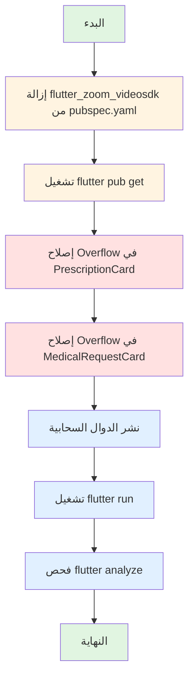

# خطة إزالة مكتبة Zoom SDK وإصلاح مشكلة Overflow

## 📋 ملخص المهام

هذه الخطة تهدف إلى:
1. إزالة مكتبة `flutter_zoom_videosdk` من المشروع بالكامل
2. الاعتماد على مكتبة `url_launcher` لفتح روابط Zoom الخارجية
3. إصلاح مشكلة Overflow في نصوص السجلات الطبية
4. نشر الدوال السحابية النهائية
5. التحقق من نجاح جميع التغييرات

---

## 🔍 نتائج التحليل الأولي

### 1. حالة مكتبة flutter_zoom_videosdk
- **الموقع**: [`pubspec.yaml:109`](pubspec.yaml:109)
- **الحالة**: موجودة في ملف التبعيات
- **الاستخدام**: لا توجد أي استخدامات في ملفات .dart (تم التحقق)

### 2. مشاكل Overflow في السجلات الطبية
تم تحديد موقعين في ملف [`medical_record_cards.dart`](lib/features/medical_records/presentation/widgets/medical_record_cards.dart):

**الموقع الأول - السطر 210**:
```dart
Text(
  prescription.notes!,
  style: const TextStyle(color: Colors.black54),
),
```

**الموقع الثاني - السطر 369**:
```dart
Text(
  notes!,
  style: const TextStyle(
    fontSize: 14,
    color: Colors.black87,
  ),
),
```

### 3. إعدادات Firebase
- **المشروع**: elajtech-fc804
- **قاعدة البيانات**: elajtech
- **موقع ملف service-account.json**: [`firebase_backend/functions/service-account.json`](firebase_backend/functions/service-account.json)
- **موقع firebase.json**: [`firebase_backend/firebase.json`](firebase_backend/firebase.json)

---

## 📝 خطة التنفيذ التفصيلية

### المرحلة 1: إزالة مكتبة flutter_zoom_videosdk

#### الخطوة 1.1: إزالة المكتبة من pubspec.yaml
- **الملف**: [`pubspec.yaml`](pubspec.yaml)
- **الإجراء**: حذف السطر 109 الذي يحتوي على `flutter_zoom_videosdk: ^1.12.5`
- **السبب**: لا توجد استخدامات للمكتبة في الكود، وسيتم الاعتماد على url_launcher

#### الخطوة 1.2: تحديث التبعيات
- **الأمر**: `flutter pub get`
- **الهدف**: إزالة المكتبة المحذوفة من pubspec.lock

### المرحلة 2: إصلاح مشكلة Overflow في السجلات الطبية

#### الخطوة 2.1: إصلاح Overflow في PrescriptionCard
- **الملف**: [`lib/features/medical_records/presentation/widgets/medical_record_cards.dart`](lib/features/medical_records/presentation/widgets/medical_record_cards.dart)
- **الموقع**: السطر 209-212
- **التعديل**: تغليف نص الملاحظات العامة بـ Expanded widget

**قبل**:
```dart
Text(
  prescription.notes!,
  style: const TextStyle(color: Colors.black54),
),
```

**بعد**:
```dart
Expanded(
  child: Text(
    prescription.notes!,
    style: const TextStyle(color: Colors.black54),
    maxLines: null,
    overflow: TextOverflow.visible,
  ),
),
```

#### الخطوة 2.2: إصلاح Overflow في MedicalRequestCard
- **الملف**: [`lib/features/medical_records/presentation/widgets/medical_record_cards.dart`](lib/features/medical_records/presentation/widgets/medical_record_cards.dart)
- **الموقع**: السطر 368-374
- **التعديل**: تغليف نص الملاحظات بـ Expanded widget

**قبل**:
```dart
Text(
  notes!,
  style: const TextStyle(
    fontSize: 14,
    color: Colors.black87,
  ),
),
```

**بعد**:
```dart
Expanded(
  child: Text(
    notes!,
    style: const TextStyle(
      fontSize: 14,
      color: Colors.black87,
    ),
    maxLines: null,
    overflow: TextOverflow.visible,
  ),
),
```

### المرحلة 3: نشر الدوال السحابية

#### الخطوة 3.1: التحقق من ملف service-account.json
- **الملف**: [`firebase_backend/functions/service-account.json`](firebase_backend/functions/service-account.json)
- **التأكد**: أن الملف موجود ويحتوي على المفاتيح الصحيحة للمشروع elajtech-fc804

#### الخطوة 3.2: نشر الدوال السحابية
- **الأمر**: `cd firebase_backend && firebase deploy --only functions`
- **الهدف**: نشر الدوال السحابية باستخدام قاعدة البيانات elajtech
- **المتوقع**: ناجح إذا تم استخدام service-account.json المحدث

### المرحلة 4: التحقق النهائي

#### الخطوة 4.1: تشغيل التطبيق
- **الأمر**: `flutter run`
- **الهدف**: التأكد من:
  - عدم وجود أخطاء في البناء
  - نجاح إزالة مكتبة flutter_zoom_videosdk
  - عدم حدوث Overflow في نصوص السجلات الطبية

#### الخطوة 4.2: فحص الأخطاء والتحذيرات
- **الأمر**: `flutter analyze`
- **الهدف**: التأكد من عدم وجود أخطاء أو تحذيرات جديدة

---

## 🎯 معايير النجاح

1. ✅ تمت إزالة `flutter_zoom_videosdk` من [`pubspec.yaml`](pubspec.yaml:109)
2. ✅ تم تحديث `pubspec.lock` بعد تشغيل `flutter pub get`
3. ✅ تم إصلاح مشكلة Overflow في [`medical_record_cards.dart`](lib/features/medical_records/presentation/widgets/medical_record_cards.dart)
4. ✅ تم نشر الدوال السحابية بنجاح
5. ✅ تم تشغيل التطبيق بدون أخطاء
6. ✅ تم التحقق من عدم وجود أخطاء أو تحذيرات جديدة

---

## ⚠️ ملاحظات هامة

1. **لا توجد استخدامات لـ flutter_zoom_videosdk**: تم التحقق من جميع ملفات .dart ولم يتم العثور على أي استخدام للمكتبة
2. **url_launcher موجود**: المكتبة موجودة بالفعل في [`pubspec.yaml:74`](pubspec.yaml:74) ويمكن استخدامها لفتح روابط Zoom الخارجية
3. **قاعدة البيانات**: يجب التأكد من استخدام قاعدة البيانات `elajtech` في جميع عمليات Firestore
4. **Build Runner**: إذا تم إضافة أي Entity أو Model جديد، يجب تشغيل `dart run build_runner build --delete-conflicting-outputs`

---

## 📊 مخطط التنفيذ



---

## 🔄 الترتيب الزمني

1. **إزالة المكتبة**: 1-2 دقيقة
2. **تحديث التبعيات**: 2-3 دقائق
3. **إصلاح Overflow**: 2-3 دقائق
4. **نشر الدوال السحابية**: 5-10 دقائق
5. **تشغيل التطبيق**: 3-5 دقائق
6. **الفحص النهائي**: 1-2 دقيقة

**الإجمالي المتوقع**: 14-25 دقيقة

---

## 📝 ملاحظات التنفيذ

- جميع التعديلات ستتم على ملفات موجودة فقط
- لا حاجة لإنشاء ملفات جديدة
- يجب التأكد من حفظ النسخ الاحتياطية قبل البدء
- يجب التحقق من نجاح كل خطوة قبل الانتقال للخطوة التالية
