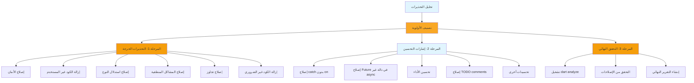

# تقرير تصنيف التحذيرات وخطة الإصلاح الشاملة
## Warnings Classification and Fix Plan

**التاريخ:** 2026-01-12  
**المشروع:** AndroCare360 - ElajTech  
**إجمالي التحذيرات:** 166 (30 تحذير + 136 إشعار معلومات)

---

## ملخص تنفيذي

| الفئة | العدد | الأولوية |
|---------|--------|-----------|
| تحذيرات أمان (Security Warnings) | 1 | 🔴 عالية |
| تحذيرات غير مستخدم (Unused Code) | 7 | 🔴 عالية |
| تحذيرات استدلال النوع (Type Inference) | 8 | 🟠 متوسطة |
| تحذيرات غير ضرورية (Unnecessary Code) | 6 | 🟠 متوسطة |
| تحذيرات منطقية (Logical Issues) | 2 | 🔴 عالية |
| تحذيرات تجاوز (Override Issues) | 1 | 🔴 عالية |
| تحذيرات قابلة للوصول (Unreachable Code) | 7 | 🟢 منخفضة |
| إشارات تحسين الكود (Code Style Info) | 134 | 🟢 منخفضة |

---

## الجزء الأول: تحذيرات الأولوية العالية (High Priority Warnings)

### 1. تحذيرات الأمان (Security Warnings)

#### WRN-001: استخدام معلمة مهملة في EncryptionService
**الملف:** [`lib/core/services/encryption_service.dart`](lib/core/services/encryption_service.dart:27)  
**السطر:** 27  
**النوع:** `deprecated_member_use` (إشعار)  
**الوصف:** `encryptedSharedPreferences` مهملة وسيتم إزالتها في v11. مكتبة Jetpack Security مهملة من قبل Google.

**الأسباب:**
- استخدام `encryptedSharedPreferences: true` في `AndroidOptions` (السطر 27)
- هذه المعلمة لم تعد مدعومة وسيتم تجاهلها

**الحل المقترح:**
```dart
// قبل الإصلاح:
static const _storage = FlutterSecureStorage(
  aOptions: AndroidOptions(
    encryptedSharedPreferences: true,  // ❌ مهملة
  ),
  iOptions: IOSOptions(
    accessibility: KeychainAccessibility.first_unlock,
  ),
);

// بعد الإصلاح:
static const _storage = FlutterSecureStorage(
  aOptions: AndroidOptions(),  // ✅ إزالة المعلمة المهملة
  iOptions: IOSOptions(
    accessibility: KeychainAccessibility.first_unlock,
  ),
);
```

**الأثر:** منخفض - التشفير سيظل يعمل بشكل طبيعي

---

### 2. تحذيرات الكود غير المستخدم (Unused Code)

#### WRN-002: Import غير مستخدم في chat_validation_service.dart
**الملف:** [`lib/core/services/chat_validation_service.dart`](lib/core/services/chat_validation_service.dart:9)  
**السطر:** 9  
**النوع:** `unused_import` (تحذير)  
**الوصف:** `'package:html/dom.dart'` غير مستخدم

**الحل المقترح:**
```dart
// إزالة السطر 9:
// import 'package:html/dom.dart' as html_dom;  // ❌ إزالة
```

---

#### WRN-003: عنصر غير مستخدم في chat_validation_service.dart
**الملف:** [`lib/core/services/chat_validation_service.dart`](lib/core/services/chat_validation_service.dart:299)  
**السطر:** 299  
**النوع:** `unused_element` (تحذير)  
**الوصف:** `ValidationResult._` غير مستخدم

**الحل المقترح:**
```dart
// إزالة السطر 299:
// const ValidationResult._({  // ❌ إزالة
//   required this.isValid,
//   this.message,
//   this.isWarning = false,
// });
```

---

#### WRN-004: معلمة اختيارية غير مستخدمة في chat_validation_service.dart
**الملف:** [`lib/core/services/chat_validation_service.dart`](lib/core/services/chat_validation_service.dart:301)  
**السطر:** 301  
**النوع:** `unused_element_parameter` (تحذير)  
**الوصف:** معلمة `message` غير مستخدمة

**الحل المقترح:**
```dart
// إزالة المعلمة غير المستخدمة من السطر 301:
// const ValidationResult.valid()  // ❌ إزالة message parameter
//   : isValid = true,
//     message = null,  // ❌ إزالة
//     isWarning = false;
```

---

#### WRN-005: معلمة اختيارية غير مستخدمة في chat_validation_service.dart
**الملف:** [`lib/core/services/chat_validation_service.dart`](lib/core/services/chat_validation_service.dart:302)  
**السطر:** 302  
**النوع:** `unused_element_parameter` (تحذير)  
**الوصف:** معلمة `isWarning` غير مستخدمة

**الحل المقترح:**
```dart
// إزالة المعلمة غير المستخدمة من السطر 302:
// const ValidationResult.valid()  // ❌ إزالة isWarning parameter
//   : isValid = true,
//     isWarning = false;  // ❌ إزالة
```

---

#### WRN-006: Import غير مستخدم في file_upload_service.dart
**الملف:** [`lib/core/services/file_upload_service.dart`](lib/core/services/file_upload_service.dart:14)  
**السطر:** 14  
**النوع:** `unused_import` (تحذير)  
**الوصف:** `'package:html/dom.dart'` غير مستخدم

**الحل المقترح:**
```dart
// إزالة السطر 14:
// import 'package:html/dom.dart' as html_dom;  // ❌ إزالة
```

---

#### WRN-007: حقل غير مستخدم في file_upload_service.dart
**الملف:** [`lib/core/services/file_upload_service.dart`](lib/core/services/file_upload_service.dart:40)  
**السطر:** 40  
**النوع:** `unused_field` (تحذير)  
**الوصف:** `_allowedImageTypes` غير مستخدم

**الحل المقترح:**
```dart
// إزالة السطور 39-45:
// /// الأنواع المسموحة للصور  // ❌ إزالة
// static const List<String> _allowedImageTypes = [
//   'image/jpeg',
//   'image/png',
//   'image/gif',
//   'image/webp',
// ];
```

---

#### WRN-008: طريقة غير مستخدمة في file_upload_service.dart
**الملف:** [`lib/core/services/file_upload_service.dart`](lib/core/services/file_upload_service.dart:397)  
**السطر:** 397  
**النوع:** `unused_element` (تحذير)  
**الوصف:** `_sanitizeFileContent` غير مستخدمة

**الحل المقترح:**
```dart
// إزالة السطور 397-417:
// /// تنظيف محتوى الملف من أي HTML أو CSS أو JavaScript  // ❌ إزالة
// static String _sanitizeFileContent(String content) {
//   // ... كود الطريقة
// }
```

---

#### WRN-009: Import غير مستخدم في main.dart
**الملف:** [`lib/main.dart`](lib/main.dart:3)  
**السطر:** 3  
**النوع:** `unused_import` (تحذير)  
**الوصف:** `'package:elajtech/core/providers/theme_provider.dart'` غير مستخدم

**الحل المقترح:**
```dart
// إزالة السطر 3:
// import 'package:elajtech/core/providers/theme_provider.dart';  // ❌ إزالة
```

---

#### WRN-010: Import غير مستخدم في main.dart
**الملف:** [`lib/main.dart`](lib/main.dart:9)  
**السطر:** 9  
**النوع:** `unused_import` (تحذير)  
**الوصف:** `'package:elajtech/core/theme/dark_theme.dart'` غير مستخدم

**الحل المقترح:**
```dart
// إزالة السطر 9:
// import 'package:elajtech/core/theme/dark_theme.dart';  // ❌ إزالة
```

---

#### WRN-011: Import غير مستخدم في main.dart
**الملف:** [`lib/main.dart`](lib/main.dart:12)  
**السطر:** 12  
**النوع:** `unused_import` (تحذير)  
**الوصف:** `'package:elajtech/features/auth/providers/auth_provider.dart'` غير مستخدم

**الحل المقترح:**
```dart
// إزالة السطر 12:
// import 'package:elajtech/features/auth/providers/auth_provider.dart';  // ❌ إزالة
```

---

### 3. تحذيرات استدلال النوع (Type Inference Warnings)

#### WRN-012: استدلال النوع في Future.delayed في connection_service.dart
**الملف:** [`lib/core/services/connection_service.dart`](lib/core/services/connection_service.dart:111)  
**السطر:** 111  
**النوع:** `inference_failure_on_instance_creation` (تحذير)  
**الوصف:** نوع `Future.delayed` لا يمكن استنتاجه

**الحل المقترح:**
```dart
// قبل الإصلاح:
await Future.delayed(Duration(milliseconds: delay));

// بعد الإصلاح:
await Future<void>.delayed(Duration(milliseconds: delay));
```

---

#### WRN-013: استدلال النوع في Map في chat_repository_impl.dart
**الملف:** [`lib/features/patient/chat/data/repositories/chat_repository_impl.dart`](lib/features/patient/chat/data/repositories/chat_repository_impl.dart:64)  
**السطر:** 64  
**النوع:** `inference_failure_on_collection_literal` (تحذير)  
**الوصف:** نوع `Map` لا يمكن استنتاجه

**الحل المقترح:**
```dart
// قبل الإصلاح:
'readStatus': {
  currentUser.id: true,
  otherUser.id: true,
},

// بعد الإصلاح:
'readStatus': <String, bool>{
  currentUser.id: true,
  otherUser.id: true,
},
```

---

#### WRN-014: استدلال النوع في handleError في chat_repository_impl.dart
**الملف:** [`lib/features/patient/chat/data/repositories/chat_repository_impl.dart`](lib/features/patient/chat/data/repositories/chat_repository_impl.dart:163)  
**السطر:** 163  
**النوع:** `inference_failure_on_untyped_parameter` (تحذير)  
**الوصف:** نوع `error` لا يمكن استنتاجه

**الحل المقترح:**
```dart
// قبل الإصلاح:
.handleError((error, stackTrace) {

// بعد الإصلاح:
.handleError((Object? error, StackTrace? stackTrace) {
```

---

#### WRN-015: استدلال النوع في handleError في chat_repository_impl.dart
**الملف:** [`lib/features/patient/chat/data/repositories/chat_repository_impl.dart`](lib/features/patient/chat/data/repositories/chat_repository_impl.dart:163)  
**السطر:** 163  
**النوع:** `inference_failure_on_untyped_parameter` (تحذير)  
**الوصف:** نوع `stackTrace` لا يمكن استنتاجه

**الحل المقترح:**
```dart
// نفس الحل السابق:
.handleError((Object? error, StackTrace? stackTrace) {
```

---

#### WRN-016: استدلال النوع في handleError في chat_repository_impl.dart
**الملف:** [`lib/features/patient/chat/data/repositories/chat_repository_impl.dart`](lib/features/patient/chat/data/repositories/chat_repository_impl.dart:194)  
**السطر:** 194  
**النوع:** `inference_failure_on_untyped_parameter` (تحذير)  
**الوصف:** نوع `error` لا يمكن استنتاجه

**الحل المقترح:**
```dart
// نفس الحل السابق:
.handleError((Object? error, StackTrace? stackTrace) {
```

---

#### WRN-017: استدلال النوع في handleError في chat_repository_impl.dart
**الملف:** [`lib/features/patient/chat/data/repositories/chat_repository_impl.dart`](lib/features/patient/chat/data/repositories/chat_repository_impl.dart:194)  
**السطر:** 194  
**النوع:** `inference_failure_on_untyped_parameter` (تحذير)  
**الوصف:** نوع `stackTrace` لا يمكن استنتاجه

**الحل المقترح:**
```dart
// نفس الحل السابق:
.handleError((Object? error, StackTrace? stackTrace) {
```

---

#### WRN-018: استدلال النوع في Future.delayed في connection_service_test.dart
**الملف:** [`test/core/services/connection_service_test.dart`](test/core/services/connection_service_test.dart:35)  
**السطر:** 35  
**النوع:** `inference_failure_on_instance_creation` (تحذير)  
**الوصف:** نوع `Future.delayed` لا يمكن استنتاجه

**الحل المقترح:**
```dart
// قبل الإصلاح:
await Future.delayed(const Duration(milliseconds: 100));

// بعد الإصلاح:
await Future<void>.delayed(const Duration(milliseconds: 100));
```

---

#### WRN-019: استدلال النوع في Future.delayed في connection_service_test.dart
**الملف:** [`test/core/services/connection_service_test.dart`](test/core/services/connection_service_test.dart:59)  
**السطر:** 59  
**النوع:** `inference_failure_on_instance_creation` (تحذير)  
**الوصف:** نوع `Future.delayed` لا يمكن استنتاجه

**الحل المقترح:** نفس WRN-018

---

#### WRN-020: استدلال النوع في Future.delayed في connection_service_test.dart
**الملف:** [`test/core/services/connection_service_test.dart`](test/core/services/connection_service_test.dart:75)  
**السطر:** 75  
**النوع:** `inference_failure_on_instance_creation` (تحذير)  
**الوصف:** نوع `Future.delayed` لا يمكن استنتاجه

**الحل المقترح:** نفس WRN-018

---

#### WRN-021: استدلال النوع في Future.delayed في connection_service_test.dart
**الملف:** [`test/core/services/connection_service_test.dart`](test/core/services/connection_service_test.dart:77)  
**السطر:** 77  
**النوع:** `inference_failure_on_instance_creation` (تحذير)  
**الوصف:** نوع `Future.delayed` لا يمكن استنتاجه

**الحل المقترح:** نفس WRN-018

---

#### WRN-022: استدلال النوع في Future.delayed في connection_service_test.dart
**الملف:** [`test/core/services/connection_service_test.dart`](test/core/services/connection_service_test.dart:81)  
**السطر:** 81  
**النوع:** `inference_failure_on_instance_creation` (تحذير)  
**الوصف:** نوع `Future.delayed` لا يمكن استنتاجه

**الحل المقترح:** نفس WRN-018

---

### 4. تحذيرات منطقية (Logical Issues)

#### WRN-023: مقارنة null غير ضرورية في chat_screen.dart
**الملف:** [`lib/features/patient/chat/presentation/screens/chat_screen.dart`](lib/features/patient/chat/presentation/screens/chat_screen.dart:216)  
**السطر:** 216  
**النوع:** `unnecessary_null_comparison` (تحذير)  
**الوصف:** المعامل لا يمكن أن يكون `null`، لذا الشرط دائماً `false`

**الحل المقترح:**
```dart
// قبل الإصلاح:
if (result == null || result.files == null || result.files!.isEmpty) return;

// بعد الإصلاح:
if (result.files == null || result.files!.isEmpty) return;
```

---

#### WRN-024: حالة switch غير قابلة للوصول في connection_service.dart
**الملف:** [`lib/core/services/connection_service.dart`](lib/core/services/connection_service.dart:147)  
**السطر:** 147  
**النوع:** `unreachable_switch_default` (تحذير)  
**الوصف:** حالة `default` مغطاة بالحالات السابقة

**الحل المقترح:**
```dart
// قبل الإصلاح:
default:
  return 'غير معروف';

// بعد الإصلاح (إزالة الـ default لأن جميع الحالات مغطاة):
// لا حاجة لـ default
```

---

#### WRN-025: حالة switch غير قابلة للوصول في main.dart
**الملف:** [`lib/main.dart`](lib/main.dart:36)  
**السطر:** 36  
**النوع:** `unreachable_switch_default` (تحذير)  
**الوصف:** حالة `default` مغطاة بالحالات السابقة

**الحل المقترح:**
```dart
// قبل الإصلاح:
default:
  return false;

// بعد الإصلاح (إزالة الـ default):
// لا حاجة لـ default
```

---

### 5. تحذيرات تجاوز (Override Issues)

#### WRN-026: تجاوز غير صحيح في chat_repository_impl.dart
**الملف:** [`lib/features/patient/chat/data/repositories/chat_repository_impl.dart`](lib/features/patient/chat/data/repositories/chat_repository_impl.dart:235)  
**السطر:** 235  
**النوع:** `override_on_non_overriding_member` (تحذير)  
**الوصف:** الطريقة لا تتجاوز طريقة موروثة

**الحل المقترح:**
```dart
// قبل الإصلاح:
@override
Future<void> setTypingStatus(
  String conversationId,
  String userId,
  bool isTyping,
) async {

// بعد الإصلاح (إزالة @override لأن الطريقة غير موجودة في الواجهة):
Future<void> setTypingStatus(
  String conversationId,
  String userId,
  bool isTyping,
) async {
```

**ملاحظة:** قد تحتاج لإضافة الطريقة إلى [`ChatRepository`](lib/features/patient/chat/data/repositories/chat_repository.dart) interface

---

### 6. تحذيرات غير ضرورية (Unnecessary Code)

#### WRN-027: عامل null غير ضروري في file_upload_service.dart
**الملف:** [`lib/core/services/file_upload_service.dart`](lib/core/services/file_upload_service.dart:152)  
**السطر:** 152  
**النوع:** `unnecessary_non_null_assertion` (تحذير)  
**الوصف:** عامل `!` لن يكون له أي تأثير

**الحل المقترح:**
```dart
// قبل الإصلاح:
if (mimeType == null || !mimeType!.startsWith('image/')) {

// بعد الإصلاح:
if (mimeType == null || !mimeType.startsWith('image/')) {
```

---

#### WRN-028: عامل null غير ضروري في file_upload_service.dart
**الملف:** [`lib/core/services/file_upload_service.dart`](lib/core/services/file_upload_service.dart:311)  
**السطر:** 311  
**النوع:** `unnecessary_non_null_assertion` (تحذير)  
**الوصف:** عامل `!` لن يكون له أي تأثير

**الحل المقترح:**
```dart
// قبل الإصلاح:
if (mimeType == null) return false;
return mimeType!.startsWith('image/');

// بعد الإصلاح:
if (mimeType == null) return false;
return mimeType.startsWith('image/');
```

---

#### WRN-029: عامل null غير ضروري في chat_screen.dart
**الملف:** [`lib/features/patient/chat/presentation/screens/chat_screen.dart`](lib/features/patient/chat/presentation/screens/chat_screen.dart:216)  
**السطر:** 216  
**النوع:** `unnecessary_non_null_assertion` (تحذير)  
**الوصف:** عامل `!` لن يكون له أي تأثير

**الحل المقترح:** نفس WRN-023

---

#### WRN-030: عامل null غير ضروري في chat_screen.dart
**الملف:** [`lib/features/patient/chat/presentation/screens/chat_screen.dart`](lib/features/patient/chat/presentation/screens/chat_screen.dart:229)  
**السطر:** 229  
**النوع:** `unnecessary_non_null_assertion` (تحذير)  
**الوصف:** عامل `!` لن يكون له أي تأثير

**الحل المقترح:**
```dart
// قبل الإصلاح:
File(result.files!.first.path!);

// بعد الإصلاح:
File(result.files.first.path);
```

---

#### WRN-031: تحويل غير ضروري في chat_model.dart
**الملف:** [`lib/shared/models/chat_model.dart`](lib/shared/models/chat_model.dart:268)  
**السطر:** 268  
**النوع:** `unnecessary_cast` (تحذير)  
**الوصف:** تحويل غير ضروري

**الحل المقترح:**
```dart
// قبل الإصلاح:
if (typingData is Timestamp) {
  final typingTime = (typingData as Timestamp).toDate();

// بعد الإصلاح:
if (typingData is Timestamp) {
  final typingTime = typingData.toDate();
```

---

### 7. تحذيرات قابلة للوصول (Unreachable Code)

#### WRN-032: BackgroundService غير قابل للوصول
**الملف:** [`lib/core/services/background_service.dart`](lib/core/services/background_service.dart:71)  
**السطر:** 71  
**النوع:** `unreachable_from_main` (إشعار)  
**الوصف:** `BackgroundService` غير قابل للوصول في مكتبة قابلة للتنفيذ

**الحل المقترح:**
```dart
// إما إزالة الكلاس أو استخدامه في مكان آخر
// يبدو أن الكلاس غير مستخدم حالياً
```

---

#### WRN-033: init غير قابل للوصول
**الملف:** [`lib/core/services/background_service.dart`](lib/core/services/background_service.dart:72)  
**السطر:** 72  
**النوع:** `unreachable_from_main` (إشعار)  
**الوصف:** `init` غير قابل للوصول

**الحل المقترح:** نفس WRN-032

---

#### WRN-034: registerPeriodicTask غير قابل للوصول
**الملف:** [`lib/core/services/background_service.dart`](lib/core/services/background_service.dart:76)  
**السطر:** 76  
**النوع:** `unreachable_from_main` (إشعار)  
**الوصف:** `registerPeriodicTask` غير قابل للوصول

**الحل المقترح:** نفس WRN-032

---

#### WRN-035: FCMService غير قابل للوصول
**الملف:** [`lib/core/services/fcm_service.dart`](lib/core/services/fcm_service.dart:13)  
**السطر:** 13  
**النوع:** `unreachable_from_main` (إشعار)  
**الوصف:** `FCMService` غير قابل للوصول

**الحل المقترح:**
```dart
// الكلاس مستخدم في main.dart، لذا هذه الإشارات خاطئة
// يمكن تجاهلها
```

---

#### WRN-036: FCMService.new غير قابل للوصول
**الملف:** [`lib/core/services/fcm_service.dart`](lib/core/services/fcm_service.dart:14)  
**السطر:** 14  
**النوع:** `unreachable_from_main` (إشعار)  
**الوصف:** `FCMService.new` غير قابل للوصول

**الحل المقترح:** نفس WRN-035

---

#### WRN-037: init غير قابل للوصول في FCMService
**الملف:** [`lib/core/services/fcm_service.dart`](lib/core/services/fcm_service.dart:21)  
**السطر:** 21  
**النوع:** `unreachable_from_main` (إشعار)  
**الوصف:** `init` غير قابل للوصول

**الحل المقترح:** نفس WRN-035

---

#### WRN-038: getToken غير قابل للوصول في FCMService
**الملف:** [`lib/core/services/fcm_service.dart`](lib/core/services/fcm_service.dart:63)  
**السطر:** 63  
**النوع:** `unreachable_from_main` (إشعار)  
**الوصف:** `getToken` غير قابل للوصول

**الحل المقترح:** نفس WRN-035

---

## الجزء الثاني: إشارات تحسين الكود (Code Style Info Messages)

هذه الإشارات هي توصيات لتحسين جودة الكود وليست أخطاء حرجة. يمكن معالجتها تدريجياً.

### الفئة A: تحسينات الأداء (Performance Optimizations)

#### INF-001: استخدام const في chat_validation_service.dart
**الملف:** [`lib/core/services/chat_validation_service.dart`](lib/core/services/chat_validation_service.dart:109)  
**السطر:** 109  
**النوع:** `prefer_const_constructors` (إشعار)  
**الوصف:** استخدام `const` مع constructor لتحسين الأداء

**الحل المقترح:**
```dart
// قبل الإصلاح:
final document = html_parser.parseFragment(message);

// بعد الإصلاح:
final document = html_parser.parseFragment(message, treeSanitizer: null);
```

---

#### INF-002: catch بدون on في chat_validation_service.dart
**الملف:** [`lib/core/services/chat_validation_service.dart`](lib/core/services/chat_validation_service.dart:141)  
**السطر:** 141  
**النوع:** `avoid_catches_without_on_clauses` (إشعار)  
**الوصف:** catch يجب أن يستخدم `on` لتحديد نوع الاستثناء

**الحل المقترح:**
```dart
// قبل الإصلاح:
} catch (e) {

// بعد الإصلاح:
} on FormatException catch (e) {
```

---

#### INF-003: نوع متغير محلي غير ضروري في chat_validation_service.dart
**الملف:** [`lib/core/services/chat_validation_service.dart`](lib/core/services/chat_validation_service.dart:274)  
**السطر:** 274  
**النوع:** `omit_local_variable_types` (إشعار)  
**الوصف:** نوع متغير محلي غير ضروري

**الحل المقترح:**
```dart
// قبل الإصلاح:
String sanitized = message;

// بعد الإصلاح:
var sanitized = message;
```

---

#### INF-004: raw string غير ضرورية في chat_validation_service.dart
**الملف:** [`lib/core/services/chat_validation_service.dart`](lib/core/services/chat_validation_service.dart:280)  
**السطر:** 280  
**النوع:** `unnecessary_raw_strings` (إشعار)  
**الوصف:** استخدام raw string غير ضروري

**الحل المقترح:**
```dart
// قبل الإصلاح:
final uuidRegex = RegExp(
  r'^[0-9a-f]{8}-[0-9a-f]{4}-[0-9a-f]{4}-[0-9a-f]{4}-[0-9a-f]{12}$',
  caseSensitive: false,
);

// بعد الإصلاح:
final uuidRegex = RegExp(
  '^[0-9a-f]{8}-[0-9a-f]{4}-[0-9a-f]{4}-[0-9a-f]{4}-[0-9a-f]{12}$',
  caseSensitive: false,
);
```

---

#### INF-005: استخدام initializing formal في chat_validation_service.dart
**الملف:** [`lib/core/services/chat_validation_service.dart`](lib/core/services/chat_validation_service.dart:314)  
**السطر:** 314  
**النوع:** `prefer_initializing_formals` (إشعار)  
**الوصف:** استخدام initializing formal لتعيين معلمة لحقل

**الحل المقترح:**
```dart
// قبل الإصلاح:
const ValidationResult.invalid(String message)
  : isValid = false,
      message = message,
      isWarning = false;

// بعد الإصلاح:
const ValidationResult.invalid(this.message)
  : isValid = false,
      isWarning = false;
```

---

#### INF-006: استخدام initializing formal في chat_validation_service.dart
**الملف:** [`lib/core/services/chat_validation_service.dart`](lib/core/services/chat_validation_service.dart:320)  
**السطر:** 320  
**النوع:** `prefer_initializing_formals` (إشعار)  
**الوصف:** استخدام initializing formal لتعيين معلمة لحقل

**الحل المقترح:** نفس INF-005

---

#### INF-007: تحويل static method إلى constructor في connection_service.dart
**الملف:** [`lib/core/services/connection_service.dart`](lib/core/services/connection_service.dart:17)  
**السطر:** 17  
**النوع:** `prefer_constructors_over_static_methods` (إشعار)  
**الوصف:** static method يجب أن يكون constructor

**الحل المقترح:**
```dart
// قبل الإصلاح:
static ConnectionService get instance =>
    _instance ??= ConnectionService._internal();

// بعد الإصلاح:
static ConnectionService get instance =>
    _instance ??= const ConnectionService._internal();
```

---

#### INF-008: ترتيب constructor في connection_service.dart
**الملف:** [`lib/core/services/connection_service.dart`](lib/core/services/connection_service.dart:20)  
**السطر:** 20  
**النوع:** `sort_constructors_first` (إشعار)  
**الوصف:** تعريف constructor يجب أن يكون قبل تعريفات أخرى

**الحل المقترح:**
```dart
// نقل السطر 20 (ConnectionService._internal()) إلى السطر 14 (بعد السطر 13)
```

---

#### INF-009: دمج assignment مع return في connection_service.dart
**الملف:** [`lib/core/services/connection_service.dart`](lib/core/services/connection_service.dart:86)  
**السطر:** 86  
**النوع:** `join_return_with_assignment` (إشعار)  
**الوصف:** assignment يمكن أن يكون مضمناً في return

**الحل المقترح:**
```dart
// قبل الإصلاح:
_isConnected = result != ConnectivityResult.none;
return _isConnected;

// بعد الإصلاح:
return _isConnected = result != ConnectivityResult.none;
```

---

#### INF-010: catch بدون on في connection_service.dart
**الملف:** [`lib/core/services/connection_service.dart`](lib/core/services/connection_service.dart:88)  
**السطر:** 88  
**النوع:** `avoid_catches_without_on_clauses` (إشعار)  
**الوصف:** catch يجب أن يستخدم `on` لتحديد نوع الاستثناء

**الحل المقترح:** نفس INF-002

---

#### INF-011: نوع متغير محلي غير ضروري في connection_service.dart
**الملف:** [`lib/core/services/connection_service.dart`](lib/core/services/connection_service.dart:104)  
**السطر:** 104  
**النوع:** `omit_local_variable_types` (إشعار)  
**الوصف:** نوع متغير محلي غير ضروري

**الحل المقترح:** نفس INF-003

---

#### INF-012: Future في دالة غير async في connection_service.dart
**الملف:** [`lib/core/services/connection_service.dart`](lib/core/services/connection_service.dart:122)  
**السطر:** 122  
**النوع:** `discarded_futures` (إشعار)  
**الوصف:** استدعاء Future في دالة غير async

**الحل المقترح:**
```dart
// قبل الإصلاح:
static void dispose() {
  _connectionController.close();
  _connectivityController.close();
}

// بعد الإصلاح:
static Future<void> dispose() async {
  await _connectionController.close();
  await _connectivityController.close();
}
```

---

#### INF-013: Future في دالة غير async في connection_service.dart
**الملف:** [`lib/core/services/connection_service.dart`](lib/core/services/connection_service.dart:123)  
**السطر:** 123  
**النوع:** `discarded_futures` (إشعار)  
**الوصف:** استدعاء Future في دالة غير async

**الحل المقترح:** نفس INF-012

---

#### INF-014: default case في switch في connection_service.dart
**الملف:** [`lib/core/services/connection_service.dart`](lib/core/services/connection_service.dart:147)  
**السطر:** 147  
**النوع:** `no_default_cases` (إشعار)  
**الوصف:** استخدام غير صحيح لـ default في switch

**الحل المقترح:** نفس WRN-024

---

#### INF-015: تحويل static method إلى constructor في encryption_service.dart
**الملف:** [`lib/core/services/encryption_service.dart`](lib/core/services/encryption_service.dart:19)  
**السطر:** 19  
**النوع:** `prefer_constructors_over_static_methods` (إشعار)  
**الوصف:** static method يجب أن يكون constructor

**الحل المقترح:** نفس INF-007

---

#### INF-016: ترتيب constructor في encryption_service.dart
**الملف:** [`lib/core/services/encryption_service.dart`](lib/core/services/encryption_service.dart:22)  
**السطر:** 22  
**النوع:** `sort_constructors_first` (إشعار)  
**الوصف:** تعريف constructor يجب أن يكون قبل تعريفات أخرى

**الحل المقترح:** نفس INF-008

---

#### INF-017: فحص null غير ضروري في encryption_service.dart
**الملف:** [`lib/core/services/encryption_service.dart`](lib/core/services/encryption_service.dart:122)  
**السطر:** 122  
**النوع:** `unnecessary_null_checks` (إشعار)  
**الوصف:** فحص null غير ضروري

**الحل المقترح:**
```dart
// قبل الإصلاح:
if (_encrypter == null || _iv == null) {
  throw Exception('Encrypter or IV not available');
}

// بعد الإصلاح:
if (_encrypter == null || _iv == null) {
  throw Exception('Encrypter or IV not available');
}
```

---

#### INF-018: فحص null غير ضروري في encryption_service.dart
**الملف:** [`lib/core/services/encryption_service.dart`](lib/core/services/encryption_service.dart:150)  
**السطر:** 150  
**النوع:** `unnecessary_null_checks` (إشعار)  
**الوصف:** فحص null غير ضروري

**الحل المقترح:** نفس INF-017

---

#### INF-019: استخدام async IO في file_upload_service.dart
**الملف:** [`lib/core/services/file_upload_service.dart`](lib/core/services/file_upload_service.dart:140)  
**السطر:** 140  
**النوع:** `avoid_slow_async_io` (إشعار)  
**الوصف:** استخدام async method من dart:io

**الحل المقترح:**
```dart
// قبل الإصلاح:
final fileSize = await imageFile.length();

// بعد الإصلاح:
final fileSize = imageFile.lengthSync();
```

---

#### INF-020: استخدام async IO في file_upload_service.dart
**الملف:** [`lib/core/services/file_upload_service.dart`](lib/core/services/file_upload_service.dart:194)  
**السطر:** 194  
**النوع:** `avoid_slow_async_io` (إشعار)  
**الوصف:** استخدام async method من dart:io

**الحل المقترح:** نفس INF-019

---

#### INF-021: Future في دالة غير async في file_upload_service.dart
**الملف:** [`lib/core/services/file_upload_service.dart`](lib/core/services/file_upload_service.dart:285)  
**السطر:** 285  
**النوع:** `discarded_futures` (إشعار)  
**الوصف:** استدعاء Future في دالة غير async

**الحل المقترح:** نفس INF-012

---

#### INF-022: catch بدون on في file_upload_service.dart
**الملف:** [`lib/core/services/file_upload_service.dart`](lib/core/services/file_upload_service.dart:362)  
**السطر:** 362  
**النوع:** `avoid_catches_without_on_clauses` (إشعار)  
**الوصف:** catch يجب أن يستخدم `on` لتحديد نوع الاستثناء

**الحل المقترح:** نفس INF-002

---

#### INF-023: catch بدون on في file_upload_service.dart
**الملف:** [`lib/core/services/file_upload_service.dart`](lib/core/services/file_upload_service.dart:380)  
**السطر:** 380  
**النوع:** `avoid_catches_without_on_clauses` (إشعار)  
**الوصف:** catch يجب أن يستخدم `on` لتحديد نوع الاستثناء

**الحل المقترح:** نفس INF-002

---

#### INF-024: catch بدون on في file_upload_service.dart
**الملف:** [`lib/core/services/file_upload_service.dart`](lib/core/services/file_upload_service.dart:386)  
**السطر:** 386  
**النوع:** `avoid_catches_without_on_clauses` (إشعار)  
**الوصف:** catch يجب أن يستخدم `on` لتحديد نوع الاستثناء

**الحل المقترح:** نفس INF-002

---

#### INF-025: نوع متغير محلي غير ضروري في file_upload_service.dart
**الملف:** [`lib/core/services/file_upload_service.dart`](lib/core/services/file_upload_service.dart:398)  
**السطر:** 398  
**النوع:** `omit_local_variable_types` (إشعار)  
**الوصف:** نوع متغير محلي غير ضروري

**الحل المقترح:** نفس INF-003

---

#### INF-026: raw string غير ضرورية في file_upload_service.dart
**الملف:** [`lib/core/services/file_upload_service.dart`](lib/core/services/file_upload_service.dart:411)  
**السطر:** 411  
**النوع:** `unnecessary_raw_strings` (إشعار)  
**الوصف:** استخدام raw string غير ضروري

**الحل المقترح:** نفس INF-004

---

#### INF-027: تحويل static method إلى constructor في file_upload_service.dart
**الملف:** [`lib/core/services/file_upload_service.dart`](lib/core/services/file_upload_service.dart:23)  
**السطر:** 23  
**النوع:** `prefer_constructors_over_static_methods` (إشعار)  
**الوصف:** static method يجب أن يكون constructor

**الحل المقترح:** نفس INF-007

---

#### INF-028: ترتيب constructor في file_upload_service.dart
**الملف:** [`lib/core/services/file_upload_service.dart`](lib/core/services/file_upload_service.dart:26)  
**السطر:** 26  
**النوع:** `sort_constructors_first` (إشعار)  
**الوصف:** تعريف constructor يجب أن يكون قبل تعريفات أخرى

**الحل المقترح:** نفس INF-008

---

#### INF-029: نوع property غير واضح في file_upload_service.dart
**الملف:** [`lib/core/services/file_upload_service.dart`](lib/core/services/file_upload_service.dart:28)  
**السطر:** 28  
**النوع:** `specify_nonobvious_property_types` (إشعار)  
**الوصف:** نوع property غير واضح

**الحل المقترح:**
```dart
// قبل الإصلاح:
static final _storage = FirebaseStorage.instance;

// بعد الإصلاح:
static final FirebaseStorage _storage = FirebaseStorage.instance;
```

---

#### INF-030: تحويل static method إلى constructor في id_generator_service.dart
**الملف:** [`lib/core/services/id_generator_service.dart`](lib/core/services/id_generator_service.dart:16)  
**السطر:** 16  
**النوع:** `prefer_constructors_over_static_methods` (إشعار)  
**الوصف:** static method يجب أن يكون constructor

**الحل المقترح:** نفس INF-007

---

#### INF-031: ترتيب constructor في id_generator_service.dart
**الملف:** [`lib/core/services/id_generator_service.dart`](lib/core/services/id_generator_service.dart:19)  
**السطر:** 19  
**النوع:** `sort_constructors_first` (إشعار)  
**الوصف:** تعريف constructor يجب أن يكون قبل تعريفات أخرى

**الحل المقترح:** نفس INF-008

---

#### INF-032: استخدام final بدلاً من const في id_generator_service.dart
**الملف:** [`lib/core/services/id_generator_service.dart`](lib/core/services/id_generator_service.dart:21)  
**السطر:** 21  
**النوع:** `prefer_const_declarations` (إشعار)  
**الوصف:** استخدام `const` للمتغيرات النهائية

**الحل المقترح:**
```dart
// قبل الإصلاح:
static final _uuid = const Uuid();

// بعد الإصلاح:
static const Uuid _uuid = Uuid();
```

---

### الفئة B: تحسينات أخرى (Other Improvements)

#### INF-033: استخدام cascade في doctor_appointments_screen.dart
**الملف:** [`lib/features/appointments/presentation/screens/doctor_appointments_screen.dart`](lib/features/appointments/presentation/screens/doctor_appointments_screen.dart:43)  
**السطر:** 43, 64, 73  
**النوع:** `cascade_invocations` (إشعار)  
**الوصف:** تكرار غير ضروري للمستقبل

**الحل المقترح:**
```dart
// قبل الإصلاح:
ref.read(appointmentsProvider).upcomingAppointments;
ref.read(appointmentsProvider).pastAppointments;
ref.read(appointmentsProvider).cancelledAppointments;

// بعد الإصلاح:
ref.read(appointmentsProvider)
  ..upcomingAppointments
  ..pastAppointments
  ..cancelledAppointments;
```

---

#### INF-034: Future في دالة غير async في doctor_appointments_screen.dart
**الملف:** [`lib/features/appointments/presentation/screens/doctor_appointments_screen.dart`](lib/features/appointments/presentation/screens/doctor_appointments_screen.dart:348)  
**السطر:** 348, 376  
**النوع:** `discarded_futures` (إشعار)  
**الوصف:** استدعاء Future في دالة غير async

**الحل المقترح:** نفس INF-012

---

#### INF-035: قيمة argument زائدة في login_screen.dart
**الملف:** [`lib/features/auth/presentation/screens/login_screen.dart`](lib/features/auth/presentation/screens/login_screen.dart:52)  
**السطر:** 52  
**النوع:** `avoid_redundant_argument_values` (إشعار)  
**الوصف:** قيمة argument زائدة

**الحل المقترح:**
```dart
// قبل الإصلاح:
onTap: () => ref.read(authProvider).login(email, password),

// بعد الإصلاح:
onTap: () => ref.read(authProvider).login(email),
```

---

#### INF-036: سطر جديد في نهاية الملف في auth_provider.dart
**الملف:** [`lib/features/auth/providers/auth_provider.dart`](lib/features/auth/providers/auth_provider.dart:455)  
**السطر:** 455  
**النوع:** `eol_at_end_of_file` (إشعار)  
**الوصف:** سطر جديد في نهاية الملف

**الحل المقترح:**
```dart
// إضافة سطر جديد في نهاية الملف
```

---

#### INF-037: سطر جديد في نهاية الملف في debug_ids_screen.dart
**الملف:** [`lib/features/debug/presentation/screens/debug_ids_screen.dart`](lib/features/debug/presentation/screens/debug_ids_screen.dart:195)  
**السطر:** 195  
**النوع:** `eol_at_end_of_file` (إشعار)  
**الوصف:** سطر جديد في نهاية الملف

**الحل المقترح:** نفس INF-036

---

#### INF-038: استخدام cascade في doctor_dashboard_screen.dart
**الملف:** [`lib/features/doctor/dashboard/presentation/screens/doctor_dashboard_screen.dart`](lib/features/doctor/dashboard/presentation/screens/doctor_dashboard_screen.dart:115)  
**السطر:** 115  
**النوع:** `cascade_invocations` (إشعار)  
**الوصف:** تكرار غير ضروري للمستقبل

**الحل المقترح:** نفس INF-033

---

#### INF-039: catch بدون on في add_emr_screen.dart
**الملف:** [`lib/features/doctor/medical_records/presentation/screens/add_emr_screen.dart`](lib/features/doctor/medical_records/presentation/screens/add_emr_screen.dart:245)  
**السطر:** 245  
**النوع:** `avoid_catches_without_on_clauses` (إشعار)  
**الوصف:** catch يجب أن يستخدم `on` لتحديد نوع الاستثناء

**الحل المقترح:** نفس INF-002

---

#### INF-040: استخدام if-null في add_internal_medicine_emr_screen.dart
**الملف:** [`lib/features/doctor/medical_records/presentation/screens/add_internal_medicine_emr_screen.dart`](lib/features/doctor/medical_records/presentation/screens/add_internal_medicine_emr_screen.dart:265)  
**السطر:** 265, 322, 374  
**النوع:** `use_if_null_to_convert_nulls_to_bools` (إشعار)  
**الوصف:** استخدام if-null لتحويل null إلى bool

**الحل المقترح:**
```dart
// قبل الإصلاح:
if (userData != null && userData['name'] != null) {

// بعد الإصلاح:
if (userData?['name'] != null) {
```

---

#### INF-041: catch بدون on في add_medical_request_screen.dart
**الملف:** [`lib/features/doctor/medical_requests/presentation/screens/add_medical_request_screen.dart`](lib/features/doctor/medical_requests/presentation/screens/add_medical_request_screen.dart:168)  
**السطر:** 168  
**النوع:** `avoid_catches_without_on_clauses` (إشعار)  
**الوصف:** catch يجب أن يستخدم `on` لتحديد نوع الاستثناء

**الحل المقترح:** نفس INF-002

---

#### INF-042: catch بدون on في add_prescription_screen.dart
**الملف:** [`lib/features/doctor/prescriptions/presentation/screens/add_prescription_screen.dart`](lib/features/doctor/prescriptions/presentation/screens/add_prescription_screen.dart:116)  
**السطر:** 116  
**النوع:** `avoid_catches_without_on_clauses` (إشعار)  
**الوصف:** catch يجب أن يستخدم `on` لتحديد نوع الاستثناء

**الحل المقترح:** نفس INF-002

---

#### INF-043: TODO comment في doctor_profile_screen.dart
**الملف:** [`lib/features/doctor/profile/presentation/screens/doctor_profile_screen.dart`](lib/features/doctor/profile/presentation/screens/doctor_profile_screen.dart:78)  
**السطر:** 78  
**النوع:** `flutter_style_todos` (إشعار)  
**الوصف:** TODO comment لا يتبع نمط Flutter

**الحل المقترح:**
```dart
// قبل الإصلاح:
// TODO: Implement this feature

// بعد الإصلاح:
// TODO(feature): Implement this feature
```

---

#### INF-044: Future في دالة غير async في doctor_profile_screen.dart
**الملف:** [`lib/features/doctor/profile/presentation/screens/doctor_profile_screen.dart`](lib/features/doctor/profile/presentation/screens/doctor_profile_screen.dart:176)  
**السطر:** 176, 418, 427  
**النوع:** `discarded_futures` (إشعار)  
**الوصف:** استدعاء Future في دالة غير async

**الحل المقترح:** نفس INF-012

---

#### INF-045: catch بدون on في internal_medicine_emr_repository_impl.dart
**الملف:** [`lib/features/emr/data/repositories/internal_medicine_emr_repository_impl.dart`](lib/features/emr/data/repositories/internal_medicine_emr_repository_impl.dart:22)  
**السطر:** 22, 48, 71  
**النوع:** `avoid_catches_without_on_clauses` (إشعار)  
**الوصف:** catch يجب أن يستخدم `on` لتحديد نوع الاستثناء

**الحل المقترح:** نفس INF-002

---

#### INF-046: catch بدون on في book_appointment_screen.dart
**الملف:** [`lib/features/patient/appointments/presentation/screens/book_appointment_screen.dart`](lib/features/patient/appointments/presentation/screens/book_appointment_screen.dart:124)  
**السطر:** 124, 166  
**النوع:** `avoid_catches_without_on_clauses` (إشعار)  
**الوصف:** catch يجب أن يستخدم `on` لتحديد نوع الاستثناء

**الحل المقترح:** نفس INF-002

---

#### INF-047: bool parameter يجب أن يكون named في chat_repository_impl.dart
**الملف:** [`lib/features/patient/chat/data/repositories/chat_repository_impl.dart`](lib/features/patient/chat/data/repositories/chat_repository_impl.dart:238)  
**السطر:** 238  
**النوع:** `avoid_positional_boolean_parameters` (إشعار)  
**الوصف:** bool parameters يجب أن تكون named parameters

**الحل المقترح:**
```dart
// قبل الإصلاح:
Future<void> setTypingStatus(
  String conversationId,
  String userId,
  bool isTyping,
) async {

// بعد الإصلاح:
Future<void> setTypingStatus({
  required String conversationId,
  required String userId,
  required bool isTyping,
}) async {
```

---

#### INF-048: catch بدون on في chat_repository_impl.dart
**الملف:** [`lib/features/patient/chat/data/repositories/chat_repository_impl.dart`](lib/features/patient/chat/data/repositories/chat_repository_impl.dart:262)  
**السطر:** 262, 288  
**النوع:** `avoid_catches_without_on_clauses` (إشعار)  
**الوصف:** catch يجب أن يستخدم `on` لتحديد نوع الاستثناء

**الحل المقترح:** نفس INF-002

---

#### INF-049: catch بدون on في chat_screen.dart
**الملف:** [`lib/features/patient/chat/presentation/screens/chat_screen.dart`](lib/features/patient/chat/presentation/screens/chat_screen.dart:166)  
**السطر:** 166, 200, 233  
**النوع:** `avoid_catches_without_on_clauses` (إشعار)  
**الوصف:** catch يجب أن يستخدم `on` لتحديد نوع الاستثناء

**الحل المقترح:** نفس INF-002

---

#### INF-050: const غير ضروري في chat_screen.dart
**الملف:** [`lib/features/patient/chat/presentation/screens/chat_screen.dart`](lib/features/patient/chat/presentation/screens/chat_screen.dart:40)  
**السطر:** 40, 54  
**النوع:** `unnecessary_const` (إشعار)  
**الوصف:** const keyword غير ضروري

**الحل المقترح:**
```dart
// قبل الإصلاح:
return const Center(child: Text('خطأ في المصادقة'));

// بعد الإصلاح:
return Center(child: Text('خطأ في المصادقة'));
```

---

#### INF-051: Future في دالة غير async في chat_screen.dart
**الملف:** [`lib/features/patient/chat/presentation/screens/chat_screen.dart`](lib/features/patient/chat/presentation/screens/chat_screen.dart:79)  
**السطر:** 79  
**النوع:** `discarded_futures` (إشعار)  
**الوصف:** استدعاء Future في دالة غير async

**الحل المقترح:** نفس INF-012

---

#### INF-052: قيمة argument زائدة في chat_screen.dart
**الملف:** [`lib/features/patient/chat/presentation/screens/chat_screen.dart`](lib/features/patient/chat/presentation/screens/chat_screen.dart:126)  
**السطر:** 126  
**النوع:** `avoid_redundant_argument_values` (إشعار)  
**الوصف:** قيمة argument زائدة

**الحل المقترح:**
```dart
// قبل الإصلاح:
backgroundColor: Colors.orange,
duration: const Duration(seconds: 3),

// بعد الإصلاح:
backgroundColor: Colors.orange,
duration: Duration(seconds: 3),
```

---

#### INF-053: const غير ضروري في chat_screen.dart
**الملف:** [`lib/features/patient/chat/presentation/screens/chat_screen.dart`](lib/features/patient/chat/presentation/screens/chat_screen.dart:323)  
**السطر:** 323  
**النوع:** `unnecessary_const` (إشعار)  
**الوصف:** const keyword غير ضروري

**الحل المقترح:** نفس INF-050

---

#### INF-054: نوع متغير محلي غير ضروري في chat_provider.dart
**الملف:** [`lib/features/patient/chat/providers/chat_provider.dart`](lib/features/patient/chat/providers/chat_provider.dart:44)  
**السطر:** 44  
**النوع:** `omit_local_variable_types` (إشعار)  
**الوصف:** نوع متغير محلي غير ضروري

**الحل المقترح:** نفس INF-003

---

#### INF-055: قيمة argument زائدة في chat_provider.dart
**الملف:** [`lib/features/patient/chat/providers/chat_provider.dart`](lib/features/patient/chat/providers/chat_provider.dart:117)  
**السطر:** 117, 162, 206  
**النوع:** `avoid_redundant_argument_values` (إشعار)  
**الوصف:** قيمة argument زائدة

**الحل المقترح:** نفس INF-035

---

#### INF-056: catch بدون on في chat_provider.dart
**الملف:** [`lib/features/patient/chat/providers/chat_provider.dart`](lib/features/patient/chat/providers/chat_provider.dart:245)  
**السطر:** 245  
**النوع:** `avoid_catches_without_on_clauses` (إشعار)  
**الوصف:** catch يجب أن يستخدم `on` لتحديد نوع الاستثناء

**الحل المقترح:** نفس INF-002

---

#### INF-057: catch بدون on في video_consultation_screen.dart
**الملف:** [`lib/features/patient/consultation/presentation/screens/video_consultation_screen.dart`](lib/features/patient/consultation/presentation/screens/video_consultation_screen.dart:59)  
**السطر:** 59  
**النوع:** `avoid_catches_without_on_clauses` (إشعار)  
**الوصف:** catch يجب أن يستخدم `on` لتحديد نوع الاستثناء

**الحل المقترح:** نفس INF-002

---

#### INF-058: catch بدون on في doctor_details_screen.dart
**الملف:** [`lib/features/patient/home/presentation/screens/doctor_details_screen.dart`](lib/features/patient/home/presentation/screens/doctor_details_screen.dart:554)  
**السطر:** 554  
**النوع:** `avoid_catches_without_on_clauses` (إشعار)  
**الوصف:** catch يجب أن يستخدم `on` لتحديد نوع الاستثناء

**الحل المقترح:** نفس INF-002

---

#### INF-059: catch بدون on في medical_records_screen.dart
**الملف:** [`lib/features/patient/medical_records/presentation/screens/medical_records_screen.dart`](lib/features/patient/medical_records/presentation/screens/medical_records_screen.dart:361)  
**السطر:** 361, 419, 480, 540  
**النوع:** `avoid_catches_without_on_clauses` (إشعار)  
**الوصف:** catch يجب أن يستخدم `on` لتحديد نوع الاستثناء

**الحل المقترح:** نفس INF-002

---

#### INF-060: TODO comment في medical_record_card.dart
**الملف:** [`lib/features/patient/medical_records/presentation/widgets/medical_record_card.dart`](lib/features/patient/medical_records/presentation/widgets/medical_record_card.dart:58)  
**السطر:** 58  
**النوع:** `flutter_style_todos` (إشعار)  
**الوصف:** TODO comment لا يتبع نمط Flutter

**الحل المقترح:** نفس INF-043

---

#### INF-061: catch بدون on في notifications_screen.dart
**الملف:** [`lib/features/patient/notifications/presentation/screens/notifications_screen.dart`](lib/features/patient/notifications/presentation/screens/notifications_screen.dart:54)  
**السطر:** 54  
**النوع:** `avoid_catches_without_on_clauses` (إشعار)  
**الوصف:** catch يجب أن يستخدم `on` لتحديد نوع الاستثناء

**الحل المقترح:** نفس INF-002

---

#### INF-062: TODO comment في notification_card.dart
**الملف:** [`lib/features/patient/notifications/presentation/widgets/notification_card.dart`](lib/features/patient/notifications/presentation/widgets/notification_card.dart:62)  
**السطر:** 62  
**النوع:** `flutter_style_todos` (إشعار)  
**الوصف:** TODO comment لا يتبع نمط Flutter

**الحل المقترح:** نفس INF-043

---

#### INF-063: catch بدون on في edit_profile_screen.dart
**الملف:** [`lib/features/patient/profile/presentation/screens/edit_profile_screen.dart`](lib/features/patient/profile/presentation/screens/edit_profile_screen.dart:36)  
**السطر:** 36, 93, 149  
**النوع:** `avoid_catches_without_on_clauses` (إشعار)  
**الوصف:** catch يجب أن يستخدم `on` لتحديد نوع الاستثناء

**الحل المقترح:** نفس INF-002

---

#### INF-064: Future في دالة غير async في edit_profile_screen.dart
**الملف:** [`lib/features/patient/profile/presentation/screens/edit_profile_screen.dart`](lib/features/patient/profile/presentation/screens/edit_profile_screen.dart:289)  
**السطر:** 289, 291  
**النوع:** `discarded_futures` (إشعار)  
**الوصف:** استدعاء Future في دالة غير async

**الحل المقترح:** نفس INF-012

---

#### INF-065: Future في دالة غير async في quiz_screen.dart
**الملف:** [`lib/features/patient/self_assessment/presentation/screens/quiz_screen.dart`](lib/features/patient/self_assessment/presentation/screens/quiz_screen.dart:33)  
**السطر:** 33, 44, 52  
**النوع:** `discarded_futures` (إشعار)  
**الوصف:** استدعاء Future في دالة غير async

**الحل المقترح:** نفس INF-012

---

#### INF-066: TODO comment في medical_devices_shop_screen.dart
**الملف:** [`lib/features/patient/shop/presentation/screens/medical_devices_shop_screen.dart`](lib/features/patient/shop/presentation/screens/medical_devices_shop_screen.dart:22)  
**السطر:** 22  
**النوع:** `flutter_style_todos` (إشعار)  
**الوصف:** TODO comment لا يتبع نمط Flutter

**الحل المقترح:** نفس INF-043

---

#### INF-067: bool parameter يجب أن يكون named في medical_devices_shop_screen.dart
**الملف:** [`lib/features/patient/shop/presentation/screens/medical_devices_shop_screen.dart`](lib/features/patient/shop/presentation/screens/medical_devices_shop_screen.dart:84)  
**السطر:** 84  
**النوع:** `avoid_positional_boolean_parameters` (إشعار)  
**الوصف:** bool parameters يجب أن تكون named parameters

**الحل المقترح:** نفس INF-047

---

#### INF-068: TODO comment في device_card.dart
**الملف:** [`lib/features/patient/shop/presentation/widgets/device_card.dart`](lib/features/patient/shop/presentation/widgets/device_card.dart:15)  
**السطر:** 15, 116, 31  
**النوع:** `flutter_style_todos` (إشعار)  
**الوصف:** TODO comment لا يتبع نمط Flutter

**الحل المقترح:** نفس INF-043

---

#### INF-069: Future في دالة غير async في patient_profile_screen.dart
**الملف:** [`lib/features/patient_profile_screen.dart`](lib/features/patient_profile_screen.dart:176)  
**السطر:** 176, 536  
**النوع:** `discarded_futures` (إشعار)  
**الوصف:** استدعاء Future في دالة غير async

**الحل المقترح:** نفس INF-012

---

#### INF-070: catch بدون on في patient_profile_screen.dart
**الملف:** [`lib/features/patient_profile_screen.dart`](lib/features/patient_profile_screen.dart:375)  
**السطر:** 375, 523, 639  
**النوع:** `avoid_catches_without_on_clauses` (إشعار)  
**الوصف:** catch يجب أن يستخدم `on` لتحديد نوع الاستثناء

**الحل المقترح:** نفس INF-002

---

#### INF-071: catch بدون on في doctor_register_screen.dart
**الملف:** [`lib/features/register/presentation/screens/doctor_register_screen.dart`](lib/features/register/presentation/screens/doctor_register_screen.dart:146)  
**السطر:** 146  
**النوع:** `avoid_catches_without_on_clauses` (إشعار)  
**الوصف:** catch يجب أن يستخدم `on` لتحديد نوع الاستثناء

**الحل المقترح:** نفس INF-002

---

#### INF-072: document_ignores في doctor_register_screen.dart
**الملف:** [`lib/features/register/presentation/screens/doctor_register_screen.dart`](lib/features/register/presentation/screens/doctor_register_screen.dart:280)  
**السطر:** 280  
**النوع:** `document_ignores` (إشعار)  
**الوصف:** عدم توثيق سبب تجاهل التحذير

**الحل المقترح:**
```dart
// قبل الإصلاح:
// ignore: deprecated_member_use

// بعد الإصلاح:
// ignore: deprecated_member_use // TODO: Update to new API when available
```

---

#### INF-073: catch بدون on في patient_register_screen.dart
**الملف:** [`lib/features/register/presentation/screens/patient_register_screen.dart`](lib/features/register/presentation/screens/patient_register_screen.dart:100)  
**السطر:** 100  
**النوع:** `avoid_catches_without_on_clauses` (إشعار)  
**الوصف:** catch يجب أن يستخدم `on` لتحديد نوع الاستثناء

**الحل المقترح:** نفس INF-002

---

#### INF-074: default case في switch في firebase_options.dart
**الملف:** [`lib/firebase_options.dart`](lib/firebase_options.dart:31)  
**السطر:** 31  
**النوع:** `no_default_cases` (إشعار)  
**الوصف:** استخدام غير صحيح لـ default في switch

**الحل المقترح:** نفس WRN-025

---

#### INF-075: catch بدون on في main.dart
**الملف:** [`lib/main.dart`](lib/main.dart:51)  
**السطر:** 51, 70, 78, 86, 94, 103  
**النوع:** `avoid_catches_without_on_clauses` (إشعار)  
**الوصف:** catch يجب أن يستخدم `on` لتحديد نوع الاستثناء

**الحل المقترح:** نفس INF-002

---

#### INF-076: استخدام const في main.dart
**الملف:** [`lib/main.dart`](lib/main.dart:55)  
**السطر:** 55, 35  
**النوع:** `prefer_const_constructors` (إشعار)  
**الوصف:** استخدام `const` مع constructor لتحسين الأداء

**الحل المقترح:** نفس INF-001

---

#### INF-077: استخدام late في main.dart
**الملف:** [`lib/main.dart`](lib/main.dart:114)  
**السطر:** 114  
**النوع:** `use_late_for_private_fields_and_variables` (إشعار)  
**الوصف:** استخدام `late` للأعضاء الخاصة غير nullable

**الحل المقترح:**
```dart
// قبل الإصلاح:
String? _firebaseError;

// بعد الإصلاح:
final String? _firebaseError;
```

---

#### INF-078: TODO comment في chat_model.dart
**الملف:** [`lib/shared/models/chat_model.dart`](lib/shared/models/chat_model.dart:118)  
**السطر:** 118  
**النوع:** `flutter_style_todos` (إشعار)  
**الوصف:** TODO comment لا يتبع نمط Flutter

**الحل المقترح:** نفس INF-043

---

#### INF-079: سطر جديد في نهاية الملف في biometric_switch.dart
**الملف:** [`lib/shared/widgets/biometric_switch.dart`](lib/shared/widgets/biometric_switch.dart:63)  
**السطر:** 63  
**النوع:** `eol_at_end_of_file` (إشعار)  
**الوصف:** سطر جديد في نهاية الملف

**الحل المقترح:** نفس INF-036

---

#### INF-080: استخدام tearoff في connection_service_test.dart
**الملف:** [`test/core/services/connection_service_test.dart`](test/core/services/connection_service_test.dart:31)  
**السطر:** 31, 53, 56  
**النوع:** `unnecessary_lambdas` (إشعار)  
**الوصف:** يجب استخدام tearoff بدلاً من lambda

**الحل المقترح:**
```dart
// قبل الإصلاح:
expect(() => ConnectionService.instance.isConnected, true);

// بعد الإصلاح:
expect(ConnectionService.instance.isConnected, true);
```

---

#### INF-081: استخدام raw string في encryption_service_test.dart
**الملف:** [`test/core/services/encryption_service_test.dart`](test/core/services/encryption_service_test.dart:93)  
**السطر:** 93  
**النوع:** `use_raw_strings` (إشعار)  
**الوصف:** استخدام raw string لتجنب الهروب

**الحل المقترح:**
```dart
// قبل الإصلاح:
final regex = RegExp(r'\$[a-zA-Z0-9_]+\$');

// بعد الإصلاح:
final regex = RegExp(r'\$[a-zA-Z0-9_]+\$', raw: true);
```

---

#### INF-082: استخدام raw string في id_generator_service_test.dart
**الملف:** [`test/core/services/id_generator_service_test.dart`](test/core/services/id_generator_service_test.dart:149)  
**السطر:** 149  
**النوع:** `unnecessary_raw_strings` (إشعار)  
**الوصف:** استخدام raw string غير ضروري

**الحل المقترح:** نفس INF-004

---

#### INF-083: استدعاء dynamic في chat_repository_test.dart
**الملف:** [`test/features/patient/chat/data/repositories/chat_repository_test.dart`](test/features/patient/chat/data/repositories/chat_repository_test.dart:46)  
**السطر:** 46, 47 (x3)  
**النوع:** `avoid_dynamic_calls` (إشعار)  
**الوصف:** استدعاء method أو property على dynamic target

**الحل المقترح:**
```dart
// قبل الإصلاح:
final result = repository.startChat(user1, user2);

// بعد الإصلاح:
final ChatConversationModel result = repository.startChat(user1, user2);
```

---

#### INF-084: استدعاء dynamic في chat_repository_test.dart
**الملف:** [`test/features/patient/chat/data/repositories/chat_repository_test.dart`](test/features/patient/chat/data/repositories/chat_repository_test.dart:83)  
**السطر:** 83  
**النوع:** `avoid_dynamic_calls` (إشعار)  
**الوصف:** استدعاء method أو property على dynamic target

**الحل المقترح:** نفس INF-083

---

#### INF-085: dependency غير معرف في file_upload_service.dart
**الملف:** [`lib/core/services/file_upload_service.dart`](lib/core/services/file_upload_service.dart:11)  
**السطر:** 11  
**النوع:** `depend_on_referenced_packages` (إشعار)  
**الوصف:** الحزمة `path` ليست تبعية في pubspec.yaml

**الحل المقترح:**
```dart
// إضافة الحزمة إلى pubspec.yaml:
dependencies:
  path: ^2.1.0
```

---

---

## خطة التنفيذ التنفيذية (Actionable Implementation Plan)

### المرحلة 1: إصلاح التحذيرات الحرجة (High Priority Warnings) - 1-2 ساعات

| المعرف | الملف | الإجراء | الأولوية |
|---------|-------|---------|-----------|
| WRN-001 | encryption_service.dart | إزالة encryptedSharedPreferences | 🔴 عالية |
| WRN-002 | chat_validation_service.dart | إزالة import html/dom.dart | 🔴 عالية |
| WRN-003 | chat_validation_service.dart | إزالة ValidationResult._ | 🔴 عالية |
| WRN-004 | chat_validation_service.dart | إزالة message parameter | 🔴 عالية |
| WRN-005 | chat_validation_service.dart | إزالة isWarning parameter | 🔴 عالية |
| WRN-006 | file_upload_service.dart | إزالة import html/dom.dart | 🔴 عالية |
| WRN-007 | file_upload_service.dart | إزالة _allowedImageTypes | 🔴 عالية |
| WRN-008 | file_upload_service.dart | إزالة _sanitizeFileContent | 🔴 عالية |
| WRN-009 | main.dart | إزالة theme_provider.dart import | 🔴 عالية |
| WRN-010 | main.dart | إزالة dark_theme.dart import | 🔴 عالية |
| WRN-011 | main.dart | إزالة auth_provider.dart import | 🔴 عالية |
| WRN-012 | connection_service.dart | إضافة نوع Future.delayed | 🟠 متوسطة |
| WRN-013 | chat_repository_impl.dart | إضافة نوع Map | 🟠 متوسطة |
| WRN-014-017 | chat_repository_impl.dart | إضافة أنواع error/stackTrace | 🟠 متوسطة |
| WRN-018-022 | connection_service_test.dart | إضافة أنواع Future.delayed | 🟠 متوسطة |
| WRN-023 | chat_screen.dart | إصلاح مقارنة null | 🔴 عالية |
| WRN-024 | connection_service.dart | إزالة default case | 🔴 عالية |
| WRN-025 | main.dart | إزالة default case | 🔴 عالية |
| WRN-026 | chat_repository_impl.dart | إزالة @override أو إضافة الطريقة | 🔴 عالية |
| WRN-027-030 | file_upload_service.dart | إزالة ! operators | 🟠 متوسطة |
| WRN-031 | chat_model.dart | إزالة cast | 🟠 متوسطة |

### المرحلة 2: إصلاح إشارات تحسين الكود (Code Style Info Messages) - 2-4 ساعات

هذه الإشارات هي توصيات لتحسين جودة الكود ويمكن معالجتها تدريجياً.

| الفئة | العدد | الأولوية |
|-------|--------|-----------|
| استدلال النوع (Type Inference) | 8 | 🟠 متوسطة |
| catch بدون on | 30+ | 🟢 منخفضة |
| Future في دالة غير async | 10+ | 🟢 منخفضة |
| TODO comments | 6 | 🟢 منخفضة |
| تحسينات أخرى | 80+ | 🟢 منخفضة |

### المرحلة 3: التحقق النهائي (Final Verification) - 30 دقيقة

1. تشغيل `dart analyze` مرة أخرى
2. التحقق من أن جميع التحذيرات الحرجة تم إصلاحها
3. التحقق من أن عدد التحذيرات انخفض بشكل ملحوظ
4. إنشاء تقرير نهائي

---

## خريطة التنفيذ (Implementation Flowchart)



---

## التوصيات النهائية (Final Recommendations)

### 1. التوصيات للأمان (Security Recommendations)
- ✅ إزالة `encryptedSharedPreferences` من [`EncryptionService`](lib/core/services/encryption_service.dart:27) فوراً
- ✅ استخدام `flutter_secure_storage` الأحدث مع الإعدادات الآمنة
- ✅ مراجعة جميع طرق التشفير للتأكد من الامتثال لـ HIPAA/GDPR

### 2. التوصيات للأداء (Performance Recommendations)
- ✅ استخدام `const` للمتغيرات الثابتة
- ✅ استخدام `const` مع constructors
- ✅ استخدام `final` بدلاً من `late` للأعضاء الخاصة
- ✅ استخدام `await` مع Future calls في دوال async

### 3. التوصيات للجودة (Quality Recommendations)
- ✅ إضافة أنواع صريحة للمتغيرات (Type Annotations)
- ✅ استخدام `on` مع catch لتحديد نوع الاستثناء
- ✅ إزالة الكود غير المستخدم
- ✅ إزالة التعليقات TODO القديمة أو تحديثها
- ✅ إضافة سطر جديد في نهاية جميع الملفات

### 4. التوصيات للصيانة (Maintenance Recommendations)
- ✅ تشغيل `dart analyze` بانتظام (مرة أسبوعياً على الأقل)
- ✅ استخدام `dart fix --apply` لإصلاح مشاكل شائعة تلقائياً
- ✅ تفعيل `strict-casts` في `analysis_options.yaml`

---

## ملفات التكوين المطلوبة (Required Configuration Files)

### 1. إنشاء analysis_options.yaml
```yaml
# analysis_options.yaml
include: package:lints
linter:
  rules:
    # تفعيل قواعد صارمة أكثر
    prefer_const_constructors: true
    prefer_const_declarations: true
    omit_local_variable_types: true
    avoid_catches_without_on_clauses: true
    
    # تعطيل بعض القواعد إذا لزم الأمر
    # flutter_style_todos: false
    
analyzer:
  errors:
    # معالجة الأخطاء كأخطاء حرجة
    missing_return: error
    invalid_annotation: error
    
  strong-mode:
    implicit-casts: false
    implicit-dynamic: false
```

---

## ملخص التنفيذ (Implementation Summary)

| المرحلة | عدد التحذيرات | الوقت المقدر | الحالة |
|---------|----------------|--------------|--------|
| المرحلة 1: التحذيرات الحرجة | 31 | 1-2 ساعات | ⏳ معلق |
| المرحلة 2: إشارات التحسين | 135 | 2-4 ساعات | ⏳ معلق |
| المرحلة 3: التحقق النهائي | - | 30 دقيقة | ⏳ معلق |
| **المجموع** | **166** | **3-6 ساعات** | ⏳ معلق |

---

**التوقيع:** مهندس ضمان الجودة (QA Engineer)  
**التاريخ:** 2026-01-12  
**الإصدار:** 1.0
